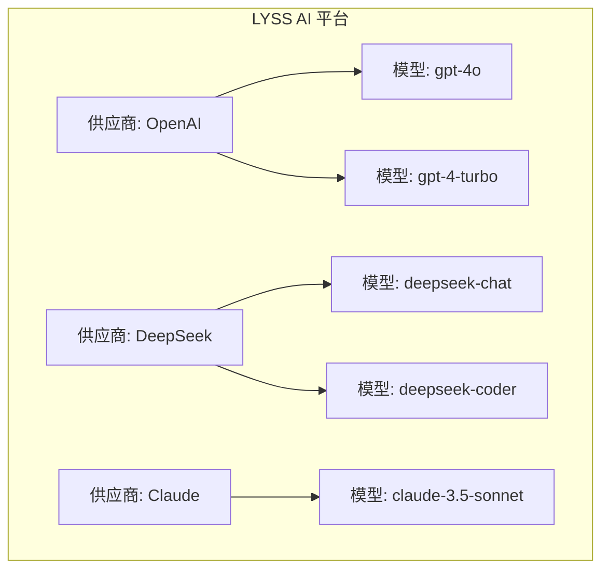
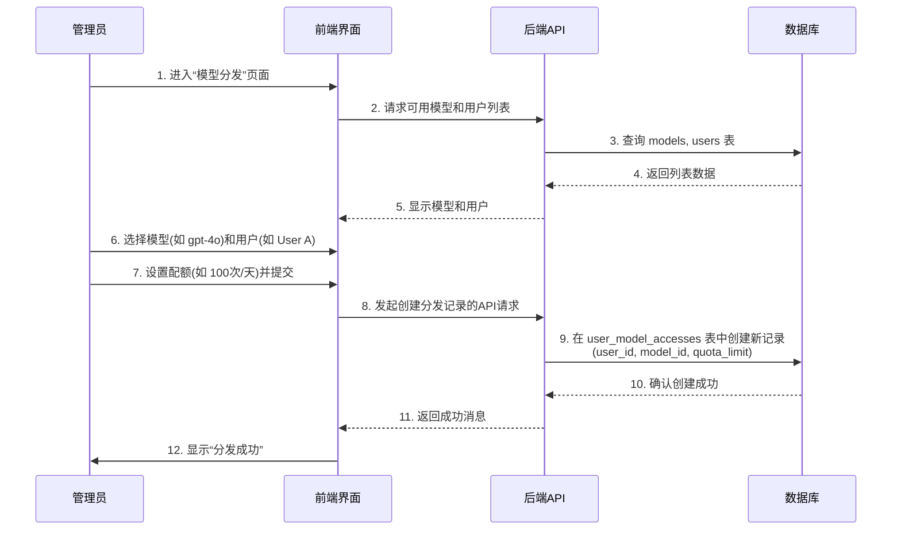
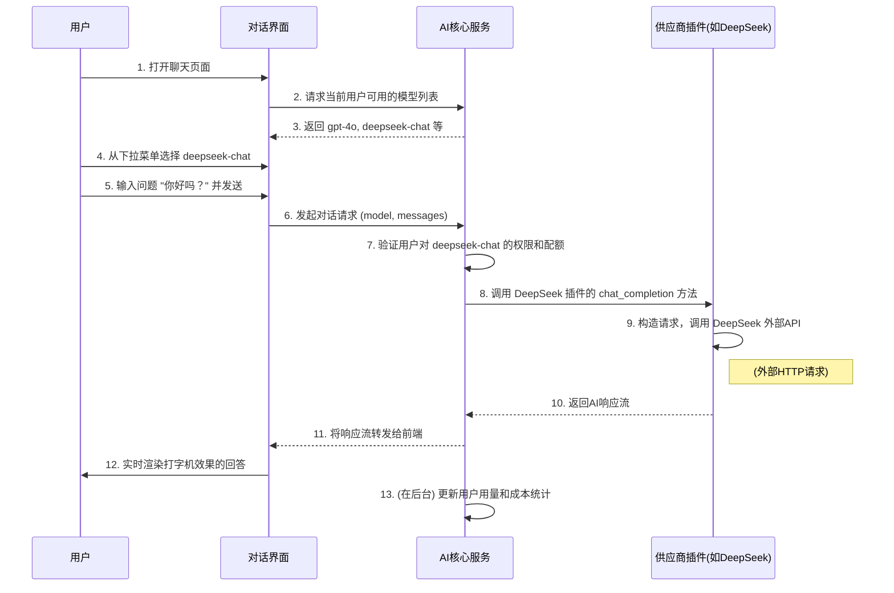

# LYSS AI 平台产品需求文档 (PRD)

*版本: 5.0 (基于代码生成) | 最后更新: 2025年6月30日*

---

## 1. 产品概述

### 1.1. 产品定位
**LYSS AI 平台** 是一个专为企业环境设计的**多AI供应商聚合与管理平台**。它旨在解决企业在引入和使用多样化AI服务时面临的挑战，如接口不统一、权限管理复杂、成本控制困难以及缺乏个性化体验等。

平台通过提供统一的AI对话接口、精细化的权限管理（RBAC）、灵活的模型分发、实时的成本监控和智能化的记忆系统，帮助企业安全、高效、可控地利用最先进的AI技术。

### 1.2. 核心价值
- **统一化管理**: 在单一平台内集成、配置和管理来自不同供应商（如 DeepSeek, OpenAI, Claude 等）的AI模型。
- **成本可控**: 通过模型分发、配额限制和使用情况监控，精确控制AI使用成本。
- **权限安全**: 基于角色的访问控制（RBAC），确保合适的人员拥有合适的模型访问权限。
- **体验一致**: 为最终用户提供一个统一、流畅且具备个性化记忆的AI对话界面，屏蔽底层供应商的复杂性。
- **高度可扩展**: 采用插件化的供应商架构，可以快速集成新的AI服务，保持技术领先。

### 1.3. 目标用户与角色

| 角色 | 核心职责 | 主要诉求 |
| :--- | :--- | :--- |
| **超级管理员 (Super Admin)** | 系统初始化、全局配置、供应商集成 | 维护平台稳定，引入新的AI能力，管理系统级设置。 |
| **管理员 (Admin)** | 团队用户管理、模型分发、成本监控 | 为团队成员分配AI资源，确保资源合理使用，监控团队成本。 |
| **普通用户 (User)** | 使用AI进行日常工作、处理文档、获取信息 | 拥有一个稳定、强大且懂我的AI助手，提升工作效率。 |

---

## 2. 核心架构与设计原则

### 2.1. "供应商 -> 模型" 的层级关系

这是平台最核心的架构理念。理解此关系对于理解平台功能至关重要。

1.  **供应商 (Provider)**:
    *   **定义**: 一个AI服务的提供商，例如 **OpenAI**、**DeepSeek** 或 **Anthropic (Claude)**。
    *   **配置**: 超级管理员或管理员或用户在系统中配置一个供应商，需要提供 `API Base URL` 和 `API Key` 等认证信息。一个供应商可以被配置多个，通过字段区分。
    *   **作用**: 供应商是模型的**来源**和**集合**。

2.  **模型 (Model)**:
    *   **定义**: 由特定供应商提供的具体AI模型，例如 OpenAI 提供的 `gpt-4o`，或 DeepSeek 提供的 `deepseek-chat`。
    *   **来源**: 模型数据通常在配置供应商并测试连接成功后，从供应商的API自动同步到平台数据库中。
    *   **关系**: 每个模型都**唯一归属于**一个供应商。用户不能直接使用模型，除非被授予权限，或者用户自己配置的供应商。

**层级示意图:**

### 2.2. 技术栈概览
- **数据库**: PostgreSQL (业务数据), Redis (缓存), Qdrant (向量存储)
- **AI集成**: 插件化的供应商系统 (`backend/app/providers/`)

---

## 3. 功能需求详述

### 3.1. 用户与权限管理 (RBAC)

#### 3.1.1. 角色权限矩阵

| 功能模块 | 超级管理员 | 管理员 | 普通用户 |
| :--- | :--- | :--- | :--- |
| **系统配置** | ✅ 完全控制 | ❌ 查看 | ❌ 不可见 |
| **供应商管理** | ✅ 创建/编辑/删除 | ✅ 创建/编辑/删除 | ✅ 创建/编辑/删除 (仅限个人) |
| **模型管理** | ✅ 查看/同步 | ✅ 查看/同步 | ❌ 不可见 |
| **模型分发** | ✅ 分发给任何用户 | ✅ 分发给其组织内用户 | ❌ 不可见 |
| **用户管理** | ✅ 管理所有用户/角色 | ✅ 管理其组织内用户 | ❌ 不可见 |
| **AI对话** | ✅ | ✅ | ✅ (需有模型权限) |
| **成本监控** | ✅ 查看全平台数据 | ✅ 查看组织内数据 | ✅ 查看个人数据 |

#### 3.1.2. 功能描述
- **角色分配**: 超级管理员可以任命或撤销管理员。新注册用户默认为普通用户。

### 3.2. 供应商与模型管理

#### 3.2.1. 供应商配置
- **入口**: 管理后台的“供应商管理”页面。
- **操作**:
    - **添加供应商**: 管理员选择一个支持的供应商类型（如 OpenAI），并填写配置表单（显示名称、API地址、API密钥等）。
    - **测试连接**: 在保存前，系统会调用相应供应商插件的 `test_connection` 方法，使用提供的凭据发送一个测试请求，以验证配置的有效性。
    - **状态管理**: 供应商可以被启用或禁用。禁用的供应商及其下的所有模型将对用户不可见。

#### 3.2.2. 模型同步
- **触发**: 当一个供应商被成功添加或其配置被更新时。
- **流程**: 系统调用供应商插件的 `get_available_models` 方法，获取该供应商提供的所有模型列表(上网调研供应商官网，方法由供应商提供)，并将其信息（如模型名称、上下文长度、价格等）存入平台数据库，并与该供应商关联。

### 3.3. 模型分发 (核心业务流程)

此功能是连接**模型**和**用户**的桥梁。

- **目的**: 将特定模型的使用权限授予一个或多个用户。
- **入口**: 管理后台的“模型分发”页面。
- **流程**:
    1.  **选择模型**: 管理员从平台已同步的**模型列表**中选择一个或多个模型。
    2.  **选择用户**: 管理员选择一个或多个用户/用户组作为授权对象。
    3.  **配置权限**:
        - **配额限制**: 设置该用户使用此模型的限制（例如：每天100次调用，或每月总Token数不超过50万）。
        - **有效期**: 设置权限的起止时间。
    4.  **确认分发**: 系统在 `user_model_accesses` 表中创建记录，关联用户和模型，并写入权限配置。

### 3.4. 统一AI对话界面

- **入口**: `/chat` 页面。
- **核心组件**:
    - **模型选择器 (`ModelSelector.tsx`)**:
        - **显示逻辑**: 此下拉菜单**仅显示**当前登录用户**已被授权使用**的模型列表。
        - **信息展示**: 每个选项清晰地展示模型的显示名称、所属供应商及其图标。
        - **切换**: 用户可以在对话中随时切换模型。
    - **对话区域 (`ChatArea.tsx`)**:
        - **流式响应**: 消息以打字机效果实时显示。
        - **上下文管理**: 自动向后端发送历史消息，以维持对话上下文。
        - **多模态支持**: 支持文件上传（用于文档问答）。
    - **参数设置**: 用户可以点击设置按钮，调整 `temperature`, `max_tokens` 等高级参数。

### 3.5. 智能记忆与文件处理

- **智能记忆**:
    - **技术**: 集成 Mem0 记忆引擎和 Qdrant 向量数据库。
    - **流程**: 在对话过程中，系统自动提取关键信息，将其存入用户的个人记忆库。在后续对话中，AI可以查询记忆库，提供更具个性化和上下文感知能力的回答。
- **文件处理**:
    - **流程**: 用户上传文档（PDF, DOCX等）后，后端服务会解析文档内容，将其分块并向量化，存入Qdrant。当用户提问时，系统会进行语义搜索，找到最相关的文档片段并将其作为上下文提供给AI模型，从而实现精准的文档问答。

### 3.6. 成本与用量监控

- **数据来源**: 每一次AI调用完成后，其使用的 `total_tokens` 和计算出的 `cost` 都会被记录，并与用户、模型、供应商关联。
- **展示**:
    - **管理员面板**: 提供多维度的统计图表，展示整个平台或特定组织的成本趋势、各供应商成本占比、各模型使用频率等。
    - **用户个人中心**: 用户可以清晰地看到自己的消费明细和剩余配额。

---

## 4. 关键业务流程图

### 4.1. 管理员分发模型给用户

### 4.2. 用户使用授权模型进行对话

---

## 5. 非功能性需求

- **性能**: 95%的API响应时间应在200ms以内（不含AI供应商响应时间）；流式对话首字符响应时间 < 2秒。
- **安全**: API密钥必须使用强加密（如AES-256）存储；所有关键操作必须有审计日志。
- **可用性**: 系统核心服务可用性需达到99.9%。
- **可扩展性**: 系统应支持水平扩展以应对用户增长。

---

## 6. 产品路线图 (Roadmap)

### v1.0 (当前)
- ✅ 核心对话功能
- ✅ 多供应商支持与插件化架构
- ✅ RBAC权限管理
- ✅ 模型分发与配额控制
- ✅ 基础文件问答

### v1.1 (下一阶段)
- 🔄 优化智能记忆系统，提供手动管理记忆的能力
- 🔄 增加更高级的监控和告警功能（如成本超预警）
- 🔄 实现API的限流和熔断机制，提升系统稳定性

### v2.0 (未来规划)
- 📋 引入工作流引擎，支持创建更复杂的AI应用
- 📋 建立插件市场，允许社区贡献供应商插件或功能插件
- 📋 集成企业SSO（单点登录）
- 📋 开发移动端原生应用
