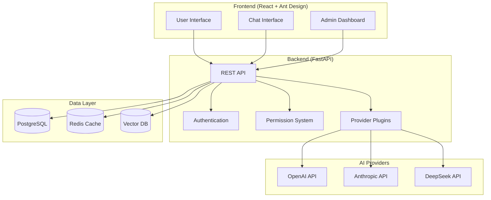

# LYSS AI Platform

**A modern, enterprise-grade multi-AI provider aggregation and management platform**

[](https://opensource.org/licenses/MIT)
[](https://www.python.org/downloads/)
[](https://fastapi.tiangolo.com)
[](https://reactjs.org/)

---

## 🎯 Project Vision

LYSS AI Platform solves the complexity of managing multiple AI service providers in enterprise environments. It provides a unified interface for accessing AI models from different providers (OpenAI, Anthropic, DeepSeek, etc.) with enterprise-grade features like role-based access control, cost monitoring, and intelligent memory.

## ✨ Key Features

### 🔐 Enterprise Security
- **Role-Based Access Control (RBAC)** - Three-tier user system (User/Admin/Super Admin)
- **Encrypted API Key Storage** - AES-256 encryption for sensitive credentials
- **Scope-Based Isolation** - Organization vs Personal provider segregation
- **JWT Authentication** - Secure token-based authentication

### 🔌 AI Provider Integration
- **Pluggable Architecture** - Easy integration of new AI providers
- **Unified API Interface** - Consistent API across all providers
- **Real-time Model Sync** - Automatic model discovery and synchronization
- **Connection Testing** - Validate provider configurations before saving

### 📊 Cost & Usage Management
- **Granular Usage Tracking** - Token-level usage monitoring
- **Cost Calculation** - Real-time cost tracking per user/model
- **Quota Management** - Flexible quota limits and controls
- **Usage Analytics** - Comprehensive usage statistics and reports

### 🧠 Smart Features
- **Intelligent Memory** - Personalized conversation context using Mem0
- **Document Q&A** - Upload and query documents with vector search
- **Streaming Responses** - Real-time response streaming
- **Multi-modal Support** - Text, vision, and function calling capabilities

## 🏗️ Architecture Overview



## 🚀 Quick Start

### Using Docker (Recommended)

1. **Clone the repository**:
   ```bash
   git clone <repository-url>
   cd Lyss
   ```

2. **Start all services**:
   ```bash
   docker-compose up -d
   ```

3. **Access the application**:
   - Backend API: http://localhost:8000
   - API Documentation: http://localhost:8000/api/v1/docs
   - Frontend (when available): http://localhost:3000

4. **Default Admin Credentials**:
   ```
   Email: admin@lyss.ai
   Password: admin123
   ```

### Manual Setup

See individual README files in `/backend` and `/frontend` directories for detailed setup instructions.

## 📁 Project Structure

```
Lyss/
├── backend/                 # FastAPI backend application
│   ├── app/
│   │   ├── api/            # API endpoints
│   │   ├── core/           # Security, config, permissions
│   │   ├── models/         # SQLAlchemy models
│   │   ├── schemas/        # Pydantic schemas
│   │   ├── services/       # Business logic
│   │   └── providers/      # AI provider plugins
│   ├── alembic/            # Database migrations
│   └── tests/              # Backend tests
├── frontend/               # React frontend (coming soon)
├── read/                   # Technical documentation
├── docker-compose.yml      # Development environment
├── BACKEND_DEV_CHECKLIST.md
├── FRONTEND_DEV_CHECKLIST.md
└── PRD.md                  # Product Requirements Document
```

## 🔧 Core Concepts

### Provider Scope System

**ORGANIZATION Scope:**
- Created by: Admins only
- Visibility: Admin dashboard
- Distribution: Can be shared with team members
- Use case: Company-wide AI model access

**PERSONAL Scope:**
- Created by: Any user
- Visibility: Owner only
- Distribution: Cannot be shared
- Use case: Personal API keys and private models

### Plugin Architecture

Adding a new AI provider is straightforward:

```python
@register_provider("custom_ai")
class CustomAIProvider(LLMProvider):
    @classmethod
    def get_config_model(cls):
        return CustomAIConfig
    
    async def chat_completion(self, request):
        # Your implementation here
        pass
```

## 🛣️ Development Roadmap

### ✅ Phase 1 - Backend Foundation (Current)
- [x] Core API structure
- [x] Authentication & RBAC system
- [x] Provider plugin architecture
- [x] Database models & migrations
- [x] OpenAI, Anthropic, DeepSeek providers

### 🔄 Phase 2 - Frontend Development (In Progress)
- [ ] React frontend setup
- [ ] Authentication UI
- [ ] Provider management interface
- [ ] Chat interface with streaming
- [ ] Admin dashboard

### 📋 Phase 3 - Advanced Features (Planned)
- [ ] Mem0 intelligent memory integration
- [ ] Document upload & Q&A
- [ ] Usage analytics & reporting
- [ ] API rate limiting & caching
- [ ] Webhook integrations

### 🚀 Phase 4 - Production Ready (Future)
- [ ] Comprehensive testing suite
- [ ] Performance optimization
- [ ] Security audit & hardening
- [ ] Deployment automation
- [ ] Monitoring & alerting

## 🤝 Contributing

We welcome contributions! Please see our development checklists:

- [Backend Development Checklist](BACKEND_DEV_CHECKLIST.md)
- [Frontend Development Checklist](FRONTEND_DEV_CHECKLIST.md)

### Development Guidelines

1. Follow PEP 8 for Python code
2. Use TypeScript for frontend development
3. Write comprehensive tests
4. Update documentation
5. Follow conventional commit messages

## 📝 API Documentation

Once the backend is running, comprehensive API documentation is available at:
- **Swagger UI**: http://localhost:8000/api/v1/docs
- **ReDoc**: http://localhost:8000/api/v1/redoc

## 🔒 Security

- All API keys are encrypted using AES-256
- JWT tokens for authentication
- RBAC for fine-grained permissions
- SQL injection protection via SQLAlchemy ORM
- Input validation using Pydantic schemas

## 📊 Monitoring & Analytics

- Real-time usage tracking
- Cost monitoring per user/model
- Token consumption analytics
- Provider performance metrics
- Error logging and alerting

## 🌍 Production Deployment

For production deployment, ensure:

1. Change default credentials
2. Use strong encryption keys
3. Configure HTTPS/SSL
4. Set up database backups
5. Configure monitoring and logging
6. Use environment-specific configs

## 📄 License

This project is licensed under the MIT License - see the [LICENSE](LICENSE) file for details.

## 🆘 Support

For support and questions:

1. Check the [technical documentation](read/) for detailed guides
2. Review API documentation at `/docs` endpoint
3. Create an issue for bugs or feature requests
4. Check existing issues for solutions

---

**Built with ❤️ by the LYSS AI Team**