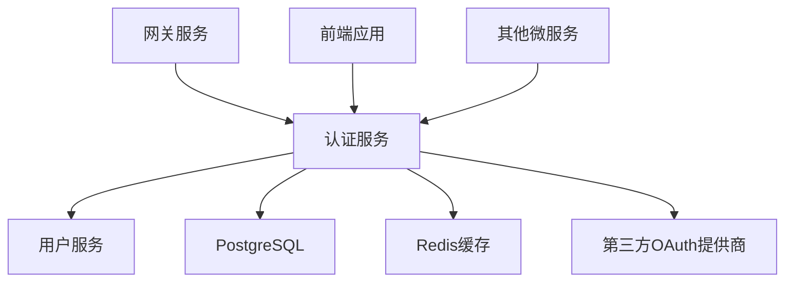

# 认证服务 (Auth Service) 开发文档

**版本**: 2.0  
**更新时间**: 2025-01-25  
**技术栈**: Go + Kratos + JWT + Redis + PostgreSQL  
**状态**: 已确认

---

## 服务概述

认证服务是 Lyss AI Platform 的安全核心，专门负责用户身份认证、访问令牌管理、权限控制和会话管理。作为安全网关，它为整个平台提供统一的身份验证机制，确保只有经过认证的用户才能访问系统资源。

### 🎯 核心职责

- **身份认证**: 用户登录验证、密码校验、多因素认证
- **令牌管理**: JWT生成、刷新、撤销、黑名单管理
- **会话管理**: 用户会话跟踪、多设备登录控制
- **OAuth集成**: 支持第三方OAuth登录 (GitHub, Google, 微信等)
- **权限验证**: 为其他服务提供令牌验证和权限检查接口

### 🔗 服务依赖关系



---

## 技术架构设计

### 项目结构

```
auth-service/
├── cmd/
│   └── server/
│       └── main.go              # 服务入口
├── internal/
│   ├── config/
│   │   └── config.go           # 配置管理
│   ├── handler/
│   │   ├── auth.go            # 认证相关接口
│   │   ├── token.go           # 令牌管理接口
│   │   └── oauth.go           # OAuth集成接口
│   ├── service/
│   │   ├── auth.go            # 认证业务逻辑
│   │   ├── token.go           # 令牌业务逻辑
│   │   ├── oauth.go           # OAuth业务逻辑
│   │   └── session.go         # 会话管理逻辑
│   ├── repository/
│   │   ├── token.go           # 令牌数据访问
│   │   └── oauth.go           # OAuth数据访问
│   ├── model/
│   │   ├── token.go           # 令牌数据模型
│   │   ├── oauth.go           # OAuth数据模型
│   │   └── session.go         # 会话数据模型
│   ├── middleware/
│   │   ├── jwt.go             # JWT验证中间件
│   │   ├── cors.go            # 跨域中间件
│   │   └── rate_limit.go      # 限流中间件
│   └── utils/
│       ├── jwt.go             # JWT工具
│       ├── hash.go            # 哈希工具
│       ├── crypto.go          # 加密工具
│       └── validator.go       # 验证工具
├── pkg/
│   ├── database/
│   │   └── postgres.go        # 数据库连接
│   ├── cache/
│   │   └── redis.go           # Redis连接
│   ├── oauth/
│   │   ├── github.go          # GitHub OAuth
│   │   ├── google.go          # Google OAuth
│   │   └── wechat.go          # 微信OAuth
│   └── logger/
│       └── logger.go          # 日志工具
├── migrations/
│   ├── 001_create_jwt_tokens.sql    # JWT令牌表
│   └── 002_create_oauth_connections.sql # OAuth连接表
├── docker/
│   └── Dockerfile            # 容器化配置
├── docs/
│   └── api.md               # API文档
├── go.mod
├── go.sum
└── README.md
```

### 核心安全设计原则

#### 1. 零信任架构
每个请求都需要验证，不信任任何内部网络传输

#### 2. 最小权限原则
用户和服务只获得执行其任务所需的最低权限

#### 3. 深度防御
多层安全控制，包括令牌验证、权限检查、限流等

#### 4. 安全存储
敏感信息加密存储，令牌哈希处理

---

## 数据模型设计

### JWT令牌模型 (JWTToken)

```go
package model

import (
    "time"
    "net"
)

type JWTToken struct {
    ID                 uint64    `json:"id" gorm:"primaryKey;autoIncrement"`
    UserID             uint64    `json:"user_id" gorm:"not null;index"`
    TokenHash          string    `json:"-" gorm:"size:255;not null;uniqueIndex"`
    RefreshTokenHash   string    `json:"-" gorm:"size:255"`
    ExpiresAt          time.Time `json:"expires_at" gorm:"not null;index"`
    RefreshExpiresAt   time.Time `json:"refresh_expires_at"`
    IsRevoked          bool      `json:"is_revoked" gorm:"default:false;index"`
    DeviceInfo         string    `json:"device_info" gorm:"type:jsonb"`
    IPAddress          net.IP    `json:"ip_address" gorm:"type:inet"`
    UserAgent          string    `json:"user_agent" gorm:"size:500"`
    LoginMethod        string    `json:"login_method" gorm:"size:50"` // password, oauth
    CreatedAt          time.Time `json:"created_at"`
    LastUsedAt         time.Time `json:"last_used_at"`
}

// JWT Claims 结构
type Claims struct {
    UserID   uint64 `json:"user_id"`
    Username string `json:"username"`
    Role     int    `json:"role"`
    TokenID  string `json:"token_id"`
    jwt.RegisteredClaims
}

// 令牌状态
type TokenStatus int

const (
    TokenStatusActive TokenStatus = iota + 1
    TokenStatusExpired
    TokenStatusRevoked
)
```

### OAuth连接模型 (OAuthConnection)

```go
type OAuthConnection struct {
    ID                    uint64    `json:"id" gorm:"primaryKey;autoIncrement"`
    UserID                uint64    `json:"user_id" gorm:"not null;index"`
    Provider              string    `json:"provider" gorm:"size:50;not null;index"`
    ProviderUserID        string    `json:"provider_user_id" gorm:"size:100;not null"`
    AccessTokenEncrypted  string    `json:"-" gorm:"type:text"`
    RefreshTokenEncrypted string    `json:"-" gorm:"type:text"`
    TokenExpiresAt        time.Time `json:"token_expires_at"`
    UserInfo              string    `json:"user_info" gorm:"type:jsonb"`
    IsActive              bool      `json:"is_active" gorm:"default:true"`
    CreatedAt             time.Time `json:"created_at"`
    UpdatedAt             time.Time `json:"updated_at"`
}

// OAuth提供商
const (
    ProviderGitHub = "github"
    ProviderGoogle = "google"
    ProviderWechat = "wechat"
)

// OAuth用户信息
type OAuthUserInfo struct {
    ID       string `json:"id"`
    Name     string `json:"name"`
    Email    string `json:"email"`
    Avatar   string `json:"avatar"`
    Username string `json:"username"`
}
```

### 用户会话模型 (UserSession)

```go
type UserSession struct {
    ID            string    `json:"id" gorm:"primaryKey;size:128"` // Redis Key
    UserID        uint64    `json:"user_id" gorm:"not null;index"`
    DeviceID      string    `json:"device_id" gorm:"size:128;index"`
    IPAddress     net.IP    `json:"ip_address" gorm:"type:inet"`
    UserAgent     string    `json:"user_agent" gorm:"size:500"`
    LoginTime     time.Time `json:"login_time"`
    LastActivity  time.Time `json:"last_activity"`
    ExpiresAt     time.Time `json:"expires_at"`
    IsActive      bool      `json:"is_active" gorm:"default:true"`
}

// 会话配置
type SessionConfig struct {
    MaxSessions        int           `json:"max_sessions"`         // 最大并发会话数
    SessionTimeout     time.Duration `json:"session_timeout"`     // 会话超时时间
    InactivityTimeout  time.Duration `json:"inactivity_timeout"`  // 非活跃超时
    RequireDeviceAuth  bool          `json:"require_device_auth"` // 需要设备认证
}
```

---

## API接口设计

### 身份认证接口

#### 1. 用户登录
```http
POST /api/v1/auth/login
Content-Type: application/json

{
    "username": "johndoe",
    "password": "secure_password_123",
    "device_info": {
        "device_id": "device_123",
        "device_name": "iPhone 13",
        "os": "iOS 16.1",
        "app_version": "1.0.0"
    },
    "remember_me": true
}
```

**响应示例**:
```json
{
    "code": 200,
    "message": "登录成功",
    "data": {
        "access_token": "eyJhbGciOiJIUzI1NiIs...",
        "refresh_token": "eyJhbGciOiJIUzI1NiIs...",
        "token_type": "Bearer",
        "expires_in": 3600,
        "refresh_expires_in": 86400,
        "user": {
            "id": 1001,
            "username": "johndoe",
            "email": "john@example.com",
            "role": 1
        }
    }
}
```

#### 2. 刷新令牌
```http
POST /api/v1/auth/refresh
Content-Type: application/json
Authorization: Bearer {refresh_token}

{
    "refresh_token": "eyJhbGciOiJIUzI1NiIs..."
}
```

#### 3. 退出登录
```http
POST /api/v1/auth/logout
Authorization: Bearer {access_token}

{
    "logout_all_devices": false
}
```

#### 4. 令牌验证
```http
POST /api/v1/auth/verify
Authorization: Bearer {access_token}

{
    "token": "eyJhbGciOiJIUzI1NiIs..."
}
```

**响应示例**:
```json
{
    "code": 200,
    "message": "令牌有效",
    "data": {
        "valid": true,
        "user_id": 1001,
        "username": "johndoe",
        "role": 1,
        "expires_at": "2025-01-25T18:30:00Z",
        "permissions": ["user:read", "user:write"]
    }
}
```

### OAuth集成接口

#### 1. 获取OAuth授权URL
```http
GET /api/v1/auth/oauth/{provider}/authorize?redirect_uri=https://app.example.com/callback
```

**响应示例**:
```json
{
    "code": 200,
    "message": "获取成功",
    "data": {
        "authorization_url": "https://github.com/login/oauth/authorize?client_id=xxx&redirect_uri=xxx&scope=user:email&state=xxx",
        "state": "random_state_string"
    }
}
```

#### 2. OAuth回调处理
```http
POST /api/v1/auth/oauth/{provider}/callback
Content-Type: application/json

{
    "code": "oauth_authorization_code",
    "state": "random_state_string",
    "redirect_uri": "https://app.example.com/callback"
}
```

#### 3. 绑定OAuth账号
```http
POST /api/v1/auth/oauth/{provider}/bind
Authorization: Bearer {access_token}
Content-Type: application/json

{
    "oauth_code": "authorization_code",
    "state": "state_value"
}
```

### 会话管理接口

#### 1. 获取活跃会话列表
```http
GET /api/v1/auth/sessions
Authorization: Bearer {access_token}
```

**响应示例**:
```json
{
    "code": 200,
    "message": "获取成功",
    "data": {
        "current_session": {
            "id": "session_123",
            "device_name": "iPhone 13",
            "ip_address": "192.168.1.100",
            "login_time": "2025-01-25T10:00:00Z",
            "last_activity": "2025-01-25T15:30:00Z",
            "is_current": true
        },
        "other_sessions": [
            {
                "id": "session_456",
                "device_name": "MacBook Pro",
                "ip_address": "192.168.1.101",
                "login_time": "2025-01-24T14:00:00Z",
                "last_activity": "2025-01-25T12:00:00Z",
                "is_current": false
            }
        ]
    }
}
```

#### 2. 终止指定会话
```http
DELETE /api/v1/auth/sessions/{session_id}
Authorization: Bearer {access_token}
```

#### 3. 终止所有其他会话
```http
DELETE /api/v1/auth/sessions/others
Authorization: Bearer {access_token}
```

---

## 核心业务逻辑实现

### 认证服务层实现

```go
package service

import (
    "context"
    "crypto/rand"
    "encoding/hex"
    "errors"
    "fmt"
    "strings"
    "time"
    
    "auth-service/internal/model"
    "auth-service/internal/repository"
    "auth-service/pkg/utils"
    "github.com/golang-jwt/jwt/v5"
)

type AuthService struct {
    tokenRepo       repository.TokenRepository
    userService     UserServiceClient // 用户服务客户端
    cache           cache.Cache
    jwtSecret       string
    tokenExpiry     time.Duration
    refreshExpiry   time.Duration
}

func NewAuthService(
    tokenRepo repository.TokenRepository,
    userService UserServiceClient,
    cache cache.Cache,
    jwtSecret string,
    tokenExpiry, refreshExpiry time.Duration,
) *AuthService {
    return &AuthService{
        tokenRepo:     tokenRepo,
        userService:   userService,
        cache:         cache,
        jwtSecret:     jwtSecret,
        tokenExpiry:   tokenExpiry,
        refreshExpiry: refreshExpiry,
    }
}

// 用户登录
func (s *AuthService) Login(ctx context.Context, req *LoginRequest) (*LoginResponse, error) {
    // 1. 参数验证
    if err := s.validateLoginRequest(req); err != nil {
        return nil, fmt.Errorf("参数验证失败: %w", err)
    }
    
    // 2. 验证用户凭据
    user, err := s.userService.ValidateCredentials(ctx, req.Username, req.Password)
    if err != nil {
        return nil, fmt.Errorf("用户认证失败: %w", err)
    }
    
    if user.Status != model.UserStatusActive {
        return nil, errors.New("用户账号已被禁用")
    }
    
    // 3. 检查会话限制
    if err := s.checkSessionLimits(ctx, user.ID); err != nil {
        return nil, fmt.Errorf("会话检查失败: %w", err)
    }
    
    // 4. 生成令牌
    tokenID := s.generateTokenID()
    accessToken, err := s.generateAccessToken(user, tokenID)
    if err != nil {
        return nil, fmt.Errorf("生成访问令牌失败: %w", err)
    }
    
    refreshToken, err := s.generateRefreshToken(user, tokenID)
    if err != nil {
        return nil, fmt.Errorf("生成刷新令牌失败: %w", err)
    }
    
    // 5. 保存令牌记录
    now := time.Now()
    tokenRecord := &model.JWTToken{
        UserID:           user.ID,
        TokenHash:        s.hashToken(accessToken),
        RefreshTokenHash: s.hashToken(refreshToken),
        ExpiresAt:        now.Add(s.tokenExpiry),
        RefreshExpiresAt: now.Add(s.refreshExpiry),
        DeviceInfo:       s.marshalDeviceInfo(req.DeviceInfo),
        IPAddress:        s.parseIPAddress(req.IPAddress),
        UserAgent:        req.UserAgent,
        LoginMethod:      "password",
    }
    
    if err := s.tokenRepo.Create(ctx, tokenRecord); err != nil {
        return nil, fmt.Errorf("保存令牌记录失败: %w", err)
    }
    
    // 6. 创建用户会话
    if err := s.createUserSession(ctx, user.ID, tokenID, req); err != nil {
        // 会话创建失败不影响登录，记录日志即可
        logger.Warn("创建用户会话失败", zap.Error(err))
    }
    
    // 7. 更新用户最后登录时间
    if err := s.userService.UpdateLastLogin(ctx, user.ID); err != nil {
        logger.Warn("更新最后登录时间失败", zap.Error(err))
    }
    
    return &LoginResponse{
        AccessToken:      accessToken,
        RefreshToken:     refreshToken,
        TokenType:        "Bearer",
        ExpiresIn:        int(s.tokenExpiry.Seconds()),
        RefreshExpiresIn: int(s.refreshExpiry.Seconds()),
        User:             user,
    }, nil
}

// 刷新令牌
func (s *AuthService) RefreshToken(ctx context.Context, refreshToken string) (*TokenResponse, error) {
    // 1. 验证刷新令牌
    claims, err := s.validateToken(refreshToken, true)
    if err != nil {
        return nil, fmt.Errorf("刷新令牌无效: %w", err)
    }
    
    // 2. 检查令牌是否已撤销
    tokenHash := s.hashToken(refreshToken)
    tokenRecord, err := s.tokenRepo.GetByRefreshTokenHash(ctx, tokenHash)
    if err != nil {
        return nil, fmt.Errorf("令牌记录不存在: %w", err)
    }
    
    if tokenRecord.IsRevoked {
        return nil, errors.New("令牌已被撤销")
    }
    
    if time.Now().After(tokenRecord.RefreshExpiresAt) {
        return nil, errors.New("刷新令牌已过期")
    }
    
    // 3. 获取用户信息
    user, err := s.userService.GetUserByID(ctx, claims.UserID)
    if err != nil {
        return nil, fmt.Errorf("获取用户信息失败: %w", err)
    }
    
    if user.Status != model.UserStatusActive {
        return nil, errors.New("用户账号已被禁用")
    }
    
    // 4. 生成新的访问令牌
    newTokenID := s.generateTokenID()
    newAccessToken, err := s.generateAccessToken(user, newTokenID)
    if err != nil {
        return nil, fmt.Errorf("生成新访问令牌失败: %w", err)
    }
    
    // 5. 可选：生成新的刷新令牌 (滚动刷新策略)
    newRefreshToken := refreshToken
    if s.shouldRotateRefreshToken(tokenRecord) {
        newRefreshToken, err = s.generateRefreshToken(user, newTokenID)
        if err != nil {
            return nil, fmt.Errorf("生成新刷新令牌失败: %w", err)
        }
    }
    
    // 6. 更新令牌记录
    now := time.Now()
    tokenRecord.TokenHash = s.hashToken(newAccessToken)
    tokenRecord.RefreshTokenHash = s.hashToken(newRefreshToken)
    tokenRecord.ExpiresAt = now.Add(s.tokenExpiry)
    tokenRecord.LastUsedAt = now
    
    if err := s.tokenRepo.Update(ctx, tokenRecord); err != nil {
        return nil, fmt.Errorf("更新令牌记录失败: %w", err)
    }
    
    // 7. 将旧令牌加入黑名单
    s.addTokenToBlacklist(claims.ID, claims.ExpiresAt.Time)
    
    return &TokenResponse{
        AccessToken:  newAccessToken,
        TokenType:    "Bearer",
        ExpiresIn:    int(s.tokenExpiry.Seconds()),
        RefreshToken: newRefreshToken,
    }, nil
}

// 令牌验证
func (s *AuthService) VerifyToken(ctx context.Context, tokenString string) (*TokenVerificationResult, error) {
    // 1. 检查令牌黑名单
    if s.isTokenBlacklisted(tokenString) {
        return &TokenVerificationResult{Valid: false}, errors.New("令牌已被撤销")
    }
    
    // 2. 验证JWT签名和格式
    claims, err := s.validateToken(tokenString, false)
    if err != nil {
        return &TokenVerificationResult{Valid: false}, fmt.Errorf("令牌验证失败: %w", err)
    }
    
    // 3. 检查令牌是否在数据库中存在且有效
    tokenHash := s.hashToken(tokenString)
    tokenRecord, err := s.tokenRepo.GetByTokenHash(ctx, tokenHash)
    if err != nil {
        return &TokenVerificationResult{Valid: false}, fmt.Errorf("令牌记录不存在: %w", err)
    }
    
    if tokenRecord.IsRevoked {
        return &TokenVerificationResult{Valid: false}, errors.New("令牌已被撤销")
    }
    
    // 4. 检查用户状态
    user, err := s.userService.GetUserByID(ctx, claims.UserID)
    if err != nil {
        return &TokenVerificationResult{Valid: false}, fmt.Errorf("获取用户信息失败: %w", err)
    }
    
    if user.Status != model.UserStatusActive {
        return &TokenVerificationResult{Valid: false}, errors.New("用户账号已被禁用")
    }
    
    // 5. 更新最后使用时间
    go func() {
        ctx, cancel := context.WithTimeout(context.Background(), 5*time.Second)
        defer cancel()
        
        tokenRecord.LastUsedAt = time.Now()
        if err := s.tokenRepo.Update(ctx, tokenRecord); err != nil {
            logger.Warn("更新令牌最后使用时间失败", zap.Error(err))
        }
    }()
    
    return &TokenVerificationResult{
        Valid:       true,
        UserID:      claims.UserID,
        Username:    claims.Username,
        Role:        claims.Role,
        ExpiresAt:   claims.ExpiresAt.Time,
        Permissions: s.getUserPermissions(user.Role),
    }, nil
}

// 退出登录
func (s *AuthService) Logout(ctx context.Context, tokenString string, logoutAllDevices bool) error {
    // 1. 验证令牌
    claims, err := s.validateToken(tokenString, false)
    if err != nil {
        return fmt.Errorf("令牌验证失败: %w", err)
    }
    
    if logoutAllDevices {
        // 撤销用户所有令牌
        if err := s.tokenRepo.RevokeAllUserTokens(ctx, claims.UserID); err != nil {
            return fmt.Errorf("撤销所有令牌失败: %w", err)
        }
        
        // 清理所有会话
        if err := s.clearAllUserSessions(ctx, claims.UserID); err != nil {
            logger.Warn("清理用户会话失败", zap.Error(err))
        }
    } else {
        // 撤销当前令牌
        tokenHash := s.hashToken(tokenString)
        if err := s.tokenRepo.RevokeByTokenHash(ctx, tokenHash); err != nil {
            return fmt.Errorf("撤销令牌失败: %w", err)
        }
        
        // 清理当前会话
        if err := s.clearUserSession(ctx, claims.ID); err != nil {
            logger.Warn("清理用户会话失败", zap.Error(err))
        }
    }
    
    // 加入黑名单
    s.addTokenToBlacklist(claims.ID, claims.ExpiresAt.Time)
    
    return nil
}

// 生成访问令牌
func (s *AuthService) generateAccessToken(user *model.User, tokenID string) (string, error) {
    now := time.Now()
    claims := &model.Claims{
        UserID:   user.ID,
        Username: user.Username,
        Role:     int(user.Role),
        TokenID:  tokenID,
        RegisteredClaims: jwt.RegisteredClaims{
            ID:        tokenID,
            Subject:   fmt.Sprintf("%d", user.ID),
            IssuedAt:  jwt.NewNumericDate(now),
            ExpiresAt: jwt.NewNumericDate(now.Add(s.tokenExpiry)),
            NotBefore: jwt.NewNumericDate(now),
            Issuer:    "lyss-auth-service",
            Audience:  []string{"lyss-platform"},
        },
    }
    
    token := jwt.NewWithClaims(jwt.SigningMethodHS256, claims)
    return token.SignedString([]byte(s.jwtSecret))
}

// 生成刷新令牌
func (s *AuthService) generateRefreshToken(user *model.User, tokenID string) (string, error) {
    now := time.Now()
    claims := &model.Claims{
        UserID:   user.ID,
        Username: user.Username,
        Role:     int(user.Role),
        TokenID:  tokenID,
        RegisteredClaims: jwt.RegisteredClaims{
            ID:        tokenID + "_refresh",
            Subject:   fmt.Sprintf("%d", user.ID),
            IssuedAt:  jwt.NewNumericDate(now),
            ExpiresAt: jwt.NewNumericDate(now.Add(s.refreshExpiry)),
            NotBefore: jwt.NewNumericDate(now),
            Issuer:    "lyss-auth-service",
            Audience:  []string{"lyss-platform-refresh"},
        },
    }
    
    token := jwt.NewWithClaims(jwt.SigningMethodHS256, claims)
    return token.SignedString([]byte(s.jwtSecret))
}

// 验证JWT令牌
func (s *AuthService) validateToken(tokenString string, isRefreshToken bool) (*model.Claims, error) {
    token, err := jwt.ParseWithClaims(tokenString, &model.Claims{}, func(token *jwt.Token) (interface{}, error) {
        if _, ok := token.Method.(*jwt.SigningMethodHMAC); !ok {
            return nil, fmt.Errorf("unexpected signing method: %v", token.Header["alg"])
        }
        return []byte(s.jwtSecret), nil
    })
    
    if err != nil {
        return nil, err
    }
    
    claims, ok := token.Claims.(*model.Claims)
    if !ok || !token.Valid {
        return nil, errors.New("invalid token")
    }
    
    // 检查受众
    expectedAudience := "lyss-platform"
    if isRefreshToken {
        expectedAudience = "lyss-platform-refresh"
    }
    
    if !claims.VerifyAudience(expectedAudience, true) {
        return nil, errors.New("invalid audience")
    }
    
    return claims, nil
}

// 生成令牌ID
func (s *AuthService) generateTokenID() string {
    bytes := make([]byte, 16)
    rand.Read(bytes)
    return hex.EncodeToString(bytes)
}

// 哈希令牌
func (s *AuthService) hashToken(token string) string {
    return utils.SHA256Hash(token)
}

// 令牌黑名单管理
func (s *AuthService) addTokenToBlacklist(tokenID string, expiresAt time.Time) {
    key := fmt.Sprintf("blacklist:token:%s", tokenID)
    duration := time.Until(expiresAt)
    if duration > 0 {
        s.cache.Set(key, "revoked", duration)
    }
}

func (s *AuthService) isTokenBlacklisted(tokenString string) bool {
    claims, err := s.validateToken(tokenString, false)
    if err != nil {
        return true // 无效令牌视为已撤销
    }
    
    key := fmt.Sprintf("blacklist:token:%s", claims.ID)
    _, exists := s.cache.Get(key)
    return exists
}
```

### OAuth服务实现

```go
package service

import (
    "context"
    "crypto/rand"
    "encoding/base64"
    "fmt"
    
    "auth-service/internal/model"
    "auth-service/pkg/oauth"
)

type OAuthService struct {
    authService     *AuthService
    oauthRepo       repository.OAuthRepository
    githubProvider  oauth.GitHubProvider
    googleProvider  oauth.GoogleProvider
    wechatProvider  oauth.WechatProvider
    cache           cache.Cache
}

// OAuth授权URL生成
func (s *OAuthService) GetAuthorizationURL(ctx context.Context, provider, redirectURI string) (*OAuthAuthorizationResponse, error) {
    // 1. 生成随机state
    state, err := s.generateState()
    if err != nil {
        return nil, fmt.Errorf("生成state失败: %w", err)
    }
    
    // 2. 缓存state和redirect_uri
    stateKey := fmt.Sprintf("oauth:state:%s", state)
    stateData := map[string]string{
        "redirect_uri": redirectURI,
        "provider":     provider,
    }
    s.cache.Set(stateKey, stateData, 10*time.Minute)
    
    // 3. 根据提供商生成授权URL
    var authURL string
    switch provider {
    case model.ProviderGitHub:
        authURL = s.githubProvider.GetAuthorizationURL(redirectURI, state)
    case model.ProviderGoogle:
        authURL = s.googleProvider.GetAuthorizationURL(redirectURI, state)
    case model.ProviderWechat:
        authURL = s.wechatProvider.GetAuthorizationURL(redirectURI, state)
    default:
        return nil, fmt.Errorf("不支持的OAuth提供商: %s", provider)
    }
    
    return &OAuthAuthorizationResponse{
        AuthorizationURL: authURL,
        State:           state,
    }, nil
}

// OAuth回调处理
func (s *OAuthService) HandleCallback(ctx context.Context, provider, code, state, redirectURI string) (*LoginResponse, error) {
    // 1. 验证state
    stateKey := fmt.Sprintf("oauth:state:%s", state)
    cachedState, exists := s.cache.Get(stateKey)
    if !exists {
        return nil, errors.New("无效的state参数")
    }
    
    stateData := cachedState.(map[string]string)
    if stateData["provider"] != provider {
        return nil, errors.New("state中的提供商不匹配")
    }
    
    // 清理已使用的state
    s.cache.Delete(stateKey)
    
    // 2. 使用授权码获取访问令牌
    var oauthUserInfo *model.OAuthUserInfo
    var accessToken string
    var err error
    
    switch provider {
    case model.ProviderGitHub:
        accessToken, err = s.githubProvider.ExchangeCodeForToken(code, redirectURI)
        if err != nil {
            return nil, fmt.Errorf("GitHub令牌交换失败: %w", err)
        }
        oauthUserInfo, err = s.githubProvider.GetUserInfo(accessToken)
    case model.ProviderGoogle:
        accessToken, err = s.googleProvider.ExchangeCodeForToken(code, redirectURI)
        if err != nil {
            return nil, fmt.Errorf("Google令牌交换失败: %w", err)
        }
        oauthUserInfo, err = s.googleProvider.GetUserInfo(accessToken)
    case model.ProviderWechat:
        accessToken, err = s.wechatProvider.ExchangeCodeForToken(code, redirectURI)
        if err != nil {
            return nil, fmt.Errorf("微信令牌交换失败: %w", err)
        }
        oauthUserInfo, err = s.wechatProvider.GetUserInfo(accessToken)
    default:
        return nil, fmt.Errorf("不支持的OAuth提供商: %s", provider)
    }
    
    if err != nil {
        return nil, fmt.Errorf("获取用户信息失败: %w", err)
    }
    
    // 3. 查找或创建用户
    user, isNewUser, err := s.findOrCreateUser(ctx, provider, oauthUserInfo)
    if err != nil {
        return nil, fmt.Errorf("用户处理失败: %w", err)
    }
    
    // 4. 保存或更新OAuth连接
    if err := s.saveOAuthConnection(ctx, user.ID, provider, oauthUserInfo, accessToken); err != nil {
        return nil, fmt.Errorf("保存OAuth连接失败: %w", err)
    }
    
    // 5. 生成平台令牌
    tokenID := s.authService.generateTokenID()
    platformAccessToken, err := s.authService.generateAccessToken(user, tokenID)
    if err != nil {
        return nil, fmt.Errorf("生成访问令牌失败: %w", err)
    }
    
    refreshToken, err := s.authService.generateRefreshToken(user, tokenID)
    if err != nil {
        return nil, fmt.Errorf("生成刷新令牌失败: %w", err)
    }
    
    // 6. 保存令牌记录
    tokenRecord := &model.JWTToken{
        UserID:           user.ID,
        TokenHash:        s.authService.hashToken(platformAccessToken),
        RefreshTokenHash: s.authService.hashToken(refreshToken),
        ExpiresAt:        time.Now().Add(s.authService.tokenExpiry),
        RefreshExpiresAt: time.Now().Add(s.authService.refreshExpiry),
        LoginMethod:      fmt.Sprintf("oauth_%s", provider),
    }
    
    if err := s.authService.tokenRepo.Create(ctx, tokenRecord); err != nil {
        return nil, fmt.Errorf("保存令牌记录失败: %w", err)
    }
    
    return &LoginResponse{
        AccessToken:      platformAccessToken,
        RefreshToken:     refreshToken,
        TokenType:        "Bearer",
        ExpiresIn:        int(s.authService.tokenExpiry.Seconds()),
        RefreshExpiresIn: int(s.authService.refreshExpiry.Seconds()),
        User:             user,
        IsNewUser:        isNewUser,
    }, nil
}

// 查找或创建用户
func (s *OAuthService) findOrCreateUser(ctx context.Context, provider string, oauthUserInfo *model.OAuthUserInfo) (*model.User, bool, error) {
    // 1. 先通过OAuth连接查找用户
    connection, err := s.oauthRepo.GetByProviderUserID(ctx, provider, oauthUserInfo.ID)
    if err == nil && connection != nil {
        user, err := s.authService.userService.GetUserByID(ctx, connection.UserID)
        if err == nil {
            return user, false, nil
        }
    }
    
    // 2. 通过邮箱查找用户
    if oauthUserInfo.Email != "" {
        user, err := s.authService.userService.GetUserByEmail(ctx, oauthUserInfo.Email)
        if err == nil {
            return user, false, nil
        }
    }
    
    // 3. 创建新用户
    username := s.generateUsernameFromOAuth(oauthUserInfo)
    newUser := &model.User{
        Username:    username,
        Email:       oauthUserInfo.Email,
        DisplayName: oauthUserInfo.Name,
        AvatarURL:   oauthUserInfo.Avatar,
        Status:      model.UserStatusActive,
        Role:        model.UserRoleNormal,
    }
    
    createdUser, err := s.authService.userService.CreateUser(ctx, newUser)
    if err != nil {
        return nil, false, fmt.Errorf("创建用户失败: %w", err)
    }
    
    return createdUser, true, nil
}

// 保存OAuth连接
func (s *OAuthService) saveOAuthConnection(ctx context.Context, userID uint64, provider string, userInfo *model.OAuthUserInfo, accessToken string) error {
    connection := &model.OAuthConnection{
        UserID:               userID,
        Provider:             provider,
        ProviderUserID:       userInfo.ID,
        AccessTokenEncrypted: s.encryptToken(accessToken),
        UserInfo:             s.marshalUserInfo(userInfo),
        IsActive:             true,
    }
    
    // 检查是否已存在连接
    existing, err := s.oauthRepo.GetByProviderUserID(ctx, provider, userInfo.ID)
    if err == nil && existing != nil {
        // 更新现有连接
        existing.AccessTokenEncrypted = connection.AccessTokenEncrypted
        existing.UserInfo = connection.UserInfo
        existing.IsActive = true
        return s.oauthRepo.Update(ctx, existing)
    }
    
    // 创建新连接
    return s.oauthRepo.Create(ctx, connection)
}

// 生成随机state
func (s *OAuthService) generateState() (string, error) {
    bytes := make([]byte, 32)
    if _, err := rand.Read(bytes); err != nil {
        return "", err
    }
    return base64.URLEncoding.EncodeToString(bytes), nil
}
```

---

## 中间件实现

### JWT验证中间件

```go
package middleware

import (
    "context"
    "strings"
    
    "github.com/go-kratos/kratos/v2/middleware"
    "github.com/go-kratos/kratos/v2/transport/http"
    "auth-service/internal/service"
    "auth-service/api/auth/v1"
)

type JWTMiddleware struct {
    authService *service.AuthService
}

func NewJWTMiddleware(authService *service.AuthService) *JWTMiddleware {
    return &JWTMiddleware{
        authService: authService,
    }
}

// JWT认证中间件 (Kratos风格)
func (m *JWTMiddleware) RequireAuth() middleware.Middleware {
    return func(handler middleware.Handler) middleware.Handler {
        return func(ctx context.Context, req interface{}) (interface{}, error) {
            // 1. 从请求中提取令牌
            if tr, ok := transport.FromServerContext(ctx); ok {
                token := tr.RequestHeader().Get("Authorization")
                if token == "" {
                    return nil, errors.Unauthorized("MISSING_TOKEN", "缺少访问令牌")
                }
                
                // 2. 验证令牌
                result, err := m.authService.VerifyToken(ctx, token)
                if err != nil || !result.Valid {
                    return nil, errors.Unauthorized("INVALID_TOKEN", "无效的访问令牌")
                }
                
                // 3. 设置用户信息到上下文
                ctx = context.WithValue(ctx, "user_id", result.UserID)
                ctx = context.WithValue(ctx, "username", result.Username)
                ctx = context.WithValue(ctx, "user_role", result.Role)
                ctx = context.WithValue(ctx, "permissions", result.Permissions)
            }
            
            return handler(ctx, req)
        }
    }
}

// 可选认证中间件
func (m *JWTMiddleware) OptionalAuth() gin.HandlerFunc {
    return func(c *gin.Context) {
        token := m.extractToken(c)
        if token != "" {
            result, err := m.authService.VerifyToken(c.Request.Context(), token)
            if err == nil && result.Valid {
                c.Set("user_id", result.UserID)
                c.Set("username", result.Username)
                c.Set("user_role", result.Role)
                c.Set("permissions", result.Permissions)
            }
        }
        c.Next()
    }
}

// 角色权限验证
func (m *JWTMiddleware) RequireRole(minRole model.UserRole) gin.HandlerFunc {
    return func(c *gin.Context) {
        userRole, exists := c.Get("user_role")
        if !exists {
            utils.ErrorResponse(c, http.StatusUnauthorized, "未认证用户", nil)
            c.Abort()
            return
        }
        
        if model.UserRole(userRole.(int)) < minRole {
            utils.ErrorResponse(c, http.StatusForbidden, "权限不足", nil)
            c.Abort()
            return
        }
        
        c.Next()
    }
}

// 权限验证
func (m *JWTMiddleware) RequirePermission(permission string) gin.HandlerFunc {
    return func(c *gin.Context) {
        permissions, exists := c.Get("permissions")
        if !exists {
            utils.ErrorResponse(c, http.StatusUnauthorized, "未认证用户", nil)
            c.Abort()
            return
        }
        
        permList := permissions.([]string)
        hasPermission := false
        for _, perm := range permList {
            if perm == permission {
                hasPermission = true
                break
            }
        }
        
        if !hasPermission {
            utils.ErrorResponse(c, http.StatusForbidden, "权限不足", nil)
            c.Abort()
            return
        }
        
        c.Next()
    }
}

// 提取令牌
func (m *JWTMiddleware) extractToken(c *gin.Context) string {
    // 1. 从Authorization头部提取
    bearerToken := c.GetHeader("Authorization")
    if len(strings.Split(bearerToken, " ")) == 2 {
        return strings.Split(bearerToken, " ")[1]
    }
    
    // 2. 从查询参数提取
    token := c.Query("token")
    if token != "" {
        return token
    }
    
    // 3. 从Cookie提取
    token, err := c.Cookie("access_token")
    if err == nil && token != "" {
        return token
    }
    
    return ""
}
```

### 限流中间件

```go
// 认证相关限流中间件
func (m *AuthMiddleware) LoginRateLimit() middleware.Middleware {
    limiter := rate.NewLimiter(rate.Every(time.Second), 5) // 每秒最多5次登录尝试
    
    return func(c *gin.Context) {
        clientIP := c.ClientIP()
        key := fmt.Sprintf("login_limit:%s", clientIP)
        
        // 检查IP级别限制
        if !limiter.Allow() {
            utils.ErrorResponse(c, http.StatusTooManyRequests, "登录尝试过于频繁", nil)
            c.Abort()
            return
        }
        
        // 检查用户级别限制
        if username := c.PostForm("username"); username != "" {
            userKey := fmt.Sprintf("login_limit:user:%s", username)
            userLimiter := rate.NewLimiter(rate.Every(time.Minute), 10) // 每分钟最多10次
            
            if !userLimiter.Allow() {
                utils.ErrorResponse(c, http.StatusTooManyRequests, "该用户登录尝试过于频繁", nil)
                c.Abort()
                return
            }
        }
        
        c.Next()
    }
}
```

---

## 安全配置和最佳实践

### 令牌安全配置

```go
type SecurityConfig struct {
    // JWT配置
    JWTSecret          string        `json:"jwt_secret"`
    AccessTokenExpiry  time.Duration `json:"access_token_expiry"`   // 15分钟
    RefreshTokenExpiry time.Duration `json:"refresh_token_expiry"`  // 7天
    
    // 会话配置
    MaxConcurrentSessions int           `json:"max_concurrent_sessions"` // 5
    SessionTimeout        time.Duration `json:"session_timeout"`         // 24小时
    InactivityTimeout     time.Duration `json:"inactivity_timeout"`      // 30分钟
    
    // 安全策略
    EnableTokenRotation   bool `json:"enable_token_rotation"`    // 刷新令牌轮换
    RequireDeviceAuth     bool `json:"require_device_auth"`      // 需要设备认证
    EnableIPWhitelist     bool `json:"enable_ip_whitelist"`      // IP白名单
    
    // 限流配置
    LoginRateLimit        int `json:"login_rate_limit"`          // 登录限流：每分钟10次
    TokenRefreshLimit     int `json:"token_refresh_limit"`       // 刷新限流：每小时20次
    
    // 加密配置
    EncryptionKey         string `json:"encryption_key"`          // 数据加密密钥
    HashSalt              string `json:"hash_salt"`               // 哈希盐值
}
```

### 密钥管理策略

```go
package security

import (
    "crypto/aes"
    "crypto/cipher"
    "crypto/rand"
    "crypto/sha256"
    "encoding/base64"
    "fmt"
    "io"
)

type CryptoManager struct {
    aesGCM cipher.AEAD
}

func NewCryptoManager(key string) (*CryptoManager, error) {
    // 使用SHA256生成32字节密钥
    hash := sha256.Sum256([]byte(key))
    
    block, err := aes.NewCipher(hash[:])
    if err != nil {
        return nil, err
    }
    
    aesGCM, err := cipher.NewGCM(block)
    if err != nil {
        return nil, err
    }
    
    return &CryptoManager{aesGCM: aesGCM}, nil
}

// 加密OAuth访问令牌
func (c *CryptoManager) EncryptToken(plaintext string) (string, error) {
    nonce := make([]byte, c.aesGCM.NonceSize())
    if _, err := io.ReadFull(rand.Reader, nonce); err != nil {
        return "", err
    }
    
    ciphertext := c.aesGCM.Seal(nonce, nonce, []byte(plaintext), nil)
    return base64.StdEncoding.EncodeToString(ciphertext), nil
}

// 解密OAuth访问令牌
func (c *CryptoManager) DecryptToken(ciphertext string) (string, error) {
    data, err := base64.StdEncoding.DecodeString(ciphertext)
    if err != nil {
        return "", err
    }
    
    nonceSize := c.aesGCM.NonceSize()
    if len(data) < nonceSize {
        return "", fmt.Errorf("ciphertext too short")
    }
    
    nonce, ciphertext := data[:nonceSize], data[nonceSize:]
    plaintext, err := c.aesGCM.Open(nil, nonce, ciphertext, nil)
    if err != nil {
        return "", err
    }
    
    return string(plaintext), nil
}
```

---

## 部署配置

### 环境变量配置

```bash
# 服务配置
SERVER_HOST=0.0.0.0
SERVER_PORT=8081
SERVER_READ_TIMEOUT=30
SERVER_WRITE_TIMEOUT=30

# 数据库配置
DB_HOST=postgres
DB_PORT=5432
DB_USERNAME=postgres
DB_PASSWORD=your_secure_password
DB_DATABASE=auth_service
DB_MAX_OPEN_CONNS=25
DB_MAX_IDLE_CONNS=5

# Redis配置
REDIS_HOST=redis
REDIS_PORT=6379
REDIS_PASSWORD=your_redis_password
REDIS_DB=1

# JWT配置
JWT_SECRET_KEY=your-super-secret-jwt-key-at-least-32-characters-long
JWT_ACCESS_TOKEN_EXPIRY=15m
JWT_REFRESH_TOKEN_EXPIRY=168h

# OAuth配置
GITHUB_CLIENT_ID=your_github_client_id
GITHUB_CLIENT_SECRET=your_github_client_secret
GOOGLE_CLIENT_ID=your_google_client_id
GOOGLE_CLIENT_SECRET=your_google_client_secret
WECHAT_APP_ID=your_wechat_app_id
WECHAT_APP_SECRET=your_wechat_app_secret

# 安全配置
ENCRYPTION_KEY=your-32-byte-encryption-key-here
HASH_SALT=your-unique-salt-value
MAX_CONCURRENT_SESSIONS=5
ENABLE_TOKEN_ROTATION=true

# 日志配置
LOG_LEVEL=info
LOG_FORMAT=json
```

### Docker配置

```dockerfile
FROM golang:1.21-alpine AS builder

WORKDIR /app

# 安装必要的包
RUN apk add --no-cache git ca-certificates

# 复制依赖文件
COPY go.mod go.sum ./
RUN go mod download

# 复制源代码
COPY . .

# 构建应用
RUN CGO_ENABLED=0 GOOS=linux go build -a -installsuffix cgo -ldflags '-w -s' -o main cmd/server/main.go

# 运行阶段
FROM alpine:latest

WORKDIR /root/

# 安装必要的包
RUN apk --no-cache add ca-certificates tzdata

# 设置时区
RUN cp /usr/share/zoneinfo/Asia/Shanghai /etc/localtime && echo "Asia/Shanghai" > /etc/timezone

# 从构建阶段复制二进制文件
COPY --from=builder /app/main .
COPY --from=builder /app/migrations ./migrations

# 创建非root用户
RUN addgroup -g 1001 -S appgroup && adduser -u 1001 -S appuser -G appgroup
USER appuser

# 暴露端口
EXPOSE 8081

# 健康检查
HEALTHCHECK --interval=30s --timeout=3s --start-period=5s --retries=3 \
    CMD wget --no-verbose --tries=1 --spider http://localhost:8081/health || exit 1

# 运行应用
CMD ["./main"]
```

---

## 监控和告警

### 关键监控指标

```go
// Prometheus监控指标
var (
    // 认证指标
    loginAttempts = prometheus.NewCounterVec(
        prometheus.CounterOpts{
            Name: "auth_service_login_attempts_total",
            Help: "Total number of login attempts",
        },
        []string{"method", "status"},
    )
    
    loginDuration = prometheus.NewHistogramVec(
        prometheus.HistogramOpts{
            Name: "auth_service_login_duration_seconds",
            Help: "Login duration in seconds",
        },
        []string{"method"},
    )
    
    // 令牌指标
    activeTokens = prometheus.NewGauge(
        prometheus.GaugeOpts{
            Name: "auth_service_active_tokens",
            Help: "Number of active tokens",
        },
    )
    
    tokenOperations = prometheus.NewCounterVec(
        prometheus.CounterOpts{
            Name: "auth_service_token_operations_total",
            Help: "Total number of token operations",
        },
        []string{"operation", "status"},
    )
    
    // OAuth指标
    oauthOperations = prometheus.NewCounterVec(
        prometheus.CounterOpts{
            Name: "auth_service_oauth_operations_total",
            Help: "Total number of OAuth operations",
        },
        []string{"provider", "operation", "status"},
    )
)
```

### 安全告警规则

```yaml
# alerts.yml
groups:
  - name: auth-service
    rules:
      # 异常登录尝试
      - alert: HighFailedLoginRate
        expr: rate(auth_service_login_attempts_total{status="failed"}[5m]) > 10
        for: 2m
        labels:
          severity: warning
        annotations:
          summary: "高失败登录率"
          description: "过去5分钟内失败登录率超过每秒10次"
      
      # 令牌验证失败
      - alert: HighTokenValidationFailure
        expr: rate(auth_service_token_operations_total{operation="verify",status="failed"}[5m]) > 50
        for: 1m
        labels:
          severity: critical
        annotations:
          summary: "令牌验证失败率过高"
          description: "令牌验证失败率异常，可能存在安全问题"
      
      # OAuth异常
      - alert: OAuthProviderError
        expr: rate(auth_service_oauth_operations_total{status="error"}[10m]) > 5
        for: 3m
        labels:
          severity: warning
        annotations:
          summary: "OAuth提供商错误率过高"
          description: "OAuth操作错误率异常，检查第三方服务状态"
```

---

## 故障排查指南

### 常见问题诊断

#### 1. 令牌验证失败
```bash
# 检查JWT密钥配置
kubectl get configmap auth-config -o yaml | grep JWT_SECRET

# 查看令牌验证日志
kubectl logs auth-service-pod | grep "token validation" | tail -20

# 检查Redis连接
kubectl exec -it redis-pod -- redis-cli ping
```

#### 2. OAuth认证失败
```bash
# 检查OAuth配置
kubectl get secret oauth-secrets -o yaml

# 查看OAuth相关日志
kubectl logs auth-service-pod | grep "oauth" | tail -20

# 测试第三方API连通性
kubectl exec -it auth-service-pod -- wget -O- https://api.github.com/user
```

#### 3. 会话管理问题
```bash
# 检查Redis会话数据
kubectl exec -it redis-pod -- redis-cli keys "session:*"

# 查看会话相关日志
kubectl logs auth-service-pod | grep "session" | tail -20

# 检查会话清理任务
kubectl logs auth-service-pod | grep "cleanup sessions"
```

---

## 性能优化建议

### 1. 令牌管理优化
- **短期访问令牌**: 15分钟过期，减少安全风险
- **长期刷新令牌**: 7天过期，提升用户体验
- **令牌黑名单**: 使用Redis实现快速黑名单检查
- **批量清理**: 定期清理过期令牌记录

### 2. 缓存策略
- **令牌验证缓存**: 缓存有效令牌信息5分钟
- **用户信息缓存**: 缓存用户基础信息10分钟
- **OAuth令牌缓存**: 缓存第三方访问令牌
- **黑名单缓存**: Redis存储撤销令牌列表

### 3. 数据库优化
- **索引优化**: 为token_hash、user_id等常用字段建立索引
- **分区表**: 对令牌表按时间分区，提升查询性能
- **定期清理**: 清理过期令牌和OAuth连接记录

---

*本文档为认证服务的完整开发指南，涵盖了JWT令牌管理、OAuth集成、安全策略等核心功能。请严格遵循安全最佳实践，确保系统安全性。*

**文档版本**: 1.0  
**安全等级**: 高  
**最后更新**: 2025-01-25  
**下次安全审查**: 2025-02-15