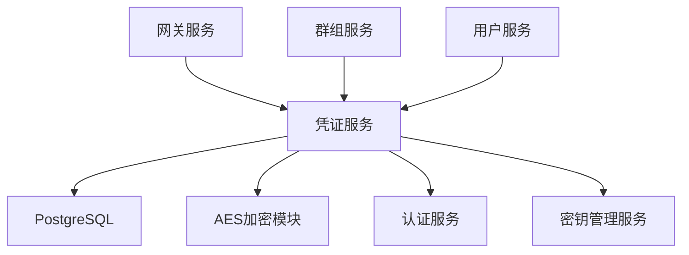

# 凭证服务 (Credential Service) 开发文档

**版本**: 2.0  
**更新时间**: 2025-01-25  
**技术栈**: Go + Kratos + GORM + PostgreSQL + AES加密  
**状态**: 已确认  
**安全等级**: 极高

---

## 服务概述

凭证服务是 Lyss AI Platform 的安全核心之一，专门负责管理用户和群组的AI供应商凭证（API Key），包括安全存储、权限控制、模型配置和使用统计。它实现了"清空并替换"的安全模型，确保敏感凭证信息的安全性。

### 🎯 核心职责

- **凭证安全管理**: API Key的加密存储、安全读取、安全更新
- **多租户支持**: 个人凭证和群组凭证的统一管理
- **供应商适配**: 支持多种AI供应商的凭证格式和配置
- **权限控制**: 基于角色的凭证访问控制
- **配置管理**: 模型参数、速率限制、配额管理
- **使用统计**: 凭证使用次数、成功率、错误统计

### 🔗 服务依赖关系



---

## 安全设计原则

### 🔒 核心安全策略

#### 1. "清空并替换"模型
- API Key等敏感信息在保存后**永远不可查看明文**
- 更新凭证时只能通过"清空"或"替换"操作
- 管理员可编辑非敏感配置（如模型温度等）

#### 2. 多层加密保护
- **传输层加密**: HTTPS/TLS 1.3
- **存储层加密**: AES-256-GCM加密存储
- **密钥管理**: 独立的密钥管理系统
- **访问控制**: 基于JWT的精细权限控制

#### 3. 审计和监控
- **完整操作日志**: 记录所有凭证操作
- **异常检测**: 监控异常访问模式
- **定期轮换**: 支持密钥定期轮换策略

---

## 技术架构设计

### 项目结构

```
credential-service/
├── cmd/
│   └── server/
│       └── main.go              # 服务入口
├── internal/
│   ├── config/
│   │   └── config.go           # 配置管理
│   ├── handler/
│   │   ├── credential.go       # 凭证管理接口
│   │   ├── provider.go         # 供应商管理接口
│   │   └── model.go            # 模型配置接口
│   ├── service/
│   │   ├── credential.go       # 凭证业务逻辑
│   │   ├── encryption.go       # 加密业务逻辑
│   │   ├── provider.go         # 供应商业务逻辑
│   │   └── validation.go       # 凭证验证逻辑
│   ├── repository/
│   │   ├── credential.go       # 凭证数据访问
│   │   └── model_permission.go # 模型权限数据访问
│   ├── model/
│   │   ├── credential.go       # 凭证数据模型
│   │   ├── provider.go         # 供应商数据模型
│   │   └── model_permission.go # 模型权限数据模型
│   ├── middleware/
│   │   ├── auth.go             # 认证中间件
│   │   ├── permission.go       # 权限中间件
│   │   └── audit.go            # 审计中间件
│   └── utils/
│       ├── crypto.go           # 加密工具
│       ├── provider.go         # 供应商工具
│       └── validator.go        # 验证工具
├── pkg/
│   ├── database/
│   │   └── postgres.go         # 数据库连接
│   ├── crypto/
│   │   ├── aes.go              # AES加密
│   │   └── keymanager.go       # 密钥管理
│   ├── client/
│   │   ├── auth.go             # 认证服务客户端
│   │   └── group.go            # 群组服务客户端
│   ├── provider/
│   │   ├── openai.go           # OpenAI适配器
│   │   ├── claude.go           # Claude适配器
│   │   ├── gemini.go           # Gemini适配器
│   │   └── interface.go        # 供应商接口
│   └── logger/
│       └── logger.go           # 日志工具
├── migrations/
│   ├── 001_create_credentials.sql      # 凭证表
│   └── 002_create_model_permissions.sql # 模型权限表
├── docker/
│   └── Dockerfile              # 容器化配置
├── docs/
│   └── api.md                  # API文档
├── go.mod
├── go.sum
└── README.md
```

---

## 数据模型设计

### 供应商凭证模型 (ProviderCredential)

```go
package model

import (
    "time"
    "database/sql/driver"
    "encoding/json"
    "gorm.io/gorm"
)

type ProviderCredential struct {
    ID             uint64               `json:"id" gorm:"primaryKey;autoIncrement"`
    Name           string               `json:"name" gorm:"size:100;not null"`
    ProviderType   ProviderType         `json:"provider_type" gorm:"size:50;not null;index"`
    Scope          CredentialScope      `json:"scope" gorm:"size:20;not null;index"`
    ScopeID        uint64               `json:"scope_id" gorm:"not null;index"`
    
    // 加密存储的敏感信息
    APIKeyEncrypted    string           `json:"-" gorm:"type:text;not null"`
    APISecretEncrypted string           `json:"-" gorm:"type:text"`
    
    // 非敏感配置信息
    APIEndpoint        string           `json:"api_endpoint" gorm:"size:500"`
    Region             string           `json:"region" gorm:"size:50"`
    ModelConfig        ModelConfig      `json:"model_config" gorm:"type:jsonb"`
    RateLimitConfig    RateLimitConfig  `json:"rate_limit_config" gorm:"type:jsonb"`
    
    // 状态和统计
    Status             CredentialStatus `json:"status" gorm:"type:smallint;default:1;index"`
    LastUsedAt         *time.Time       `json:"last_used_at"`
    LastValidatedAt    *time.Time       `json:"last_validated_at"`
    ValidationError    string           `json:"validation_error" gorm:"type:text"`
    UsageCount         int64            `json:"usage_count" gorm:"default:0"`
    ErrorCount         int64            `json:"error_count" gorm:"default:0"`
    
    CreatedAt          time.Time        `json:"created_at"`
    UpdatedAt          time.Time        `json:"updated_at"`
    DeletedAt          gorm.DeletedAt   `json:"-" gorm:"index"`
}

// 供应商类型枚举
type ProviderType string

const (
    ProviderOpenAI      ProviderType = "openai"
    ProviderClaude      ProviderType = "anthropic"
    ProviderGemini      ProviderType = "google"
    ProviderDeepSeek    ProviderType = "deepseek"
    ProviderBaidu       ProviderType = "baidu"
    ProviderTongyi      ProviderType = "tongyi"
    ProviderMiniMax     ProviderType = "minimax"
    ProviderZhipu       ProviderType = "zhipu"
    ProviderMoonshot    ProviderType = "moonshot"
    ProviderDouBao      ProviderType = "doubao"
)

// 凭证范围
type CredentialScope string

const (
    ScopePersonal CredentialScope = "personal"
    ScopeGroup    CredentialScope = "group"
)

// 凭证状态
type CredentialStatus int

const (
    CredentialStatusActive CredentialStatus = iota + 1
    CredentialStatusDisabled
    CredentialStatusError
    CredentialStatusExpired
)

// 模型配置
type ModelConfig struct {
    Temperature      float64           `json:"temperature"`       // 温度参数
    MaxTokens        int               `json:"max_tokens"`       // 最大token数
    TopP             float64           `json:"top_p"`            // Top-p参数
    FrequencyPenalty float64           `json:"frequency_penalty"` // 频率惩罚
    PresencePenalty  float64           `json:"presence_penalty"`  // 存在惩罚
    SystemPrompt     string            `json:"system_prompt"`     // 系统提示词
    CustomSettings   map[string]interface{} `json:"custom_settings"` // 自定义设置
}

// 速率限制配置
type RateLimitConfig struct {
    RequestsPerMinute  int `json:"requests_per_minute"`  // 每分钟请求数
    RequestsPerHour    int `json:"requests_per_hour"`    // 每小时请求数
    RequestsPerDay     int `json:"requests_per_day"`     // 每天请求数
    TokensPerMinute    int `json:"tokens_per_minute"`    // 每分钟token数
    ConcurrentRequests int `json:"concurrent_requests"`  // 并发请求数
}

// JSON序列化支持
func (mc ModelConfig) Value() (driver.Value, error) {
    return json.Marshal(mc)
}

func (mc *ModelConfig) Scan(value interface{}) error {
    if value == nil {
        return nil
    }
    
    bytes, ok := value.([]byte)
    if !ok {
        return fmt.Errorf("cannot scan %T into ModelConfig", value)
    }
    
    return json.Unmarshal(bytes, mc)
}

func (rlc RateLimitConfig) Value() (driver.Value, error) {
    return json.Marshal(rlc)
}

func (rlc *RateLimitConfig) Scan(value interface{}) error {
    if value == nil {
        return nil
    }
    
    bytes, ok := value.([]byte)
    if !ok {
        return fmt.Errorf("cannot scan %T into RateLimitConfig", value)
    }
    
    return json.Unmarshal(bytes, rlc)
}
```

### 模型权限模型 (ModelPermission)

```go
type ModelPermission struct {
    ID           uint64    `json:"id" gorm:"primaryKey;autoIncrement"`
    CredentialID uint64    `json:"credential_id" gorm:"not null;index"`
    ModelName    string    `json:"model_name" gorm:"size:100;not null;index"`
    IsEnabled    bool      `json:"is_enabled" gorm:"default:true"`
    Priority     int       `json:"priority" gorm:"default:0"`
    Weight       int       `json:"weight" gorm:"default:1"`
    
    // 配额限制
    DailyQuota   *int64    `json:"daily_quota"`   // 日配额限制（tokens）
    MonthlyQuota *int64    `json:"monthly_quota"` // 月配额限制（tokens）
    
    // 使用统计
    DailyUsage   int64     `json:"daily_usage" gorm:"default:0"`
    MonthlyUsage int64     `json:"monthly_usage" gorm:"default:0"`
    TotalUsage   int64     `json:"total_usage" gorm:"default:0"`
    
    // 性能统计
    AvgResponseTime  int   `json:"avg_response_time" gorm:"default:0"` // 平均响应时间(ms)
    SuccessRate      float64 `json:"success_rate" gorm:"default:0"`     // 成功率
    LastSuccessAt    *time.Time `json:"last_success_at"`
    LastErrorAt      *time.Time `json:"last_error_at"`
    
    CreatedAt        time.Time `json:"created_at"`
    UpdatedAt        time.Time `json:"updated_at"`
    
    // 关联
    Credential ProviderCredential `json:"credential" gorm:"foreignKey:CredentialID;references:ID"`
}

// 唯一约束
func (ModelPermission) TableName() string {
    return "model_permissions"
}

// 支持的模型列表
var SupportedModels = map[ProviderType][]string{
    ProviderOpenAI: {
        "gpt-4o", "gpt-4o-mini", "gpt-4-turbo", "gpt-4",
        "gpt-3.5-turbo", "text-embedding-3-large", "text-embedding-3-small",
        "dall-e-3", "dall-e-2", "whisper-1", "tts-1",
    },
    ProviderClaude: {
        "claude-3-5-sonnet-20241022", "claude-3-5-haiku-20241022",
        "claude-3-opus-20240229", "claude-3-sonnet-20240229", "claude-3-haiku-20240307",
    },
    ProviderGemini: {
        "gemini-1.5-pro", "gemini-1.5-flash", "gemini-1.0-pro",
        "text-embedding-004", "embedding-001",
    },
    ProviderDeepSeek: {
        "deepseek-chat", "deepseek-coder",
    },
}
```

---

## API接口设计

### 凭证管理接口

#### 1. 创建凭证
```http
POST /api/v1/credentials
Authorization: Bearer {access_token}
Content-Type: application/json

{
    "name": "OpenAI主账号",
    "provider_type": "openai",
    "scope": "personal",
    "api_key": "sk-abcd1234567890abcd1234567890abcd",
    "api_endpoint": "https://api.openai.com/v1",
    "model_config": {
        "temperature": 0.7,
        "max_tokens": 4000,
        "top_p": 0.9,
        "system_prompt": "你是一个专业的AI助手"
    },
    "rate_limit_config": {
        "requests_per_minute": 60,
        "requests_per_hour": 3600,
        "tokens_per_minute": 90000,
        "concurrent_requests": 5
    }
}
```

**响应示例**:
```json
{
    "code": 200,
    "message": "凭证创建成功",
    "data": {
        "id": 1001,
        "name": "OpenAI主账号",
        "provider_type": "openai",
        "scope": "personal",
        "scope_id": 1001,
        "api_endpoint": "https://api.openai.com/v1",
        "status": 1,
        "model_config": {
            "temperature": 0.7,
            "max_tokens": 4000,
            "top_p": 0.9,
            "system_prompt": "你是一个专业的AI助手"
        },
        "rate_limit_config": {
            "requests_per_minute": 60,
            "requests_per_hour": 3600,
            "tokens_per_minute": 90000,
            "concurrent_requests": 5
        },
        "created_at": "2025-01-25T10:30:00Z"
    }
}
```

#### 2. 获取凭证列表
```http
GET /api/v1/credentials?scope=personal&provider_type=openai&status=1
Authorization: Bearer {access_token}
```

**响应示例**:
```json
{
    "code": 200,
    "message": "获取成功",
    "data": {
        "credentials": [
            {
                "id": 1001,
                "name": "OpenAI主账号",
                "provider_type": "openai",
                "scope": "personal",
                "scope_id": 1001,
                "api_endpoint": "https://api.openai.com/v1",
                "status": 1,
                "last_used_at": "2025-01-25T15:20:00Z",
                "last_validated_at": "2025-01-25T10:30:00Z",
                "usage_count": 1256,
                "error_count": 12,
                "model_config": {
                    "temperature": 0.7,
                    "max_tokens": 4000
                },
                "created_at": "2025-01-20T09:15:00Z"
            }
        ],
        "total": 1
    }
}
```

#### 3. 更新凭证配置
```http
PUT /api/v1/credentials/{credential_id}/config
Authorization: Bearer {access_token}
Content-Type: application/json

{
    "name": "OpenAI主账号 - 更新版",
    "model_config": {
        "temperature": 0.8,
        "max_tokens": 8000,
        "top_p": 0.95,
        "system_prompt": "你是一个更加智能的AI助手"
    },
    "rate_limit_config": {
        "requests_per_minute": 100,
        "requests_per_hour": 6000,
        "tokens_per_minute": 150000,
        "concurrent_requests": 10
    }
}
```

#### 4. 替换凭证密钥
```http
PUT /api/v1/credentials/{credential_id}/key
Authorization: Bearer {access_token}
Content-Type: application/json

{
    "operation": "replace",
    "api_key": "sk-new1234567890abcd1234567890abcd",
    "reason": "定期密钥轮换",
    "validate_immediately": true
}
```

**响应示例**:
```json
{
    "code": 200,
    "message": "凭证密钥更新成功",
    "data": {
        "credential_id": 1001,
        "operation": "replace",
        "status": "success",
        "validation_result": {
            "is_valid": true,
            "tested_at": "2025-01-25T16:30:00Z",
            "test_model": "gpt-3.5-turbo",
            "response_time": 1250
        }
    }
}
```

#### 5. 验证凭证
```http
POST /api/v1/credentials/{credential_id}/validate
Authorization: Bearer {access_token}
Content-Type: application/json

{
    "test_model": "gpt-3.5-turbo",
    "test_prompt": "Hello, this is a test message."
}
```

### 模型权限管理接口

#### 1. 配置模型权限
```http
POST /api/v1/credentials/{credential_id}/models
Authorization: Bearer {access_token}
Content-Type: application/json

{
    "models": [
        {
            "model_name": "gpt-4o",
            "is_enabled": true,
            "priority": 10,
            "weight": 5,
            "daily_quota": 100000,
            "monthly_quota": 3000000
        },
        {
            "model_name": "gpt-3.5-turbo",
            "is_enabled": true,
            "priority": 5,
            "weight": 3,
            "daily_quota": 500000,
            "monthly_quota": 15000000
        }
    ]
}
```

#### 2. 获取模型权限
```http
GET /api/v1/credentials/{credential_id}/models
Authorization: Bearer {access_token}
```

**响应示例**:
```json
{
    "code": 200,
    "message": "获取成功",
    "data": {
        "models": [
            {
                "id": 1,
                "model_name": "gpt-4o", 
                "is_enabled": true,
                "priority": 10,
                "weight": 5,
                "daily_quota": 100000,
                "monthly_quota": 3000000,
                "daily_usage": 15600,
                "monthly_usage": 456789,
                "total_usage": 2345678,
                "avg_response_time": 1850,
                "success_rate": 98.7,
                "last_success_at": "2025-01-25T16:25:00Z"
            }
        ]
    }
}
```

#### 3. 获取可用模型
```http
GET /api/v1/credentials/available-models?provider_type=openai
Authorization: Bearer {access_token}
```

---

## 核心业务逻辑实现

### 凭证服务层实现

```go
package service

import (
    "context"
    "errors"
    "fmt"
    "time"
    
    "credential-service/internal/model"
    "credential-service/internal/repository"
    "credential-service/pkg/crypto"
    "credential-service/pkg/provider"
)

type CredentialService struct {
    credentialRepo  repository.CredentialRepository
    modelPermRepo   repository.ModelPermissionRepository
    cryptoManager   *crypto.Manager
    providerManager *provider.Manager
    authClient      client.AuthClient
    groupClient     client.GroupClient
}

func NewCredentialService(
    credentialRepo repository.CredentialRepository,
    modelPermRepo repository.ModelPermissionRepository,
    cryptoManager *crypto.Manager,
    providerManager *provider.Manager,
    authClient client.AuthClient,
    groupClient client.GroupClient,
) *CredentialService {
    return &CredentialService{
        credentialRepo:  credentialRepo,
        modelPermRepo:   modelPermRepo,
        cryptoManager:   cryptoManager,
        providerManager: providerManager,
        authClient:      authClient,
        groupClient:     groupClient,
    }
}

// 创建凭证
func (s *CredentialService) CreateCredential(ctx context.Context, userID uint64, req *CreateCredentialRequest) (*model.ProviderCredential, error) {
    // 1. 参数验证
    if err := s.validateCreateCredentialRequest(req); err != nil {
        return nil, fmt.Errorf("参数验证失败: %w", err)
    }
    
    // 2. 权限检查
    if err := s.checkCreatePermission(ctx, userID, req.Scope, req.ScopeID); err != nil {
        return nil, fmt.Errorf("权限检查失败: %w", err)
    }
    
    // 3. 检查凭证名称唯一性
    exists, err := s.credentialRepo.ExistsByNameAndScope(ctx, req.Name, req.Scope, req.ScopeID)
    if err != nil {
        return nil, fmt.Errorf("检查凭证名称失败: %w", err)
    }
    if exists {
        return nil, errors.New("凭证名称已存在")
    }
    
    // 4. 验证API密钥有效性
    if req.ValidateImmediately {
        if err := s.validateAPIKey(ctx, req.ProviderType, req.APIKey, req.APIEndpoint); err != nil {
            return nil, fmt.Errorf("API密钥验证失败: %w", err)
        }
    }
    
    // 5. 加密敏感信息
    encryptedAPIKey, err := s.cryptoManager.Encrypt(req.APIKey)
    if err != nil {
        return nil, fmt.Errorf("加密API密钥失败: %w", err)
    }
    
    var encryptedAPISecret string
    if req.APISecret != "" {
        encryptedAPISecret, err = s.cryptoManager.Encrypt(req.APISecret)
        if err != nil {
            return nil, fmt.Errorf("加密API密钥失败: %w", err)
        }
    }
    
    // 6. 创建凭证对象
    credential := &model.ProviderCredential{
        Name:               req.Name,
        ProviderType:       req.ProviderType,
        Scope:              req.Scope,
        ScopeID:            req.ScopeID,
        APIKeyEncrypted:    encryptedAPIKey,
        APISecretEncrypted: encryptedAPISecret,
        APIEndpoint:        req.APIEndpoint,
        Region:             req.Region,
        ModelConfig:        req.ModelConfig,
        RateLimitConfig:    req.RateLimitConfig,
        Status:             model.CredentialStatusActive,
        LastValidatedAt:    timePtr(time.Now()),
    }
    
    // 7. 保存到数据库
    if err := s.credentialRepo.Create(ctx, credential); err != nil {
        return nil, fmt.Errorf("保存凭证失败: %w", err)
    }
    
    // 8. 创建默认模型权限
    if err := s.createDefaultModelPermissions(ctx, credential); err != nil {
        logger.Warn("创建默认模型权限失败", zap.Error(err))
    }
    
    // 9. 记录审计日志
    s.auditLog(ctx, userID, "credential_created", credential.ID, map[string]interface{}{
        "name":          credential.Name,
        "provider_type": credential.ProviderType,
        "scope":         credential.Scope,
    })
    
    return credential, nil
}

// 更新凭证密钥
func (s *CredentialService) UpdateCredentialKey(ctx context.Context, userID, credentialID uint64, req *UpdateKeyRequest) error {
    // 1. 获取凭证信息
    credential, err := s.credentialRepo.GetByID(ctx, credentialID)
    if err != nil {
        return fmt.Errorf("凭证不存在: %w", err)
    }
    
    // 2. 权限检查
    if err := s.checkUpdatePermission(ctx, userID, credential); err != nil {
        return fmt.Errorf("权限不足: %w", err)
    }
    
    // 3. 验证新密钥
    if req.ValidateImmediately {
        if err := s.validateAPIKey(ctx, credential.ProviderType, req.APIKey, credential.APIEndpoint); err != nil {
            return fmt.Errorf("新API密钥验证失败: %w", err)
        }
    }
    
    // 4. 加密新密钥
    encryptedAPIKey, err := s.cryptoManager.Encrypt(req.APIKey)
    if err != nil {
        return fmt.Errorf("加密新API密钥失败: %w", err)
    }
    
    // 5. 更新凭证
    now := time.Now()
    credential.APIKeyEncrypted = encryptedAPIKey
    credential.Status = model.CredentialStatusActive
    credential.ValidationError = ""
    credential.LastValidatedAt = &now
    credential.UpdatedAt = now
    
    if err := s.credentialRepo.Update(ctx, credential); err != nil {
        return fmt.Errorf("更新凭证失败: %w", err)
    }
    
    // 6. 记录审计日志
    s.auditLog(ctx, userID, "credential_key_updated", credentialID, map[string]interface{}{
        "operation": req.Operation,
        "reason":    req.Reason,
    })
    
    return nil
}

// 验证凭证
func (s *CredentialService) ValidateCredential(ctx context.Context, userID, credentialID uint64, req *ValidateCredentialRequest) (*ValidationResult, error) {
    // 1. 获取凭证信息
    credential, err := s.credentialRepo.GetByID(ctx, credentialID)
    if err != nil {
        return nil, fmt.Errorf("凭证不存在: %w", err)
    }
    
    // 2. 权限检查
    if err := s.checkReadPermission(ctx, userID, credential); err != nil {
        return nil, fmt.Errorf("权限不足: %w", err)
    }
    
    // 3. 解密API密钥
    apiKey, err := s.cryptoManager.Decrypt(credential.APIKeyEncrypted)
    if err != nil {
        return nil, fmt.Errorf("解密API密钥失败: %w", err)
    }
    
    // 4. 执行验证
    startTime := time.Now()
    providerClient := s.providerManager.GetProvider(credential.ProviderType)
    if providerClient == nil {
        return nil, fmt.Errorf("不支持的供应商类型: %s", credential.ProviderType)
    }
    
    testRequest := &provider.TestRequest{
        APIKey:      apiKey,
        APIEndpoint: credential.APIEndpoint,
        Model:       req.TestModel,
        Prompt:      req.TestPrompt,
    }
    
    testResult, err := providerClient.TestCredential(ctx, testRequest)
    duration := time.Since(startTime)
    
    // 5. 更新验证状态
    now := time.Now()
    if err != nil {
        credential.Status = model.CredentialStatusError
        credential.ValidationError = err.Error()
        credential.ErrorCount++
    } else {
        credential.Status = model.CredentialStatusActive
        credential.ValidationError = ""
        credential.UsageCount++
    }
    credential.LastValidatedAt = &now
    
    s.credentialRepo.Update(ctx, credential)
    
    // 6. 构建验证结果
    result := &ValidationResult{
        CredentialID: credentialID,
        IsValid:      err == nil,
        TestedAt:     now,
        TestModel:    req.TestModel,
        ResponseTime: int(duration.Milliseconds()),
        Error:        err,
    }
    
    if testResult != nil {
        result.TestResponse = testResult.Response
        result.TokensUsed = testResult.TokensUsed
    }
    
    // 7. 记录审计日志
    s.auditLog(ctx, userID, "credential_validated", credentialID, map[string]interface{}{
        "is_valid":      result.IsValid,
        "test_model":    req.TestModel,
        "response_time": result.ResponseTime,
    })
    
    return result, nil
}

// 获取用户可用的凭证
func (s *CredentialService) GetAvailableCredentials(ctx context.Context, userID uint64, req *GetCredentialsRequest) ([]*model.ProviderCredential, error) {
    // 1. 获取个人凭证
    personalCredentials, err := s.credentialRepo.GetByScope(ctx, model.ScopePersonal, userID)
    if err != nil {
        return nil, fmt.Errorf("获取个人凭证失败: %w", err)
    }
    
    // 2. 获取群组凭证
    userGroups, err := s.groupClient.GetUserGroups(ctx, userID)
    if err != nil {
        logger.Warn("获取用户群组失败", zap.Error(err))
        userGroups = []client.Group{} // 继续处理，但不包含群组凭证
    }
    
    var groupCredentials []*model.ProviderCredential
    for _, group := range userGroups {
        // 检查用户在群组中的权限
        if s.canAccessGroupCredentials(group, userID) {
            credentials, err := s.credentialRepo.GetByScope(ctx, model.ScopeGroup, group.ID)
            if err != nil {
                logger.Warn("获取群组凭证失败", zap.Uint64("group_id", group.ID), zap.Error(err))
                continue
            }
            groupCredentials = append(groupCredentials, credentials...)
        }
    }
    
    // 3. 合并结果并应用过滤器
    allCredentials := append(personalCredentials, groupCredentials...)
    
    // 应用过滤器
    var filteredCredentials []*model.ProviderCredential
    for _, credential := range allCredentials {
        if s.matchesFilter(credential, req) {
            filteredCredentials = append(filteredCredentials, credential)
        }
    }
    
    return filteredCredentials, nil
}

// 验证API密钥
func (s *CredentialService) validateAPIKey(ctx context.Context, providerType model.ProviderType, apiKey, endpoint string) error {
    providerClient := s.providerManager.GetProvider(providerType)
    if providerClient == nil {
        return fmt.Errorf("不支持的供应商类型: %s", providerType)
    }
    
    testRequest := &provider.TestRequest{
        APIKey:      apiKey,
        APIEndpoint: endpoint,
        Model:       s.getDefaultTestModel(providerType),
        Prompt:      "Hello, this is a test message.",
    }
    
    _, err := providerClient.TestCredential(ctx, testRequest)
    return err
}

// 创建默认模型权限
func (s *CredentialService) createDefaultModelPermissions(ctx context.Context, credential *model.ProviderCredential) error {
    supportedModels := model.SupportedModels[credential.ProviderType]
    if len(supportedModels) == 0 {
        return nil // 没有预定义模型，跳过
    }
    
    var permissions []*model.ModelPermission
    for i, modelName := range supportedModels {
        permission := &model.ModelPermission{
            CredentialID: credential.ID,
            ModelName:    modelName,
            IsEnabled:    true,
            Priority:     len(supportedModels) - i, // 越靠前优先级越高
            Weight:       1,
        }
        permissions = append(permissions, permission)
    }
    
    return s.modelPermRepo.BatchCreate(ctx, permissions)
}

// 权限检查方法
func (s *CredentialService) checkCreatePermission(ctx context.Context, userID uint64, scope model.CredentialScope, scopeID uint64) error {
    switch scope {
    case model.ScopePersonal:
        return nil // 用户总是可以创建个人凭证
    case model.ScopeGroup:
        // 检查用户在群组中的权限
        hasPermission, err := s.groupClient.CheckPermission(ctx, userID, scopeID, "credential:manage")
        if err != nil {
            return fmt.Errorf("检查群组权限失败: %w", err)
        }
        if !hasPermission {
            return errors.New("无权限在该群组中创建凭证")
        }
        return nil
    default:
        return fmt.Errorf("无效的凭证范围: %s", scope)
    }
}

func (s *CredentialService) checkUpdatePermission(ctx context.Context, userID uint64, credential *model.ProviderCredential) error {
    switch credential.Scope {
    case model.ScopePersonal:
        if credential.ScopeID != userID {
            return errors.New("无权限更新其他用户的个人凭证")
        }
        return nil
    case model.ScopeGroup:
        hasPermission, err := s.groupClient.CheckPermission(ctx, userID, credential.ScopeID, "credential:manage")
        if err != nil {
            return fmt.Errorf("检查群组权限失败: %w", err)
        }
        if !hasPermission {
            return errors.New("无权限更新该群组的凭证")
        }
        return nil
    default:
        return fmt.Errorf("无效的凭证范围: %s", credential.Scope)
    }
}

func (s *CredentialService) checkReadPermission(ctx context.Context, userID uint64, credential *model.ProviderCredential) error {
    switch credential.Scope {
    case model.ScopePersonal:
        if credential.ScopeID != userID {
            return errors.New("无权限访问其他用户的个人凭证")
        }
        return nil
    case model.ScopeGroup:
        hasPermission, err := s.groupClient.CheckPermission(ctx, userID, credential.ScopeID, "credential:read")
        if err != nil {
            return fmt.Errorf("检查群组权限失败: %w", err)
        }
        if !hasPermission {
            return errors.New("无权限访问该群组的凭证")
        }
        return nil
    default:
        return fmt.Errorf("无效的凭证范围: %s", credential.Scope)
    }
}

// 获取默认测试模型
func (s *CredentialService) getDefaultTestModel(providerType model.ProviderType) string {
    defaultModels := map[model.ProviderType]string{
        model.ProviderOpenAI:   "gpt-3.5-turbo",
        model.ProviderClaude:   "claude-3-haiku-20240307",
        model.ProviderGemini:   "gemini-1.0-pro",
        model.ProviderDeepSeek: "deepseek-chat",
    }
    
    if model, exists := defaultModels[providerType]; exists {
        return model
    }
    return "default"
}

// 审计日志记录
func (s *CredentialService) auditLog(ctx context.Context, userID uint64, action string, credentialID uint64, details map[string]interface{}) {
    go func() {
        auditCtx, cancel := context.WithTimeout(context.Background(), 5*time.Second)
        defer cancel()
        
        logger.Info("凭证操作审计",
            zap.Uint64("user_id", userID),
            zap.String("action", action),
            zap.Uint64("credential_id", credentialID),
            zap.Any("details", details),
            zap.String("client_ip", getClientIP(ctx)),
            zap.String("user_agent", getUserAgent(ctx)),
        )
    }()
}
```

### 加密管理器实现

```go
package crypto

import (
    "crypto/aes"
    "crypto/cipher"
    "crypto/rand"
    "crypto/sha256"
    "encoding/base64"
    "fmt"
    "io"
)

type Manager struct {
    aesGCM cipher.AEAD
    keyID  string
}

func NewManager(masterKey, keyID string) (*Manager, error) {
    // 使用SHA256从主密钥生成AES密钥
    hash := sha256.Sum256([]byte(masterKey))
    
    block, err := aes.NewCipher(hash[:])
    if err != nil {
        return nil, fmt.Errorf("创建AES密码器失败: %w", err)
    }
    
    aesGCM, err := cipher.NewGCM(block)
    if err != nil {
        return nil, fmt.Errorf("创建GCM模式失败: %w", err)
    }
    
    return &Manager{
        aesGCM: aesGCM,
        keyID:  keyID,
    }, nil
}

// 加密敏感数据
func (m *Manager) Encrypt(plaintext string) (string, error) {
    if plaintext == "" {
        return "", nil
    }
    
    // 生成随机nonce
    nonce := make([]byte, m.aesGCM.NonceSize())
    if _, err := io.ReadFull(rand.Reader, nonce); err != nil {
        return "", fmt.Errorf("生成nonce失败: %w", err)
    }
    
    // 加密数据
    ciphertext := m.aesGCM.Seal(nonce, nonce, []byte(plaintext), nil)
    
    // Base64编码返回
    return base64.StdEncoding.EncodeToString(ciphertext), nil
}

// 解密敏感数据
func (m *Manager) Decrypt(ciphertext string) (string, error) {
    if ciphertext == "" {
        return "", nil
    }
    
    // Base64解码
    data, err := base64.StdEncoding.DecodeString(ciphertext)
    if err != nil {
        return "", fmt.Errorf("Base64解码失败: %w", err)
    }
    
    nonceSize := m.aesGCM.NonceSize()
    if len(data) < nonceSize {
        return "", fmt.Errorf("密文长度不足")
    }
    
    // 分离nonce和密文
    nonce, cipherBytes := data[:nonceSize], data[nonceSize:]
    
    // 解密数据
    plaintext, err := m.aesGCM.Open(nil, nonce, cipherBytes, nil)
    if err != nil {
        return "", fmt.Errorf("解密失败: %w", err)
    }
    
    return string(plaintext), nil
}

// 密钥轮换支持
func (m *Manager) RotateKey(newMasterKey, newKeyID string) (*Manager, error) {
    return NewManager(newMasterKey, newKeyID)
}

// 获取当前密钥ID
func (m *Manager) GetKeyID() string {
    return m.keyID
}
```

---

## 供应商适配器实现

### 通用供应商接口

```go
package provider

import (
    "context"
    "time"
)

type Provider interface {
    GetName() string
    GetType() string
    TestCredential(ctx context.Context, req *TestRequest) (*TestResult, error)
    ValidateConfig(config map[string]interface{}) error
    GetSupportedModels() []string
    GetDefaultConfig() map[string]interface{}
}

type TestRequest struct {
    APIKey      string
    APISecret   string
    APIEndpoint string
    Model       string
    Prompt      string
    MaxTokens   int
    Temperature float64
}

type TestResult struct {
    Success     bool
    Response    string
    TokensUsed  int
    Duration    time.Duration
    Error       error
}

type Manager struct {
    providers map[string]Provider
}

func NewManager() *Manager {
    return &Manager{
        providers: make(map[string]Provider),
    }
}

func (m *Manager) RegisterProvider(provider Provider) {
    m.providers[provider.GetType()] = provider
}

func (m *Manager) GetProvider(providerType string) Provider {
    return m.providers[providerType]
}

func (m *Manager) GetSupportedProviders() []string {
    var types []string
    for providerType := range m.providers {
        types = append(types, providerType)
    }
    return types
}
```

### OpenAI适配器实现

```go
package provider

import (
    "bytes"
    "context"
    "encoding/json"
    "fmt"
    "net/http"
    "time"
)

type OpenAIProvider struct {
    httpClient *http.Client
}

func NewOpenAIProvider() *OpenAIProvider {
    return &OpenAIProvider{
        httpClient: &http.Client{
            Timeout: 30 * time.Second,
        },
    }
}

func (p *OpenAIProvider) GetName() string {
    return "OpenAI"
}

func (p *OpenAIProvider) GetType() string {
    return "openai"
}

func (p *OpenAIProvider) TestCredential(ctx context.Context, req *TestRequest) (*TestResult, error) {
    startTime := time.Now()
    
    // 构建请求
    endpoint := req.APIEndpoint
    if endpoint == "" {
        endpoint = "https://api.openai.com/v1"
    }
    
    model := req.Model
    if model == "" {
        model = "gpt-3.5-turbo"
    }
    
    requestBody := map[string]interface{}{
        "model": model,
        "messages": []map[string]string{
            {
                "role":    "user",
                "content": req.Prompt,
            },
        },
        "max_tokens":  100,
        "temperature": 0.1,
    }
    
    jsonData, err := json.Marshal(requestBody)
    if err != nil {
        return nil, fmt.Errorf("序列化请求失败: %w", err)
    }
    
    // 创建HTTP请求
    httpReq, err := http.NewRequestWithContext(ctx, "POST", endpoint+"/chat/completions", bytes.NewBuffer(jsonData))
    if err != nil {
        return nil, fmt.Errorf("创建HTTP请求失败: %w", err)
    }
    
    httpReq.Header.Set("Content-Type", "application/json")
    httpReq.Header.Set("Authorization", "Bearer "+req.APIKey)
    
    // 发送请求
    resp, err := p.httpClient.Do(httpReq)
    if err != nil {
        return &TestResult{
            Success:  false,
            Duration: time.Since(startTime),
            Error:    fmt.Errorf("请求失败: %w", err),
        }, nil
    }
    defer resp.Body.Close()
    
    // 解析响应
    var response map[string]interface{}
    if err := json.NewDecoder(resp.Body).Decode(&response); err != nil {
        return &TestResult{
            Success:  false,
            Duration: time.Since(startTime),
            Error:    fmt.Errorf("解析响应失败: %w", err),
        }, nil
    }
    
    duration := time.Since(startTime)
    
    // 检查响应状态
    if resp.StatusCode != 200 {
        errorMsg := "未知错误"
        if errorInfo, ok := response["error"].(map[string]interface{}); ok {
            if message, ok := errorInfo["message"].(string); ok {
                errorMsg = message
            }
        }
        
        return &TestResult{
            Success:  false,
            Duration: duration,
            Error:    fmt.Errorf("API错误(状态码%d): %s", resp.StatusCode, errorMsg),
        }, nil
    }
    
    // 提取响应内容
    var responseContent string
    var tokensUsed int
    
    if choices, ok := response["choices"].([]interface{}); ok && len(choices) > 0 {
        if choice, ok := choices[0].(map[string]interface{}); ok {
            if message, ok := choice["message"].(map[string]interface{}); ok {
                if content, ok := message["content"].(string); ok {
                    responseContent = content
                }
            }
        }
    }
    
    if usage, ok := response["usage"].(map[string]interface{}); ok {
        if totalTokens, ok := usage["total_tokens"].(float64); ok {
            tokensUsed = int(totalTokens)
        }
    }
    
    return &TestResult{
        Success:    true,
        Response:   responseContent,
        TokensUsed: tokensUsed,
        Duration:   duration,
    }, nil
}

func (p *OpenAIProvider) ValidateConfig(config map[string]interface{}) error {
    // 验证配置参数的有效性
    if temp, ok := config["temperature"]; ok {
        if tempFloat, ok := temp.(float64); ok {
            if tempFloat < 0 || tempFloat > 2 {
                return fmt.Errorf("temperature 参数必须在 0-2 之间")
            }
        }
    }
    
    if maxTokens, ok := config["max_tokens"]; ok {
        if maxTokensInt, ok := maxTokens.(int); ok {
            if maxTokensInt < 1 || maxTokensInt > 128000 {
                return fmt.Errorf("max_tokens 参数必须在 1-128000 之间")
            }
        }
    }
    
    return nil
}

func (p *OpenAIProvider) GetSupportedModels() []string {
    return []string{
        "gpt-4o", "gpt-4o-mini", "gpt-4-turbo", "gpt-4",
        "gpt-3.5-turbo", "text-embedding-3-large", "text-embedding-3-small",
        "dall-e-3", "dall-e-2", "whisper-1", "tts-1",
    }
}

func (p *OpenAIProvider) GetDefaultConfig() map[string]interface{} {
    return map[string]interface{}{
        "temperature":       0.7,
        "max_tokens":        4000,
        "top_p":            0.9,
        "frequency_penalty": 0.0,
        "presence_penalty":  0.0,
    }
}
```

---

## 部署配置和安全

### 环境变量配置

```bash
# 服务配置
SERVER_HOST=0.0.0.0
SERVER_PORT=8083
SERVER_READ_TIMEOUT=30
SERVER_WRITE_TIMEOUT=30

# 数据库配置
DB_HOST=postgres
DB_PORT=5432
DB_USERNAME=postgres
DB_PASSWORD=your_ultra_secure_password
DB_DATABASE=credential_service

# 加密配置（极其重要）
MASTER_ENCRYPTION_KEY=your-master-key-must-be-at-least-32-characters-long-and-very-secure
KEY_ID=credential-service-key-v1
KEY_ROTATION_SCHEDULE=90d

# 外部服务配置
AUTH_SERVICE_URL=http://auth-service:8081
GROUP_SERVICE_URL=http://group-service:8082

# 安全配置
ENABLE_AUDIT_LOG=true
AUDIT_LOG_RETENTION_DAYS=365
REQUIRE_VALIDATION_ON_CREATE=true
AUTOMATIC_KEY_ROTATION=false

# 供应商配置
SUPPORTED_PROVIDERS=openai,anthropic,google,deepseek,baidu
DEFAULT_VALIDATION_TIMEOUT=30s
MAX_VALIDATION_RETRIES=3

# 日志配置
LOG_LEVEL=info
LOG_FORMAT=json
SECURITY_LOG_LEVEL=warn
```

### 安全监控和告警

```go
// 安全监控指标
var (
    credentialOperations = prometheus.NewCounterVec(
        prometheus.CounterOpts{
            Name: "credential_service_operations_total",
            Help: "Total number of credential operations",
        },
        []string{"operation", "scope", "provider_type", "status"},
    )
    
    encryptionOperations = prometheus.NewCounterVec(
        prometheus.CounterOpts{
            Name: "credential_service_encryption_operations_total",
            Help: "Total number of encryption/decryption operations",
        },
        []string{"operation", "status"},
    )
    
    validationOperations = prometheus.NewCounterVec(
        prometheus.CounterOpts{
            Name: "credential_service_validation_operations_total",
            Help: "Total number of credential validation operations",
        },
        []string{"provider_type", "status"},
    )
    
    suspiciousActivities = prometheus.NewCounterVec(
        prometheus.CounterOpts{
            Name: "credential_service_suspicious_activities_total",
            Help: "Total number of suspicious activities detected",
        },
        []string{"activity_type", "user_id"},
    )
)

// 安全告警规则
var SecurityAlerts = []AlertRule{
    {
        Name: "高频凭证创建",
        Condition: "rate(credential_service_operations_total{operation='create'}[5m]) > 10",
        Severity: "warning",
        Description: "用户在短时间内创建大量凭证，可能存在异常行为",
    },
    {
        Name: "凭证验证失败率过高",
        Condition: "rate(credential_service_validation_operations_total{status='failed'}[10m]) > 5",
        Severity: "critical",
        Description: "凭证验证失败率异常，可能存在安全问题",
    },
    {
        Name: "解密操作失败",
        Condition: "rate(credential_service_encryption_operations_total{operation='decrypt',status='failed'}[1m]) > 0",
        Severity: "critical",
        Description: "解密操作失败，可能存在密钥问题或攻击",
    },
}
```

---

## 故障排查和运维

### 常见问题诊断

#### 1. 凭证解密失败
```bash
# 检查密钥配置
kubectl get secret credential-encryption-key -o yaml

# 查看解密相关日志
kubectl logs credential-service-pod | grep "decrypt" | tail -20

# 检查密钥轮换状态
curl -H "Authorization: Bearer $ADMIN_TOKEN" \
  http://credential-service:8083/admin/key-status
```

#### 2. 供应商API连接问题
```bash
# 测试供应商API连通性
kubectl exec -it credential-service-pod -- \
  curl -H "Authorization: Bearer sk-test..." \
  https://api.openai.com/v1/models

# 查看验证失败日志
kubectl logs credential-service-pod | grep "validation failed" | tail -10
```

#### 3. 权限检查问题
```bash
# 检查权限相关日志
kubectl logs credential-service-pod | grep "permission denied" | tail -10

# 验证群组服务连接
kubectl exec -it credential-service-pod -- \
  curl http://group-service:8082/health
```

---

*本文档为凭证服务的完整开发指南，包含了最高级别的安全要求和实现细节。务必严格遵循安全最佳实践，确保敏感凭证信息的绝对安全。*

**文档版本**: 1.0  
**安全等级**: 极高  
**最后更新**: 2025-01-25  
**下次安全审查**: 2025-02-10  
**密钥轮换周期**: 90天