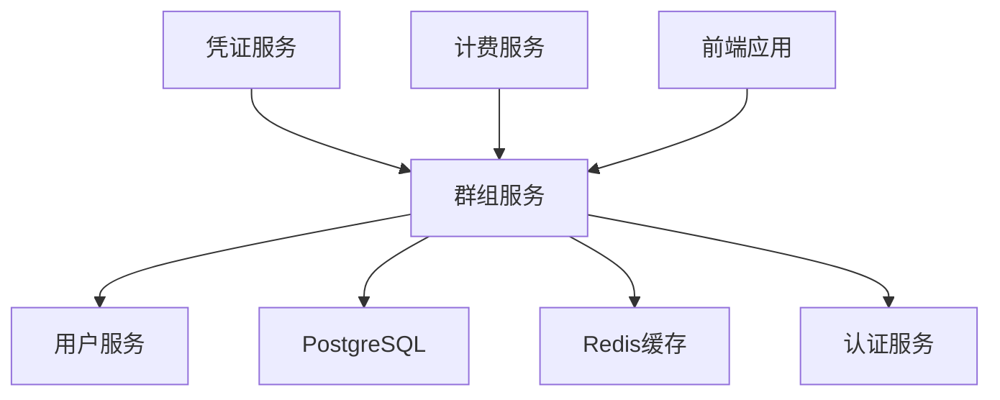
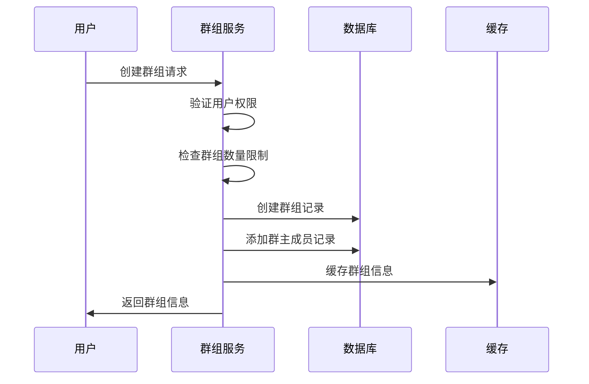
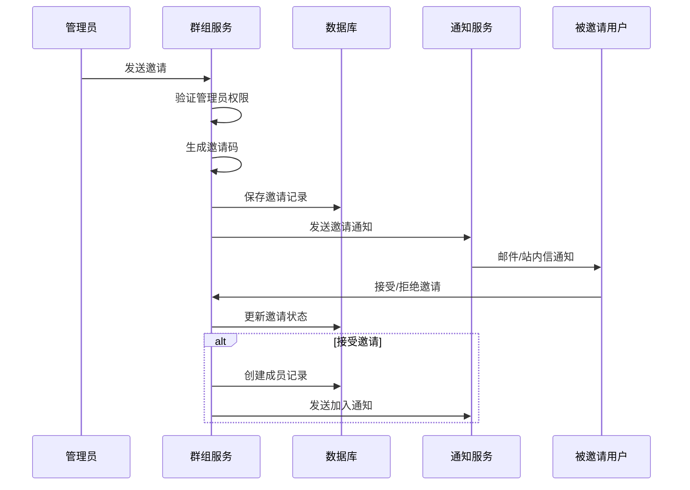

# 群组服务 (Group Service) 开发文档

**版本**: 2.0  
**更新时间**: 2025-01-25  
**技术栈**: Go + Kratos + GORM + PostgreSQL + Redis  
**状态**: 已确认

---

## 服务概述

群组服务是 Lyss AI Platform 的协作核心，负责管理用户群组的完整生命周期，包括群组创建、成员管理、权限控制、邀请系统等功能。它实现了平台的多租户协作模式，让用户可以在群组内共享AI资源和协作工作。

### 🎯 核心职责

- **群组生命周期管理**: 群组创建、配置更新、解散处理
- **成员关系管理**: 成员邀请、加入、退出、角色变更
- **权限体系管理**: 群主、管理员、成员三级权限控制
- **邀请系统**: 邀请码生成、邀请链接管理、邀请审批
- **群组发现**: 公开群组列表、搜索、申请加入

### 🔗 服务依赖关系



---

## 技术架构设计

### 项目结构

```
group-service/
├── cmd/
│   └── server/
│       └── main.go              # 服务入口
├── internal/
│   ├── config/
│   │   └── config.go           # 配置管理
│   ├── handler/
│   │   ├── group.go           # 群组管理接口
│   │   ├── member.go          # 成员管理接口
│   │   └── invitation.go     # 邀请管理接口
│   ├── service/
│   │   ├── group.go           # 群组业务逻辑
│   │   ├── member.go          # 成员业务逻辑
│   │   ├── invitation.go     # 邀请业务逻辑
│   │   └── permission.go     # 权限业务逻辑
│   ├── repository/
│   │   ├── group.go           # 群组数据访问
│   │   ├── member.go          # 成员数据访问
│   │   └── invitation.go     # 邀请数据访问
│   ├── model/
│   │   ├── group.go           # 群组数据模型
│   │   ├── member.go          # 成员数据模型
│   │   └── invitation.go     # 邀请数据模型
│   ├── middleware/
│   │   ├── auth.go            # 认证中间件
│   │   ├── permission.go      # 权限中间件
│   │   └── rate_limit.go      # 限流中间件
│   └── utils/
│       ├── invitation.go      # 邀请码工具
│       ├── permission.go      # 权限检查工具
│       └── notification.go    # 通知工具
├── pkg/
│   ├── database/
│   │   └── postgres.go        # 数据库连接
│   ├── cache/
│   │   └── redis.go           # Redis连接
│   ├── client/
│   │   ├── user.go            # 用户服务客户端
│   │   └── notification.go    # 通知服务客户端
│   └── logger/
│       └── logger.go          # 日志工具
├── migrations/
│   ├── 001_create_groups.sql       # 群组表
│   ├── 002_create_members.sql      # 成员表
│   └── 003_create_invitations.sql  # 邀请表
├── docker/
│   └── Dockerfile            # 容器化配置
├── docs/
│   └── api.md               # API文档
├── go.mod
├── go.sum
└── README.md
```

### 核心业务流程

#### 1. 群组创建流程


#### 2. 成员邀请流程


---

## 数据模型设计

### 群组基础模型 (Group)

```go
package model

import (
    "time"
    "database/sql/driver"
    "encoding/json"
    "gorm.io/gorm"
)

type Group struct {
    ID          uint64         `json:"id" gorm:"primaryKey;autoIncrement"`
    Name        string         `json:"name" gorm:"size:100;not null"`
    Description string         `json:"description" gorm:"type:text"`
    AvatarURL   string         `json:"avatar_url" gorm:"size:500"`
    IsPublic    bool           `json:"is_public" gorm:"default:false;index"`
    JoinMode    GroupJoinMode  `json:"join_mode" gorm:"type:smallint;default:1"`
    MaxMembers  int            `json:"max_members" gorm:"default:50"`
    Status      GroupStatus    `json:"status" gorm:"type:smallint;default:1;index"`
    OwnerUserID uint64         `json:"owner_user_id" gorm:"not null;index"`
    Settings    GroupSettings  `json:"settings" gorm:"type:jsonb"`
    Tags        StringArray    `json:"tags" gorm:"type:jsonb"`
    CreatedAt   time.Time      `json:"created_at"`
    UpdatedAt   time.Time      `json:"updated_at"`
    DeletedAt   gorm.DeletedAt `json:"-" gorm:"index"`
    
    // 关联字段
    Owner   User            `json:"owner" gorm:"foreignKey:OwnerUserID;references:ID"`
    Members []GroupMember   `json:"members" gorm:"foreignKey:GroupID"`
}

// 群组状态
type GroupStatus int

const (
    GroupStatusActive GroupStatus = iota + 1
    GroupStatusFrozen
    GroupStatusDissolved
)

// 加入模式
type GroupJoinMode int

const (
    GroupJoinModeInviteOnly GroupJoinMode = iota + 1 // 仅邀请
    GroupJoinModeApproval                            // 申请审批
    GroupJoinModeOpen                                // 开放加入
)

// 群组设置
type GroupSettings struct {
    AllowGuestView      bool `json:"allow_guest_view"`       // 允许访客查看
    RequireApproval     bool `json:"require_approval"`       // 需要审批
    AutoApproval        bool `json:"auto_approval"`          // 自动审批
    NotifyNewMember     bool `json:"notify_new_member"`      // 新成员通知
    NotifyMemberLeave   bool `json:"notify_member_leave"`    // 成员离开通知
    MaxInvitationsPerDay int `json:"max_invitations_per_day"` // 每日邀请限制
}

// 字符串数组类型（用于标签）
type StringArray []string

func (s StringArray) Value() (driver.Value, error) {
    return json.Marshal(s)
}

func (s *StringArray) Scan(value interface{}) error {
    if value == nil {
        *s = nil
        return nil
    }
    
    bytes, ok := value.([]byte)
    if !ok {
        return fmt.Errorf("cannot scan %T into StringArray", value)
    }
    
    return json.Unmarshal(bytes, s)
}
```

### 群组成员模型 (GroupMember)

```go
type GroupMember struct {
    ID        uint64           `json:"id" gorm:"primaryKey;autoIncrement"`
    GroupID   uint64           `json:"group_id" gorm:"not null;index"`
    UserID    uint64           `json:"user_id" gorm:"not null;index"`
    Role      GroupMemberRole  `json:"role" gorm:"type:smallint;default:1;index"`
    Status    GroupMemberStatus `json:"status" gorm:"type:smallint;default:1;index"`
    JoinedAt  time.Time        `json:"joined_at" gorm:"default:CURRENT_TIMESTAMP"`
    UpdatedAt time.Time        `json:"updated_at"`
    
    // 成员权限配置
    Permissions MemberPermissions `json:"permissions" gorm:"type:jsonb"`
    
    // 成员统计信息
    LastActiveAt   *time.Time `json:"last_active_at"`
    MessageCount   int64      `json:"message_count" gorm:"default:0"`
    InvitedByID    uint64     `json:"invited_by_id" gorm:"index"`
    
    // 关联字段
    Group     Group `json:"group" gorm:"foreignKey:GroupID;references:ID"`
    User      User  `json:"user" gorm:"foreignKey:UserID;references:ID"`
    InvitedBy User  `json:"invited_by" gorm:"foreignKey:InvitedByID;references:ID"`
}

// 成员角色
type GroupMemberRole int

const (
    GroupMemberRoleMember GroupMemberRole = iota + 1 // 普通成员
    GroupMemberRoleAdmin                              // 管理员
    GroupMemberRoleOwner                              // 群主
)

// 成员状态
type GroupMemberStatus int

const (
    GroupMemberStatusActive GroupMemberStatus = iota + 1 // 正常
    GroupMemberStatusMuted                                // 禁言
    GroupMemberStatusKicked                               // 被踢出
)

// 成员权限
type MemberPermissions struct {
    CanInvite           bool `json:"can_invite"`           // 可以邀请成员
    CanRemoveMember     bool `json:"can_remove_member"`    // 可以移除成员
    CanManageGroup      bool `json:"can_manage_group"`     // 可以管理群组
    CanViewAllMessages  bool `json:"can_view_all_messages"` // 可以查看所有消息
    CanManageCredentials bool `json:"can_manage_credentials"` // 可以管理凭证
}

// 获取默认权限
func GetDefaultPermissions(role GroupMemberRole) MemberPermissions {
    switch role {
    case GroupMemberRoleOwner:
        return MemberPermissions{
            CanInvite:           true,
            CanRemoveMember:     true,
            CanManageGroup:      true,
            CanViewAllMessages:  true,
            CanManageCredentials: true,
        }
    case GroupMemberRoleAdmin:
        return MemberPermissions{
            CanInvite:           true,
            CanRemoveMember:     true,
            CanManageGroup:      false,
            CanViewAllMessages:  true,
            CanManageCredentials: true,
        }
    default:
        return MemberPermissions{
            CanInvite:           false,
            CanRemoveMember:     false,
            CanManageGroup:      false,
            CanViewAllMessages:  false,
            CanManageCredentials: false,
        }
    }
}
```

### 群组邀请模型 (GroupInvitation)

```go
type GroupInvitation struct {
    ID               uint64              `json:"id" gorm:"primaryKey;autoIncrement"`
    GroupID          uint64              `json:"group_id" gorm:"not null;index"`
    InviterUserID    uint64              `json:"inviter_user_id" gorm:"not null;index"`
    InviteeEmail     string              `json:"invitee_email" gorm:"size:255;index"`
    InviteeUserID    *uint64             `json:"invitee_user_id" gorm:"index"`
    InvitationCode   string              `json:"invitation_code" gorm:"size:50;uniqueIndex;not null"`
    Status           InvitationStatus    `json:"status" gorm:"type:smallint;default:1;index"`
    Message          string              `json:"message" gorm:"type:text"`
    InvitedRole      GroupMemberRole     `json:"invited_role" gorm:"type:smallint;default:1"`
    ExpiresAt        time.Time           `json:"expires_at" gorm:"not null;index"`
    CreatedAt        time.Time           `json:"created_at"`
    ProcessedAt      *time.Time          `json:"processed_at"`
    
    // 邀请配置
    MaxUses          int                 `json:"max_uses" gorm:"default:1"`
    UsedCount        int                 `json:"used_count" gorm:"default:0"`
    
    // 关联字段
    Group    Group `json:"group" gorm:"foreignKey:GroupID;references:ID"`
    Inviter  User  `json:"inviter" gorm:"foreignKey:InviterUserID;references:ID"`
    Invitee  *User `json:"invitee" gorm:"foreignKey:InviteeUserID;references:ID"`
}

// 邀请状态
type InvitationStatus int

const (
    InvitationStatusPending InvitationStatus = iota + 1 // 待处理
    InvitationStatusAccepted                             // 已接受
    InvitationStatusRejected                             // 已拒绝
    InvitationStatusExpired                              // 已过期
    InvitationStatusCanceled                             // 已取消
)

// 邀请类型
type InvitationType int

const (
    InvitationTypeEmail InvitationType = iota + 1 // 邮箱邀请
    InvitationTypeLink                            // 链接邀请
    InvitationTypeCode                            // 邀请码邀请
)
```

---

## API接口设计

### 群组管理接口

#### 1. 创建群组
```http
POST /api/v1/groups
Authorization: Bearer {access_token}
Content-Type: application/json

{
    "name": "AI研发团队",
    "description": "专注于AI技术研发的团队群组",
    "is_public": false,
    "join_mode": 2,
    "max_members": 100,
    "tags": ["AI", "研发", "技术"],
    "settings": {
        "allow_guest_view": false,
        "require_approval": true,
        "notify_new_member": true,
        "max_invitations_per_day": 10
    }
}
```

**响应示例**:
```json
{
    "code": 200,
    "message": "群组创建成功",
    "data": {
        "id": 1001,
        "name": "AI研发团队",
        "description": "专注于AI技术研发的团队群组",
        "avatar_url": "",
        "is_public": false,
        "join_mode": 2,
        "max_members": 100,
        "status": 1,
        "owner_user_id": 1001,
        "tags": ["AI", "研发", "技术"],
        "member_count": 1,
        "created_at": "2025-01-25T10:30:00Z"
    }
}
```

#### 2. 获取群组信息
```http
GET /api/v1/groups/{group_id}
Authorization: Bearer {access_token}
```

**响应示例**:
```json
{
    "code": 200,
    "message": "获取成功",
    "data": {
        "id": 1001,
        "name": "AI研发团队",
        "description": "专注于AI技术研发的团队群组",
        "avatar_url": "https://cdn.example.com/groups/1001.jpg",
        "is_public": false,
        "join_mode": 2,
        "max_members": 100,
        "status": 1,
        "owner_user_id": 1001,
        "settings": {
            "allow_guest_view": false,
            "require_approval": true,
            "notify_new_member": true,
            "max_invitations_per_day": 10
        },
        "tags": ["AI", "研发", "技术"],
        "member_count": 15,
        "owner": {
            "id": 1001,
            "username": "team_leader",
            "display_name": "张团队长"
        },
        "created_at": "2025-01-20T10:30:00Z",
        "updated_at": "2025-01-25T09:15:00Z"
    }
}
```

#### 3. 更新群组信息
```http
PUT /api/v1/groups/{group_id}
Authorization: Bearer {access_token}
Content-Type: application/json

{
    "name": "AI研发团队 - 更新版",
    "description": "专注于AI技术研发和应用的团队群组",
    "avatar_url": "https://cdn.example.com/groups/new-avatar.jpg",
    "max_members": 120,
    "tags": ["AI", "研发", "技术", "应用"]
}
```

#### 4. 解散群组
```http
DELETE /api/v1/groups/{group_id}
Authorization: Bearer {access_token}
Content-Type: application/json

{
    "reason": "项目结束，群组不再需要",
    "transfer_data": false
}
```

#### 5. 群组列表查询
```http
GET /api/v1/groups?page=1&size=20&status=1&is_public=true&search=AI&tags=研发,技术
Authorization: Bearer {access_token}
```

**响应示例**:
```json
{
    "code": 200,
    "message": "查询成功",
    "data": {
        "groups": [
            {
                "id": 1001,
                "name": "AI研发团队",
                "description": "专注于AI技术研发的团队群组",
                "avatar_url": "https://cdn.example.com/groups/1001.jpg",
                "is_public": true,
                "member_count": 15,
                "max_members": 100,
                "owner": {
                    "display_name": "张团队长"
                },
                "tags": ["AI", "研发", "技术"],
                "created_at": "2025-01-20T10:30:00Z"
            }
        ],
        "pagination": {
            "page": 1,
            "size": 20,
            "total": 45,
            "pages": 3
        }
    }
}
```

### 成员管理接口

#### 1. 获取群组成员列表
```http
GET /api/v1/groups/{group_id}/members?page=1&size=20&role=1&status=1
Authorization: Bearer {access_token}
```

**响应示例**:
```json
{
    "code": 200,
    "message": "获取成功",
    "data": {
        "members": [
            {
                "id": 1,
                "user_id": 1001,
                "role": 3,
                "status": 1,
                "joined_at": "2025-01-20T10:30:00Z",
                "last_active_at": "2025-01-25T15:20:00Z",
                "message_count": 156,
                "user": {
                    "id": 1001,
                    "username": "team_leader",
                    "display_name": "张团队长",
                    "avatar_url": "https://cdn.example.com/avatars/1001.jpg"
                },
                "permissions": {
                    "can_invite": true,
                    "can_remove_member": true,
                    "can_manage_group": true,
                    "can_view_all_messages": true,
                    "can_manage_credentials": true
                }
            }
        ],
        "pagination": {
            "page": 1,
            "size": 20,
            "total": 15,
            "pages": 1
        },
        "statistics": {
            "total_members": 15,
            "active_members": 12,
            "admin_count": 2,
            "member_count": 12
        }
    }
}
```

#### 2. 更新成员角色
```http
PUT /api/v1/groups/{group_id}/members/{user_id}/role
Authorization: Bearer {access_token}
Content-Type: application/json

{
    "role": 2,
    "reason": "提升为管理员协助群组管理",
    "permissions": {
        "can_invite": true,
        "can_remove_member": true,
        "can_manage_group": false,
        "can_view_all_messages": true,
        "can_manage_credentials": true
    }
}
```

#### 3. 移除群组成员
```http
DELETE /api/v1/groups/{group_id}/members/{user_id}
Authorization: Bearer {access_token}
Content-Type: application/json

{
    "reason": "违反群组规则",
    "ban_duration": 86400
}
```

#### 4. 退出群组
```http
POST /api/v1/groups/{group_id}/leave
Authorization: Bearer {access_token}
Content-Type: application/json

{
    "reason": "个人原因退出群组"
}
```

#### 5. 转让群主
```http
POST /api/v1/groups/{group_id}/transfer-ownership
Authorization: Bearer {access_token}
Content-Type: application/json

{
    "new_owner_id": 1002,
    "reason": "转交群组管理权",
    "keep_admin_role": true
}
```

### 邀请管理接口

#### 1. 发送邀请
```http
POST /api/v1/groups/{group_id}/invitations
Authorization: Bearer {access_token}
Content-Type: application/json

{
    "type": "email",
    "invitee_email": "new_member@example.com",
    "invited_role": 1,
    "message": "邀请您加入我们的AI研发团队",
    "expires_in": 168,
    "max_uses": 1
}
```

**响应示例**:
```json
{
    "code": 200,
    "message": "邀请发送成功",
    "data": {
        "invitation_id": 2001,
        "invitation_code": "INV_ABC123DEF456",
        "invitation_link": "https://app.example.com/invitations/INV_ABC123DEF456",
        "expires_at": "2025-02-01T10:30:00Z",
        "invitee_email": "new_member@example.com"
    }
}
```

#### 2. 批量邀请
```http
POST /api/v1/groups/{group_id}/invitations/batch
Authorization: Bearer {access_token}
Content-Type: application/json

{
    "emails": [
        "user1@example.com",
        "user2@example.com",
        "user3@example.com"
    ],
    "invited_role": 1,
    "message": "邀请您加入我们的团队",
    "expires_in": 168
}
```

#### 3. 获取邀请列表
```http
GET /api/v1/groups/{group_id}/invitations?page=1&size=20&status=1
Authorization: Bearer {access_token}
```

#### 4. 处理邀请
```http
POST /api/v1/invitations/{invitation_code}/accept
Authorization: Bearer {access_token}
Content-Type: application/json

{
    "action": "accept",
    "message": "很高兴加入团队"
}
```

#### 5. 撤销邀请
```http
DELETE /api/v1/groups/{group_id}/invitations/{invitation_id}
Authorization: Bearer {access_token}
Content-Type: application/json

{
    "reason": "邀请信息有误，需要重新发送"
}
```

---

## 核心业务逻辑实现

### 群组服务层实现

```go
package service

import (
    "context"
    "errors"
    "fmt"
    "time"
    
    "group-service/internal/model"
    "group-service/internal/repository"
    "group-service/pkg/client"
    "group-service/internal/utils"
)

type GroupService struct {
    groupRepo       repository.GroupRepository
    memberRepo      repository.GroupMemberRepository
    invitationRepo  repository.GroupInvitationRepository
    userClient      client.UserClient
    cache           cache.Cache
    notificationClient client.NotificationClient
}

func NewGroupService(
    groupRepo repository.GroupRepository,
    memberRepo repository.GroupMemberRepository,
    invitationRepo repository.GroupInvitationRepository,
    userClient client.UserClient,
    cache cache.Cache,
    notificationClient client.NotificationClient,
) *GroupService {
    return &GroupService{
        groupRepo:       groupRepo,
        memberRepo:      memberRepo,
        invitationRepo:  invitationRepo,
        userClient:      userClient,
        cache:           cache,
        notificationClient: notificationClient,
    }
}

// 创建群组
func (s *GroupService) CreateGroup(ctx context.Context, userID uint64, req *CreateGroupRequest) (*model.Group, error) {
    // 1. 参数验证
    if err := s.validateCreateGroupRequest(req); err != nil {
        return nil, fmt.Errorf("参数验证失败: %w", err)
    }
    
    // 2. 检查用户权限和配额
    user, err := s.userClient.GetUserByID(ctx, userID)
    if err != nil {
        return nil, fmt.Errorf("获取用户信息失败: %w", err)
    }
    
    // 检查用户创建群组数量限制
    userGroupCount, err := s.groupRepo.CountByOwnerID(ctx, userID)
    if err != nil {
        return nil, fmt.Errorf("检查用户群组数量失败: %w", err)
    }
    
    maxGroups := s.getMaxGroupsForUser(user.Role)
    if userGroupCount >= maxGroups {
        return nil, fmt.Errorf("已达到最大群组创建数量限制(%d)", maxGroups)
    }
    
    // 3. 检查群组名称唯一性
    exists, err := s.groupRepo.ExistsByName(ctx, req.Name)
    if err != nil {
        return nil, fmt.Errorf("检查群组名称失败: %w", err)
    }
    if exists {
        return nil, errors.New("群组名称已存在")
    }
    
    // 4. 创建群组对象
    group := &model.Group{
        Name:        req.Name,
        Description: req.Description,
        AvatarURL:   req.AvatarURL,
        IsPublic:    req.IsPublic,
        JoinMode:    req.JoinMode,
        MaxMembers:  req.MaxMembers,
        Status:      model.GroupStatusActive,
        OwnerUserID: userID,
        Settings:    req.Settings,
        Tags:        req.Tags,
    }
    
    // 5. 开启事务创建群组和群主成员记录
    tx := s.groupRepo.BeginTx(ctx)
    defer tx.Rollback()
    
    // 创建群组
    if err := s.groupRepo.CreateWithTx(ctx, tx, group); err != nil {
        return nil, fmt.Errorf("创建群组失败: %w", err)
    }
    
    // 创建群主成员记录
    ownerMember := &model.GroupMember{
        GroupID:     group.ID,
        UserID:      userID,
        Role:        model.GroupMemberRoleOwner,
        Status:      model.GroupMemberStatusActive,
        Permissions: model.GetDefaultPermissions(model.GroupMemberRoleOwner),
        JoinedAt:    time.Now(),
    }
    
    if err := s.memberRepo.CreateWithTx(ctx, tx, ownerMember); err != nil {
        return nil, fmt.Errorf("创建群主成员记录失败: %w", err)
    }
    
    // 提交事务
    if err := tx.Commit(); err != nil {
        return nil, fmt.Errorf("事务提交失败: %w", err)
    }
    
    // 6. 缓存群组信息
    s.cacheGroupInfo(group)
    
    // 7. 发送创建成功通知
    go s.sendGroupCreatedNotification(ctx, group, user)
    
    return group, nil
}

// 邀请成员
func (s *GroupService) InviteMember(ctx context.Context, userID, groupID uint64, req *InviteMemberRequest) (*model.GroupInvitation, error) {
    // 1. 验证邀请者权限
    member, err := s.memberRepo.GetByGroupAndUser(ctx, groupID, userID)
    if err != nil {
        return nil, fmt.Errorf("获取成员信息失败: %w", err)
    }
    
    if !s.canInviteMembers(member) {
        return nil, errors.New("无权限邀请成员")
    }
    
    // 2. 检查群组状态和容量
    group, err := s.groupRepo.GetByID(ctx, groupID)
    if err != nil {
        return nil, fmt.Errorf("获取群组信息失败: %w", err)
    }
    
    if group.Status != model.GroupStatusActive {
        return nil, errors.New("群组状态异常，无法邀请成员")
    }
    
    // 检查成员数量限制
    memberCount, err := s.memberRepo.CountActiveByGroupID(ctx, groupID)
    if err != nil {
        return nil, fmt.Errorf("获取成员数量失败: %w", err)
    }
    
    if memberCount >= group.MaxMembers {
        return nil, fmt.Errorf("群组成员已达上限(%d)", group.MaxMembers)
    }
    
    // 3. 检查被邀请用户状态
    var inviteeUserID *uint64
    if req.InviteeEmail != "" {
        // 通过邮箱查找用户
        inviteeUser, err := s.userClient.GetUserByEmail(ctx, req.InviteeEmail)
        if err == nil {
            inviteeUserID = &inviteeUser.ID
            
            // 检查用户是否已经是成员
            existingMember, err := s.memberRepo.GetByGroupAndUser(ctx, groupID, inviteeUser.ID)
            if err == nil && existingMember != nil {
                return nil, errors.New("用户已经是群组成员")
            }
        }
    }
    
    // 4. 检查邀请频率限制
    if err := s.checkInvitationRateLimit(ctx, userID, groupID); err != nil {
        return nil, fmt.Errorf("邀请频率超限: %w", err)
    }
    
    // 5. 生成邀请记录
    invitation := &model.GroupInvitation{
        GroupID:        groupID,
        InviterUserID:  userID,
        InviteeEmail:   req.InviteeEmail,
        InviteeUserID:  inviteeUserID,
        InvitationCode: s.generateInvitationCode(),
        Status:         model.InvitationStatusPending,
        Message:        req.Message,
        InvitedRole:    req.InvitedRole,
        ExpiresAt:      time.Now().Add(time.Duration(req.ExpiresIn) * time.Hour),
        MaxUses:        req.MaxUses,
    }
    
    if err := s.invitationRepo.Create(ctx, invitation); err != nil {
        return nil, fmt.Errorf("创建邀请记录失败: %w", err)
    }
    
    // 6. 发送邀请通知
    go s.sendInvitationNotification(ctx, invitation, group, member.User)
    
    return invitation, nil
}

// 处理邀请
func (s *GroupService) ProcessInvitation(ctx context.Context, invitationCode string, userID uint64, action string) error {
    // 1. 获取邀请信息
    invitation, err := s.invitationRepo.GetByCode(ctx, invitationCode)
    if err != nil {
        return fmt.Errorf("邀请不存在: %w", err)
    }
    
    // 2. 验证邀请状态
    if invitation.Status != model.InvitationStatusPending {
        return errors.New("邀请已被处理")
    }
    
    if time.Now().After(invitation.ExpiresAt) {
        return errors.New("邀请已过期")
    }
    
    // 3. 验证用户权限
    if invitation.InviteeUserID != nil && *invitation.InviteeUserID != userID {
        return errors.New("无权限处理此邀请")
    }
    
    // 4. 获取用户和群组信息
    user, err := s.userClient.GetUserByID(ctx, userID)
    if err != nil {
        return fmt.Errorf("获取用户信息失败: %w", err)
    }
    
    group, err := s.groupRepo.GetByID(ctx, invitation.GroupID)
    if err != nil {
        return fmt.Errorf("获取群组信息失败: %w", err)
    }
    
    // 5. 处理邀请
    now := time.Now()
    switch action {
    case "accept":
        // 接受邀请
        invitation.Status = model.InvitationStatusAccepted
        invitation.ProcessedAt = &now
        invitation.UsedCount++
        
        // 检查群组容量
        memberCount, err := s.memberRepo.CountActiveByGroupID(ctx, invitation.GroupID)
        if err != nil {
            return fmt.Errorf("获取成员数量失败: %w", err)
        }
        
        if memberCount >= group.MaxMembers {
            return fmt.Errorf("群组成员已达上限")
        }
        
        // 开启事务
        tx := s.invitationRepo.BeginTx(ctx)
        defer tx.Rollback()
        
        // 更新邀请状态
        if err := s.invitationRepo.UpdateWithTx(ctx, tx, invitation); err != nil {
            return fmt.Errorf("更新邀请状态失败: %w", err)
        }
        
        // 创建成员记录
        member := &model.GroupMember{
            GroupID:     invitation.GroupID,
            UserID:      userID,
            Role:        invitation.InvitedRole,
            Status:      model.GroupMemberStatusActive,
            Permissions: model.GetDefaultPermissions(invitation.InvitedRole),
            InvitedByID: invitation.InviterUserID,
            JoinedAt:    now,
        }
        
        if err := s.memberRepo.CreateWithTx(ctx, tx, member); err != nil {
            return fmt.Errorf("创建成员记录失败: %w", err)
        }
        
        // 提交事务
        if err := tx.Commit(); err != nil {
            return fmt.Errorf("事务提交失败: %w", err)
        }
        
        // 发送加入成功通知
        go s.sendMemberJoinedNotification(ctx, group, user, member)
        
    case "reject":
        // 拒绝邀请
        invitation.Status = model.InvitationStatusRejected
        invitation.ProcessedAt = &now
        
        if err := s.invitationRepo.Update(ctx, invitation); err != nil {
            return fmt.Errorf("更新邀请状态失败: %w", err)
        }
        
        // 发送拒绝通知
        go s.sendInvitationRejectedNotification(ctx, invitation, group, user)
        
    default:
        return fmt.Errorf("无效的操作: %s", action)
    }
    
    return nil
}

// 移除成员
func (s *GroupService) RemoveMember(ctx context.Context, operatorID, groupID, targetUserID uint64, req *RemoveMemberRequest) error {
    // 1. 验证操作者权限
    operatorMember, err := s.memberRepo.GetByGroupAndUser(ctx, groupID, operatorID)
    if err != nil {
        return fmt.Errorf("获取操作者信息失败: %w", err)
    }
    
    if !s.canRemoveMembers(operatorMember) {
        return errors.New("无权限移除成员")
    }
    
    // 2. 获取目标成员信息
    targetMember, err := s.memberRepo.GetByGroupAndUser(ctx, groupID, targetUserID)
    if err != nil {
        return fmt.Errorf("目标成员不存在: %w", err)
    }
    
    // 3. 权限检查
    if !s.canRemoveTargetMember(operatorMember, targetMember) {
        return errors.New("无权限移除该成员")
    }
    
    // 4. 更新成员状态
    targetMember.Status = model.GroupMemberStatusKicked
    targetMember.UpdatedAt = time.Now()
    
    if err := s.memberRepo.Update(ctx, targetMember); err != nil {
        return fmt.Errorf("更新成员状态失败: %w", err)
    }
    
    // 5. 清理相关缓存
    s.clearMemberCache(groupID, targetUserID)
    
    // 6. 发送移除通知
    go s.sendMemberRemovedNotification(ctx, groupID, operatorID, targetUserID, req.Reason)
    
    return nil
}

// 权限检查辅助方法
func (s *GroupService) canInviteMembers(member *model.GroupMember) bool {
    if member.Status != model.GroupMemberStatusActive {
        return false
    }
    
    return member.Role == model.GroupMemberRoleOwner ||
           member.Role == model.GroupMemberRoleAdmin ||
           member.Permissions.CanInvite
}

func (s *GroupService) canRemoveMembers(member *model.GroupMember) bool {
    if member.Status != model.GroupMemberStatusActive {
        return false
    }
    
    return member.Role == model.GroupMemberRoleOwner ||
           member.Role == model.GroupMemberRoleAdmin ||
           member.Permissions.CanRemoveMember
}

func (s *GroupService) canRemoveTargetMember(operator, target *model.GroupMember) bool {
    // 不能移除自己
    if operator.UserID == target.UserID {
        return false
    }
    
    // 群主可以移除任何人
    if operator.Role == model.GroupMemberRoleOwner {
        return true
    }
    
    // 管理员不能移除群主和其他管理员
    if operator.Role == model.GroupMemberRoleAdmin {
        return target.Role == model.GroupMemberRoleMember
    }
    
    return false
}

// 邀请频率限制检查
func (s *GroupService) checkInvitationRateLimit(ctx context.Context, userID, groupID uint64) error {
    // 检查用户今日邀请次数
    todayStart := time.Now().Truncate(24 * time.Hour)
    invitationCount, err := s.invitationRepo.CountByInviterAndDateRange(
        ctx, userID, todayStart, time.Now(),
    )
    if err != nil {
        return fmt.Errorf("检查邀请次数失败: %w", err)
    }
    
    // 获取群组设置中的日邀请限制
    group, err := s.groupRepo.GetByID(ctx, groupID)
    if err != nil {
        return fmt.Errorf("获取群组设置失败: %w", err)
    }
    
    maxInvitationsPerDay := group.Settings.MaxInvitationsPerDay
    if maxInvitationsPerDay > 0 && invitationCount >= maxInvitationsPerDay {
        return fmt.Errorf("今日邀请次数已达上限(%d)", maxInvitationsPerDay)
    }
    
    return nil
}

// 生成邀请码
func (s *GroupService) generateInvitationCode() string {
    return fmt.Sprintf("INV_%s", utils.GenerateRandomString(12))
}

// 获取用户最大群组创建数量
func (s *GroupService) getMaxGroupsForUser(userRole model.UserRole) int {
    switch userRole {
    case model.UserRoleSuperAdmin:
        return 100
    case model.UserRoleAdmin:
        return 20
    default:
        return 3
    }
}
```

### 权限管理服务

```go
package service

// 权限检查服务
type PermissionService struct {
    memberRepo repository.GroupMemberRepository
    cache      cache.Cache
}

// 检查用户在群组中的权限
func (s *PermissionService) CheckPermission(ctx context.Context, userID, groupID uint64, permission string) (bool, error) {
    // 1. 从缓存获取权限信息
    cacheKey := fmt.Sprintf("permission:%d:%d", groupID, userID)
    if cached, err := s.cache.Get(cacheKey); err == nil && cached != nil {
        permissions := cached.(map[string]bool)
        if hasPermission, exists := permissions[permission]; exists {
            return hasPermission, nil
        }
    }
    
    // 2. 从数据库获取成员信息
    member, err := s.memberRepo.GetByGroupAndUser(ctx, groupID, userID)
    if err != nil {
        return false, fmt.Errorf("获取成员信息失败: %w", err)
    }
    
    if member.Status != model.GroupMemberStatusActive {
        return false, nil
    }
    
    // 3. 检查权限
    hasPermission := s.checkMemberPermission(member, permission)
    
    // 4. 缓存权限信息
    s.cachePermissions(userID, groupID, member)
    
    return hasPermission, nil
}

func (s *PermissionService) checkMemberPermission(member *model.GroupMember, permission string) bool {
    switch permission {
    case "group:manage":
        return member.Role == model.GroupMemberRoleOwner || member.Permissions.CanManageGroup
    case "member:invite":
        return member.Role >= model.GroupMemberRoleAdmin || member.Permissions.CanInvite
    case "member:remove":
        return member.Role >= model.GroupMemberRoleAdmin || member.Permissions.CanRemoveMember
    case "credential:manage":
        return member.Role >= model.GroupMemberRoleAdmin || member.Permissions.CanManageCredentials
    case "message:view_all":
        return member.Role >= model.GroupMemberRoleAdmin || member.Permissions.CanViewAllMessages
    default:
        return false
    }
}
```

---

## 部署配置和监控

### 环境变量配置

```bash
# 服务配置
SERVER_HOST=0.0.0.0
SERVER_PORT=8082
SERVER_READ_TIMEOUT=30
SERVER_WRITE_TIMEOUT=30

# 数据库配置
DB_HOST=postgres
DB_PORT=5432
DB_USERNAME=postgres
DB_PASSWORD=your_secure_password
DB_DATABASE=group_service

# Redis配置
REDIS_HOST=redis
REDIS_PORT=6379
REDIS_PASSWORD=your_redis_password
REDIS_DB=2

# 外部服务配置
USER_SERVICE_URL=http://user-service:8080
AUTH_SERVICE_URL=http://auth-service:8081
NOTIFICATION_SERVICE_URL=http://notification-service:8083

# 业务配置
MAX_GROUPS_PER_USER=3
MAX_MEMBERS_PER_GROUP=100
INVITATION_EXPIRY_HOURS=168
MAX_INVITATIONS_PER_DAY=10

# 日志配置
LOG_LEVEL=info
LOG_FORMAT=json
```

### 监控指标

```go
// 群组服务监控指标
var (
    groupOperations = prometheus.NewCounterVec(
        prometheus.CounterOpts{
            Name: "group_service_operations_total",
            Help: "Total number of group operations",
        },
        []string{"operation", "status"},
    )
    
    memberOperations = prometheus.NewCounterVec(
        prometheus.CounterOpts{
            Name: "group_service_member_operations_total",
            Help: "Total number of member operations",
        },
        []string{"operation", "status"},
    )
    
    invitationOperations = prometheus.NewCounterVec(
        prometheus.CounterOpts{
            Name: "group_service_invitation_operations_total", 
            Help: "Total number of invitation operations",
        },
        []string{"operation", "status"},
    )
    
    activeGroups = prometheus.NewGauge(
        prometheus.GaugeOpts{
            Name: "group_service_active_groups",
            Help: "Number of active groups",
        },
    )
)
```

---

*本文档为群组服务的完整开发指南，涵盖了群组管理、成员协作、权限控制等核心功能。请严格按照权限管理要求实现各项功能，确保数据安全性。*

**文档版本**: 1.0  
**最后更新**: 2025-01-25  
**下次审查**: 2025-02-08