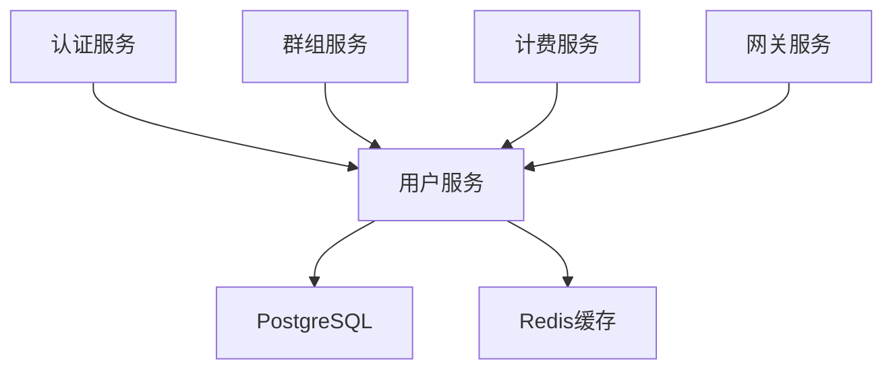

# 用户服务 (User Service) 开发文档

**版本**: 2.0  
**更新时间**: 2025-01-25  
**技术栈**: Go + Kratos + GORM + PostgreSQL  
**状态**: 已确认

---

## 服务概述

用户服务是 Lyss AI Platform 的核心基础服务，负责处理用户的完整生命周期管理，包括注册、登录、信息管理、配额控制等功能。作为系统的基石服务，它为其他微服务提供用户身份识别和基础信息支持。

### 🎯 核心职责

- **用户生命周期管理**: 注册、激活、信息更新、状态管理
- **用户配置管理**: 个人设置、偏好配置、界面定制
- **配额管理**: Token配额分配、使用跟踪、限制控制
- **用户查询服务**: 为其他微服务提供用户信息查询接口

### 🔗 服务依赖关系



---

## 技术架构设计

### 项目结构

```
user-service/
├── cmd/
│   └── server/
│       └── main.go              # 服务入口
├── internal/
│   ├── config/
│   │   └── config.go           # 配置管理
│   ├── handler/
│   │   ├── user.go            # 用户相关接口
│   │   ├── settings.go        # 用户设置接口
│   │   └── quota.go           # 配额管理接口
│   ├── service/
│   │   ├── user.go            # 用户业务逻辑
│   │   ├── settings.go        # 设置业务逻辑
│   │   └── quota.go           # 配额业务逻辑
│   ├── repository/
│   │   ├── user.go            # 用户数据访问
│   │   ├── settings.go        # 设置数据访问
│   │   └── quota.go           # 配额数据访问
│   ├── model/
│   │   ├── user.go            # 用户数据模型
│   │   ├── settings.go        # 设置数据模型
│   │   └── quota.go           # 配额数据模型
│   ├── middleware/
│   │   ├── auth.go            # 认证中间件
│   │   ├── cors.go            # 跨域中间件
│   │   └── rate_limit.go      # 限流中间件
│   └── utils/
│       ├── hash.go            # 密码哈希工具
│       ├── validator.go       # 数据验证工具
│       └── response.go        # 响应格式化工具
├── pkg/
│   ├── database/
│   │   └── postgres.go        # 数据库连接
│   ├── cache/
│   │   └── redis.go           # Redis连接
│   └── logger/
│       └── logger.go          # 日志工具
├── migrations/
│   ├── 001_create_users.sql   # 用户表迁移
│   ├── 002_create_settings.sql # 设置表迁移
│   └── 003_create_quotas.sql  # 配额表迁移
├── docker/
│   └── Dockerfile            # 容器化配置
├── docs/
│   └── api.md               # API文档
├── go.mod
├── go.sum
└── README.md
```

### 核心组件说明

#### 1. Handler层 (HTTP接口层)
负责处理HTTP请求，参数验证，调用Service层业务逻辑

#### 2. Service层 (业务逻辑层)  
实现核心业务逻辑，处理复杂的业务规则和流程

#### 3. Repository层 (数据访问层)
封装数据库操作，提供数据持久化接口

#### 4. Model层 (数据模型层)
定义数据结构和数据库映射关系

---

## 数据模型设计

### 用户基础模型 (User)

```go
package model

import (
    "time"
    "gorm.io/gorm"
)

type User struct {
    ID              uint64         `json:"id" gorm:"primaryKey;autoIncrement"`
    Username        string         `json:"username" gorm:"uniqueIndex;size:50;not null"`
    Email           string         `json:"email" gorm:"uniqueIndex;size:255;not null"`
    PasswordHash    string         `json:"-" gorm:"size:255;not null"`
    DisplayName     string         `json:"display_name" gorm:"size:100"`
    AvatarURL       string         `json:"avatar_url" gorm:"size:500"`
    Status          UserStatus     `json:"status" gorm:"type:smallint;default:1"`
    Role            UserRole       `json:"role" gorm:"type:smallint;default:1"`
    EmailVerified   bool           `json:"email_verified" gorm:"default:false"`
    LastLoginAt     *time.Time     `json:"last_login_at"`
    CreatedAt       time.Time      `json:"created_at"`
    UpdatedAt       time.Time      `json:"updated_at"`
    DeletedAt       gorm.DeletedAt `json:"-" gorm:"index"`
}

type UserStatus int

const (
    UserStatusActive UserStatus = iota + 1
    UserStatusFrozen
    UserStatusDeleted
)

type UserRole int

const (
    UserRoleNormal UserRole = iota + 1
    UserRoleAdmin
    UserRoleSuperAdmin
)
```

### 用户设置模型 (UserSettings)

```go
type UserSettings struct {
    ID           uint64    `json:"id" gorm:"primaryKey;autoIncrement"`
    UserID       uint64    `json:"user_id" gorm:"not null;index"`
    SettingKey   string    `json:"setting_key" gorm:"size:100;not null"`
    SettingValue string    `json:"setting_value" gorm:"type:jsonb"`
    CreatedAt    time.Time `json:"created_at"`
    UpdatedAt    time.Time `json:"updated_at"`
    
    User User `json:"user" gorm:"foreignKey:UserID;references:ID"`
}

// 常用设置键
const (
    SettingLanguage     = "language"
    SettingTheme        = "theme"
    SettingTimezone     = "timezone"
    SettingNotification = "notification"
    SettingPrivacy      = "privacy"
)
```

### 用户配额模型 (UserQuota)

```go
type UserQuota struct {
    ID           uint64    `json:"id" gorm:"primaryKey;autoIncrement"`
    UserID       uint64    `json:"user_id" gorm:"not null;uniqueIndex"`
    TotalQuota   int64     `json:"total_quota" gorm:"default:0"`
    UsedQuota    int64     `json:"used_quota" gorm:"default:0"`
    DailyLimit   int64     `json:"daily_limit" gorm:"default:0"`
    MonthlyLimit int64     `json:"monthly_limit" gorm:"default:0"`
    QuotaResetAt time.Time `json:"quota_reset_at"`
    CreatedAt    time.Time `json:"created_at"`
    UpdatedAt    time.Time `json:"updated_at"`
    
    User User `json:"user" gorm:"foreignKey:UserID;references:ID"`
}

// 配额操作类型
type QuotaOperation string

const (
    QuotaOperationAdd    QuotaOperation = "add"
    QuotaOperationDeduct QuotaOperation = "deduct"
    QuotaOperationReset  QuotaOperation = "reset"
)
```

---

## API接口设计

### 用户管理接口

#### 1. 用户注册
```http
POST /api/v1/users/register
Content-Type: application/json

{
    "username": "johndoe",
    "email": "john@example.com",
    "password": "secure_password_123",
    "display_name": "John Doe"
}
```

**响应示例**:
```json
{
    "code": 200,
    "message": "注册成功",
    "data": {
        "id": 1001,
        "username": "johndoe",
        "email": "john@example.com",
        "display_name": "John Doe",
        "status": 1,
        "role": 1,
        "email_verified": false,
        "created_at": "2025-01-25T10:30:00Z"
    }
}
```

#### 2. 获取用户信息
```http
GET /api/v1/users/{user_id}
Authorization: Bearer {jwt_token}
```

**响应示例**:
```json
{
    "code": 200,
    "message": "获取成功",
    "data": {
        "id": 1001,
        "username": "johndoe",
        "email": "john@example.com",
        "display_name": "John Doe",
        "avatar_url": "https://cdn.example.com/avatars/1001.jpg",
        "status": 1,
        "role": 1,
        "email_verified": true,
        "last_login_at": "2025-01-25T09:15:00Z",
        "created_at": "2025-01-24T10:30:00Z",
        "updated_at": "2025-01-25T09:15:00Z"
    }
}
```

#### 3. 更新用户信息
```http
PUT /api/v1/users/{user_id}
Authorization: Bearer {jwt_token}
Content-Type: application/json

{
    "display_name": "John Smith",
    "avatar_url": "https://cdn.example.com/avatars/new-avatar.jpg"
}
```

#### 4. 用户列表查询 (管理员)
```http
GET /api/v1/users?page=1&size=20&status=1&search=john
Authorization: Bearer {admin_jwt_token}
```

### 用户设置接口

#### 1. 获取用户设置
```http
GET /api/v1/users/{user_id}/settings
Authorization: Bearer {jwt_token}
```

**响应示例**:
```json
{
    "code": 200,
    "message": "获取成功",
    "data": {
        "language": "zh-CN",
        "theme": "dark",
        "timezone": "Asia/Shanghai",
        "notification": {
            "email": true,
            "push": false,
            "quota_warning": true
        },
        "privacy": {
            "profile_public": false,
            "activity_public": false
        }
    }
}
```

#### 2. 更新用户设置
```http
PUT /api/v1/users/{user_id}/settings
Authorization: Bearer {jwt_token}
Content-Type: application/json

{
    "language": "en-US",
    "theme": "light",
    "notification": {
        "email": true,
        "push": true,
        "quota_warning": true
    }
}
```

### 配额管理接口

#### 1. 获取用户配额信息
```http
GET /api/v1/users/{user_id}/quota
Authorization: Bearer {jwt_token}
```

**响应示例**:
```json
{
    "code": 200,
    "message": "获取成功",
    "data": {
        "user_id": 1001,
        "total_quota": 100000,
        "used_quota": 25600,
        "remaining_quota": 74400,
        "daily_limit": 5000,
        "monthly_limit": 50000,
        "usage_percentage": 25.6,
        "quota_reset_at": "2025-02-01T00:00:00Z"
    }
}
```

#### 2. 配额操作 (管理员)
```http
POST /api/v1/users/{user_id}/quota/operation
Authorization: Bearer {admin_jwt_token}
Content-Type: application/json

{
    "operation": "add",
    "amount": 10000,
    "reason": "充值购买"
}
```

---

## 核心业务逻辑实现

### 用户服务层实现

```go
package service

import (
    "context"
    "errors"
    "fmt"
    "time"
    
    "user-service/internal/model"
    "user-service/internal/repository"
    "user-service/pkg/utils"
)

type UserService struct {
    userRepo     repository.UserRepository
    settingsRepo repository.UserSettingsRepository
    quotaRepo    repository.UserQuotaRepository
    cache        cache.Cache
}

func NewUserService(
    userRepo repository.UserRepository,
    settingsRepo repository.UserSettingsRepository,
    quotaRepo repository.UserQuotaRepository,
    cache cache.Cache,
) *UserService {
    return &UserService{
        userRepo:     userRepo,
        settingsRepo: settingsRepo,
        quotaRepo:    quotaRepo,
        cache:        cache,
    }
}

// 用户注册
func (s *UserService) RegisterUser(ctx context.Context, req *RegisterRequest) (*model.User, error) {
    // 1. 参数验证
    if err := s.validateRegisterRequest(req); err != nil {
        return nil, fmt.Errorf("参数验证失败: %w", err)
    }
    
    // 2. 检查用户名和邮箱是否已存在
    exists, err := s.userRepo.ExistsByUsernameOrEmail(ctx, req.Username, req.Email)
    if err != nil {
        return nil, fmt.Errorf("检查用户存在性失败: %w", err)
    }
    if exists {
        return nil, errors.New("用户名或邮箱已存在")
    }
    
    // 3. 密码哈希
    passwordHash, err := utils.HashPassword(req.Password)
    if err != nil {
        return nil, fmt.Errorf("密码哈希失败: %w", err)
    }
    
    // 4. 创建用户对象
    user := &model.User{
        Username:     req.Username,
        Email:        req.Email,
        PasswordHash: passwordHash,
        DisplayName:  req.DisplayName,
        Status:       model.UserStatusActive,
        Role:         model.UserRoleNormal,
    }
    
    // 5. 开启事务创建用户和配额
    tx := s.userRepo.BeginTx(ctx)
    defer tx.Rollback()
    
    // 创建用户
    if err := s.userRepo.CreateWithTx(ctx, tx, user); err != nil {
        return nil, fmt.Errorf("创建用户失败: %w", err)
    }
    
    // 创建初始配额
    quota := &model.UserQuota{
        UserID:       user.ID,
        TotalQuota:   10000, // 默认初始配额
        UsedQuota:    0,
        DailyLimit:   1000,
        MonthlyLimit: 10000,
        QuotaResetAt: time.Now().AddDate(0, 1, 0),
    }
    
    if err := s.quotaRepo.CreateWithTx(ctx, tx, quota); err != nil {
        return nil, fmt.Errorf("创建用户配额失败: %w", err)
    }
    
    // 提交事务
    if err := tx.Commit(); err != nil {
        return nil, fmt.Errorf("事务提交失败: %w", err)
    }
    
    // 6. 清理相关缓存
    s.cache.Delete(fmt.Sprintf("user:%d", user.ID))
    
    return user, nil
}

// 获取用户信息
func (s *UserService) GetUserByID(ctx context.Context, userID uint64) (*model.User, error) {
    // 1. 先尝试从缓存获取
    cacheKey := fmt.Sprintf("user:%d", userID)
    if cached, err := s.cache.Get(cacheKey); err == nil && cached != nil {
        var user model.User
        if err := json.Unmarshal([]byte(cached.(string)), &user); err == nil {
            return &user, nil
        }
    }
    
    // 2. 从数据库获取
    user, err := s.userRepo.GetByID(ctx, userID)
    if err != nil {
        return nil, fmt.Errorf("获取用户失败: %w", err)
    }
    
    // 3. 写入缓存
    if userData, err := json.Marshal(user); err == nil {
        s.cache.Set(cacheKey, string(userData), 5*time.Minute)
    }
    
    return user, nil
}

// 更新用户信息
func (s *UserService) UpdateUser(ctx context.Context, userID uint64, req *UpdateUserRequest) error {
    // 1. 检查用户是否存在
    user, err := s.userRepo.GetByID(ctx, userID)
    if err != nil {
        return fmt.Errorf("用户不存在: %w", err)
    }
    
    // 2. 更新字段
    if req.DisplayName != "" {
        user.DisplayName = req.DisplayName
    }
    if req.AvatarURL != "" {
        user.AvatarURL = req.AvatarURL
    }
    
    // 3. 保存更新
    if err := s.userRepo.Update(ctx, user); err != nil {
        return fmt.Errorf("更新用户失败: %w", err)
    }
    
    // 4. 清理缓存
    s.cache.Delete(fmt.Sprintf("user:%d", userID))
    
    return nil
}

// 验证注册请求
func (s *UserService) validateRegisterRequest(req *RegisterRequest) error {
    if req.Username == "" {
        return errors.New("用户名不能为空")
    }
    if len(req.Username) < 3 || len(req.Username) > 50 {
        return errors.New("用户名长度必须在3-50个字符之间")
    }
    if req.Email == "" {
        return errors.New("邮箱不能为空")
    }
    if !utils.IsValidEmail(req.Email) {
        return errors.New("邮箱格式不正确")
    }
    if req.Password == "" {
        return errors.New("密码不能为空")
    }
    if len(req.Password) < 8 {
        return errors.New("密码长度不能少于8个字符")
    }
    
    return nil
}
```

### 配额管理服务实现

```go
// 配额操作
func (s *UserService) OperateQuota(ctx context.Context, userID uint64, req *QuotaOperationRequest) error {
    // 1. 获取用户配额
    quota, err := s.quotaRepo.GetByUserID(ctx, userID)
    if err != nil {
        return fmt.Errorf("获取用户配额失败: %w", err)
    }
    
    // 2. 执行配额操作
    switch req.Operation {
    case model.QuotaOperationAdd:
        quota.TotalQuota += req.Amount
    case model.QuotaOperationDeduct:
        if quota.TotalQuota < req.Amount {
            return errors.New("配额不足，无法扣除")
        }
        quota.TotalQuota -= req.Amount
    case model.QuotaOperationReset:
        quota.UsedQuota = 0
        quota.QuotaResetAt = time.Now().AddDate(0, 1, 0)
    default:
        return errors.New("不支持的配额操作类型")
    }
    
    // 3. 保存更新
    if err := s.quotaRepo.Update(ctx, quota); err != nil {
        return fmt.Errorf("更新配额失败: %w", err)
    }
    
    // 4. 清理缓存
    s.cache.Delete(fmt.Sprintf("quota:%d", userID))
    
    return nil
}

// 检查配额是否充足
func (s *UserService) CheckQuotaSufficient(ctx context.Context, userID uint64, requiredQuota int64) (bool, error) {
    quota, err := s.quotaRepo.GetByUserID(ctx, userID)
    if err != nil {
        return false, fmt.Errorf("获取用户配额失败: %w", err)
    }
    
    // 检查总配额
    if quota.TotalQuota-quota.UsedQuota < requiredQuota {
        return false, nil
    }
    
    // 检查日限额
    if quota.DailyLimit > 0 {
        dailyUsed, err := s.quotaRepo.GetDailyUsage(ctx, userID, time.Now())
        if err != nil {
            return false, fmt.Errorf("获取日使用量失败: %w", err)
        }
        if dailyUsed+requiredQuota > quota.DailyLimit {
            return false, nil
        }
    }
    
    return true, nil
}
```

---

## 数据访问层实现

### 用户仓储实现

```go
package repository

import (
    "context"
    "fmt"
    
    "user-service/internal/model"
    "gorm.io/gorm"
)

type UserRepository interface {
    Create(ctx context.Context, user *model.User) error
    CreateWithTx(ctx context.Context, tx *gorm.DB, user *model.User) error
    GetByID(ctx context.Context, id uint64) (*model.User, error)
    GetByUsername(ctx context.Context, username string) (*model.User, error)
    GetByEmail(ctx context.Context, email string) (*model.User, error)
    ExistsByUsernameOrEmail(ctx context.Context, username, email string) (bool, error)
    Update(ctx context.Context, user *model.User) error
    Delete(ctx context.Context, id uint64) error
    List(ctx context.Context, req *ListUsersRequest) ([]*model.User, int64, error)
    BeginTx(ctx context.Context) *gorm.DB
}

type userRepository struct {
    db *gorm.DB
}

func NewUserRepository(db *gorm.DB) UserRepository {
    return &userRepository{db: db}
}

func (r *userRepository) Create(ctx context.Context, user *model.User) error {
    return r.db.WithContext(ctx).Create(user).Error
}

func (r *userRepository) CreateWithTx(ctx context.Context, tx *gorm.DB, user *model.User) error {
    return tx.WithContext(ctx).Create(user).Error
}

func (r *userRepository) GetByID(ctx context.Context, id uint64) (*model.User, error) {
    var user model.User
    err := r.db.WithContext(ctx).Where("id = ?", id).First(&user).Error
    if err != nil {
        return nil, err
    }
    return &user, nil
}

func (r *userRepository) GetByUsername(ctx context.Context, username string) (*model.User, error) {
    var user model.User
    err := r.db.WithContext(ctx).Where("username = ?", username).First(&user).Error
    if err != nil {
        return nil, err
    }
    return &user, nil
}

func (r *userRepository) GetByEmail(ctx context.Context, email string) (*model.User, error) {
    var user model.User
    err := r.db.WithContext(ctx).Where("email = ?", email).First(&user).Error
    if err != nil {
        return nil, err
    }
    return &user, nil
}

func (r *userRepository) ExistsByUsernameOrEmail(ctx context.Context, username, email string) (bool, error) {
    var count int64
    err := r.db.WithContext(ctx).Model(&model.User{}).
        Where("username = ? OR email = ?", username, email).
        Count(&count).Error
    return count > 0, err
}

func (r *userRepository) Update(ctx context.Context, user *model.User) error {
    return r.db.WithContext(ctx).Save(user).Error
}

func (r *userRepository) Delete(ctx context.Context, id uint64) error {
    return r.db.WithContext(ctx).Delete(&model.User{}, id).Error
}

func (r *userRepository) List(ctx context.Context, req *ListUsersRequest) ([]*model.User, int64, error) {
    var users []*model.User
    var total int64
    
    query := r.db.WithContext(ctx).Model(&model.User{})
    
    // 状态过滤
    if req.Status > 0 {
        query = query.Where("status = ?", req.Status)
    }
    
    // 搜索关键词
    if req.Search != "" {
        query = query.Where("username ILIKE ? OR email ILIKE ? OR display_name ILIKE ?",
            "%"+req.Search+"%", "%"+req.Search+"%", "%"+req.Search+"%")
    }
    
    // 获取总数
    if err := query.Count(&total).Error; err != nil {
        return nil, 0, err
    }
    
    // 分页查询
    offset := (req.Page - 1) * req.Size
    if err := query.Offset(offset).Limit(req.Size).
        Order("created_at DESC").Find(&users).Error; err != nil {
        return nil, 0, err
    }
    
    return users, total, nil
}

func (r *userRepository) BeginTx(ctx context.Context) *gorm.DB {
    return r.db.WithContext(ctx).Begin()
}
```

---

## HTTP处理器实现

### 用户控制器

```go
package handler

import (
    "context"
    "strconv"
    
    "github.com/go-kratos/kratos/v2/log"
    "user-service/internal/service"
    "user-service/api/user/v1"
)

type UserHandler struct {
    userService *service.UserService
}

func NewUserHandler(userService *service.UserService) *UserHandler {
    return &UserHandler{
        userService: userService,
    }
}

// 用户注册 (Kratos风格)
func (h *UserHandler) Register(ctx context.Context, req *v1.RegisterRequest) (*v1.RegisterResponse, error) {
    user, err := h.userService.RegisterUser(ctx, req)
    if err != nil {
        return nil, err
    }
    
    return &v1.RegisterResponse{
        User: user,
        Message: "注册成功",
    }, nil
}

// 获取用户信息 (Kratos风格)
func (h *UserHandler) GetUser(ctx context.Context, req *v1.GetUserRequest) (*v1.GetUserResponse, error) {
    user, err := h.userService.GetUser(ctx, req.UserId)
    if err != nil {
        return nil, err
    }
    
    return &v1.GetUserResponse{
        User: user,
    }, nil
}
    
    user, err := h.userService.GetUserByID(c.Request.Context(), userID)
    if err != nil {
        utils.ErrorResponse(c, http.StatusNotFound, "用户不存在", err)
        return
    }
    
    utils.SuccessResponse(c, "获取成功", user)
}

// 更新用户信息
func (h *UserHandler) UpdateUser(ctx context.Context, req *v1.UpdateUserRequest) (*v1.UpdateUserResponse, error) {
    userIDStr := c.Param("user_id")
    userID, err := strconv.ParseUint(userIDStr, 10, 64)
    if err != nil {
        utils.ErrorResponse(c, http.StatusBadRequest, "用户ID格式错误", err)
        return
    }
    
    var req UpdateUserRequest
    if err := c.ShouldBindJSON(&req); err != nil {
        utils.ErrorResponse(c, http.StatusBadRequest, "请求参数错误", err)
        return
    }
    
    if err := h.userService.UpdateUser(c.Request.Context(), userID, &req); err != nil {
        utils.ErrorResponse(c, http.StatusBadRequest, "更新失败", err)
        return
    }
    
    utils.SuccessResponse(c, "更新成功", nil)
}

// 用户列表查询
func (h *UserHandler) ListUsers(ctx context.Context, req *v1.ListUsersRequest) (*v1.ListUsersResponse, error) {
    var req ListUsersRequest
    if err := c.ShouldBindQuery(&req); err != nil {
        utils.ErrorResponse(c, http.StatusBadRequest, "请求参数错误", err)
        return
    }
    
    // 设置默认值
    if req.Page <= 0 {
        req.Page = 1
    }
    if req.Size <= 0 || req.Size > 100 {
        req.Size = 20
    }
    
    users, total, err := h.userService.ListUsers(c.Request.Context(), &req)
    if err != nil {
        utils.ErrorResponse(c, http.StatusInternalServerError, "查询失败", err)
        return
    }
    
    utils.PaginationResponse(c, "查询成功", users, total, req.Page, req.Size)
}
```

---

## 配置管理

### 配置结构定义

```go
package config

import (
    "fmt"
    "os"
    "strconv"
)

type Config struct {
    Server   ServerConfig   `json:"server"`
    Database DatabaseConfig `json:"database"`
    Redis    RedisConfig    `json:"redis"`
    Log      LogConfig      `json:"log"`
    JWT      JWTConfig      `json:"jwt"`
}

type ServerConfig struct {
    Host         string `json:"host"`
    Port         int    `json:"port"`
    ReadTimeout  int    `json:"read_timeout"`
    WriteTimeout int    `json:"write_timeout"`
}

type DatabaseConfig struct {
    Host         string `json:"host"`
    Port         int    `json:"port"`
    Username     string `json:"username"`
    Password     string `json:"password"`
    Database     string `json:"database"`
    MaxOpenConns int    `json:"max_open_conns"`
    MaxIdleConns int    `json:"max_idle_conns"`
}

type RedisConfig struct {
    Host     string `json:"host"`
    Port     int    `json:"port"`
    Password string `json:"password"`
    DB       int    `json:"db"`
}

type LogConfig struct {
    Level  string `json:"level"`
    Format string `json:"format"`
}

type JWTConfig struct {
    SecretKey     string `json:"secret_key"`
    ExpireMinutes int    `json:"expire_minutes"`
}

func LoadConfig() (*Config, error) {
    config := &Config{
        Server: ServerConfig{
            Host:         getEnv("SERVER_HOST", "0.0.0.0"),
            Port:         getEnvAsInt("SERVER_PORT", 8080),
            ReadTimeout:  getEnvAsInt("SERVER_READ_TIMEOUT", 30),
            WriteTimeout: getEnvAsInt("SERVER_WRITE_TIMEOUT", 30),
        },
        Database: DatabaseConfig{
            Host:         getEnv("DB_HOST", "localhost"),
            Port:         getEnvAsInt("DB_PORT", 5432),
            Username:     getEnv("DB_USERNAME", "postgres"),
            Password:     getEnv("DB_PASSWORD", ""),
            Database:     getEnv("DB_DATABASE", "user_service"),
            MaxOpenConns: getEnvAsInt("DB_MAX_OPEN_CONNS", 25),
            MaxIdleConns: getEnvAsInt("DB_MAX_IDLE_CONNS", 5),
        },
        Redis: RedisConfig{
            Host:     getEnv("REDIS_HOST", "localhost"),
            Port:     getEnvAsInt("REDIS_PORT", 6379),
            Password: getEnv("REDIS_PASSWORD", ""),
            DB:       getEnvAsInt("REDIS_DB", 0),
        },
        Log: LogConfig{
            Level:  getEnv("LOG_LEVEL", "info"),
            Format: getEnv("LOG_FORMAT", "json"),
        },
        JWT: JWTConfig{
            SecretKey:     getEnv("JWT_SECRET_KEY", "your-secret-key"),
            ExpireMinutes: getEnvAsInt("JWT_EXPIRE_MINUTES", 1440),
        },
    }
    
    return config, nil
}

func getEnv(key, defaultValue string) string {
    if value := os.Getenv(key); value != "" {
        return value
    }
    return defaultValue
}

func getEnvAsInt(key string, defaultValue int) int {
    if value := os.Getenv(key); value != "" {
        if intValue, err := strconv.Atoi(value); err == nil {
            return intValue
        }
    }
    return defaultValue
}
```

---

## 部署配置

### Dockerfile

```dockerfile
# 构建阶段
FROM golang:1.21-alpine AS builder

WORKDIR /app

# 安装必要的包
RUN apk add --no-cache git

# 复制 go mod 文件
COPY go.mod go.sum ./
RUN go mod download

# 复制源代码
COPY . .

# 构建应用
RUN CGO_ENABLED=0 GOOS=linux go build -a -installsuffix cgo -o main cmd/server/main.go

# 运行阶段
FROM alpine:latest

WORKDIR /root/

# 安装 ca-certificates 用于 HTTPS 请求
RUN apk --no-cache add ca-certificates

# 从构建阶段复制二进制文件
COPY --from=builder /app/main .

# 复制迁移文件
COPY --from=builder /app/migrations ./migrations

# 暴露端口
EXPOSE 8080

# 运行应用
CMD ["./main"]
```

### docker-compose.yml

```yaml
version: '3.8'

services:
  user-service:
    build:
      context: .
      dockerfile: docker/Dockerfile
    ports:
      - "8080:8080"
    environment:
      - SERVER_HOST=0.0.0.0
      - SERVER_PORT=8080
      - DB_HOST=postgres
      - DB_PORT=5432
      - DB_USERNAME=postgres
      - DB_PASSWORD=postgres
      - DB_DATABASE=user_service
      - REDIS_HOST=redis
      - REDIS_PORT=6379
      - JWT_SECRET_KEY=your-super-secret-jwt-key
      - LOG_LEVEL=info
    depends_on:
      - postgres
      - redis
    networks:
      - lyss-network

  postgres:
    image: postgres:15-alpine
    environment:
      - POSTGRES_DB=user_service
      - POSTGRES_USER=postgres
      - POSTGRES_PASSWORD=postgres
    ports:
      - "5432:5432"
    volumes:
      - postgres_data:/var/lib/postgresql/data
      - ./migrations:/docker-entrypoint-initdb.d
    networks:
      - lyss-network

  redis:
    image: redis:7-alpine
    ports:
      - "6379:6379"
    volumes:
      - redis_data:/data
    networks:
      - lyss-network

volumes:
  postgres_data:
  redis_data:

networks:
  lyss-network:
    driver: bridge
```

---

## 测试策略

### 单元测试示例

```go
package service

import (
    "context"
    "testing"
    
    "github.com/stretchr/testify/assert"
    "github.com/stretchr/testify/mock"
    "user-service/internal/model"
)

// Mock Repository
type MockUserRepository struct {
    mock.Mock
}

func (m *MockUserRepository) Create(ctx context.Context, user *model.User) error {
    args := m.Called(ctx, user)
    return args.Error(0)
}

func (m *MockUserRepository) ExistsByUsernameOrEmail(ctx context.Context, username, email string) (bool, error) {
    args := m.Called(ctx, username, email)
    return args.Bool(0), args.Error(1)
}

// 测试用户注册
func TestUserService_RegisterUser(t *testing.T) {
    // 准备测试数据
    mockRepo := new(MockUserRepository)
    mockCache := new(MockCache)
    service := NewUserService(mockRepo, nil, nil, mockCache)
    
    req := &RegisterRequest{
        Username:    "testuser",
        Email:       "test@example.com",
        Password:    "password123",
        DisplayName: "Test User",
    }
    
    // 设置 Mock 期望
    mockRepo.On("ExistsByUsernameOrEmail", mock.Anything, req.Username, req.Email).Return(false, nil)
    mockRepo.On("BeginTx", mock.Anything).Return(&gorm.DB{})
    mockRepo.On("CreateWithTx", mock.Anything, mock.Anything, mock.AnythingOfType("*model.User")).Return(nil)
    
    // 执行测试
    user, err := service.RegisterUser(context.Background(), req)
    
    // 验证结果
    assert.NoError(t, err)
    assert.NotNil(t, user)
    assert.Equal(t, req.Username, user.Username)
    assert.Equal(t, req.Email, user.Email)
    assert.Equal(t, req.DisplayName, user.DisplayName)
    
    // 验证 Mock 调用
    mockRepo.AssertExpectations(t)
}
```

### 集成测试示例

```go
package integration

import (
    "bytes"
    "encoding/json"
    "net/http"
    "net/http/httptest"
    "testing"
    
    "github.com/go-kratos/kratos/v2/middleware"
    "github.com/stretchr/testify/assert"
    "user-service/internal/handler"
)

func TestUserHandler_Register(t *testing.T) {
    // 设置测试环境
    // Kratos测试环境初始化
    app := kratos.New()
    
    userHandler := handler.NewUserHandler(userService)
    router.POST("/api/v1/users/register", userHandler.Register)
    
    // 准备测试数据
    reqData := map[string]interface{}{
        "username":     "testuser",
        "email":        "test@example.com",
        "password":     "password123",
        "display_name": "Test User",
    }
    
    jsonData, _ := json.Marshal(reqData)
    
    // 创建测试请求
    req, _ := http.NewRequest("POST", "/api/v1/users/register", bytes.NewBuffer(jsonData))
    req.Header.Set("Content-Type", "application/json")
    
    // 执行请求
    w := httptest.NewRecorder()
    router.ServeHTTP(w, req)
    
    // 验证响应
    assert.Equal(t, http.StatusOK, w.Code)
    
    var response map[string]interface{}
    err := json.Unmarshal(w.Body.Bytes(), &response)
    assert.NoError(t, err)
    assert.Equal(t, float64(200), response["code"])
    assert.Equal(t, "注册成功", response["message"])
}
```

---

## 性能优化建议

### 1. 数据库优化
- **索引优化**: 为常用查询字段建立复合索引
- **连接池配置**: 合理设置数据库连接池大小
- **慢查询监控**: 监控执行时间超过100ms的查询

### 2. 缓存策略
- **用户信息缓存**: 热点用户数据缓存5分钟
- **配额信息缓存**: 配额数据缓存1分钟，及时更新
- **设置信息缓存**: 用户设置缓存15分钟

### 3. 服务性能
- **HTTP连接复用**: 配置合适的连接超时时间
- **优雅关闭**: 实现信号处理，确保服务优雅关闭
- **限流保护**: 实现基于IP和用户的访问限流

---

## 监控和日志

### 关键指标监控

```go
// 监控指标定义
var (
    // HTTP请求统计
    httpRequestsTotal = prometheus.NewCounterVec(
        prometheus.CounterOpts{
            Name: "user_service_http_requests_total",
            Help: "Total number of HTTP requests.",
        },
        []string{"method", "endpoint", "status"},
    )
    
    // 响应时间分布
    httpRequestDuration = prometheus.NewHistogramVec(
        prometheus.HistogramOpts{
            Name: "user_service_http_request_duration_seconds",
            Help: "HTTP request duration in seconds.",
        },
        []string{"method", "endpoint"},
    )
    
    // 数据库连接池状态
    dbConnectionsInUse = prometheus.NewGauge(
        prometheus.GaugeOpts{
            Name: "user_service_db_connections_in_use",
            Help: "Number of database connections in use.",
        },
    )
)
```

### 日志记录规范

```go
// 结构化日志示例
logger.Info("用户注册成功",
    zap.String("username", user.Username),
    zap.String("email", user.Email),
    zap.Uint64("user_id", user.ID),
    zap.String("client_ip", clientIP),
    zap.Duration("duration", time.Since(startTime)),
)

logger.Error("数据库操作失败",
    zap.String("operation", "create_user"),
    zap.Error(err),
    zap.String("username", req.Username),
    zap.String("trace_id", traceID),
)
```

---

## 安全考虑

### 1. 输入验证
- 所有用户输入进行严格验证
- 防止SQL注入和XSS攻击
- 限制请求参数长度和格式

### 2. 密码安全
- 使用bcrypt进行密码哈希
- 强制密码复杂度要求
- 支持密码重置和修改

### 3. 访问控制
- JWT令牌验证
- 接口权限检查
- 敏感操作二次验证

### 4. 数据保护
- 敏感数据加密存储
- 审计日志记录
- 个人信息脱敏处理

---

## 故障排查

### 常见问题及解决方案

#### 1. 数据库连接失败
```bash
# 检查数据库连接配置
kubectl logs user-service-pod | grep "database connection"

# 检查网络连通性
kubectl exec -it user-service-pod -- ping postgres-service
```

#### 2. 缓存连接异常
```bash
# 检查Redis连接状态
kubectl exec -it redis-pod -- redis-cli ping

# 查看缓存相关日志
kubectl logs user-service-pod | grep "cache"
```

#### 3. 性能问题诊断
```bash
# 查看响应时间分布
curl http://user-service:8080/metrics | grep http_request_duration

# 监控数据库慢查询
tail -f /var/log/postgresql/postgresql.log | grep "slow query"
```

---

*本文档为用户服务的完整开发指南，涵盖了从架构设计到部署运维的全部内容。开发过程中请严格遵循本文档的规范和最佳实践。*

**文档版本**: 1.0  
**最后更新**: 2025-01-25  
**下次审查**: 2025-02-01