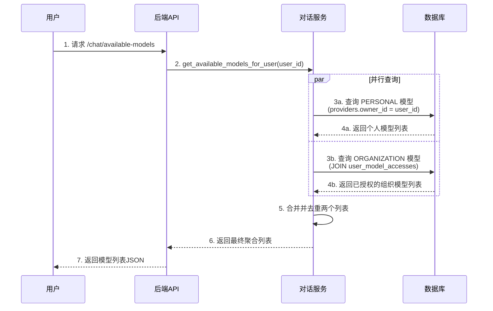
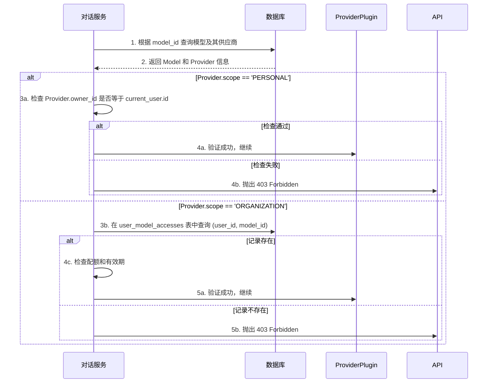

# LYSS AI 平台 - 核心业务流程实现 (V2.1)

**版本**: 2.1
**最后更新**: 2025年7月2日

---

## 1. 概述

本文档阐述了 V2.1 架构下，平台后端关键业务流程的实现逻辑。

## 2. 业务流程一: 聚合用户可用模型列表

此���程对应 `GET /api/v1/chat/available-models` 端点，是用户开始聊天的第一步。

### 2.1. 流程图



### 2.2. 服务层实现

```python
# app/services/chat_service.py
from sqlalchemy.orm import selectinload
from sqlalchemy import select
from app.models import Provider, Model, UserModelAccess

class ChatService:
    async def get_available_models_for_user(self, db: AsyncSession, user_id: uuid.UUID) -> list[Model]:
        # 1. 获取用户自己的 PERSONAL 模型
        personal_stmt = (
            select(Model)
            .join(Provider)
            .where(Provider.owner_id == user_id, Provider.scope == 'PERSONAL', Provider.is_enabled == True)
            .options(selectinload(Model.provider)) # 预加载供应商信息
        )
        personal_models_result = await db.execute(personal_stmt)
        personal_models = personal_models_result.scalars().all()

        # 2. 获取分发给用户的 ORGANIZATION 模型
        org_stmt = (
            select(Model)
            .join(UserModelAccess, Model.id == UserModelAccess.model_id)
            .join(Provider)
            .where(UserModelAccess.user_id == user_id, Provider.scope == 'ORGANIZATION', Provider.is_enabled == True)
            .options(selectinload(Model.provider))
        )
        org_models_result = await db.execute(org_stmt)
        org_models = org_models_result.scalars().all()

        # 3. 合并和去重
        all_models = {model.id: model for model in personal_models}
        all_models.update({model.id: model for model in org_models})

        return list(all_models.values())
```

## 3. 业务流程二: 对话权限验证 (V2.1)

在用户发起对话请求时，验证其对所选模型 `model_id` 的使用权。

### 3.1. 流程图



---
(成本计算等其他流程无核心变化)
