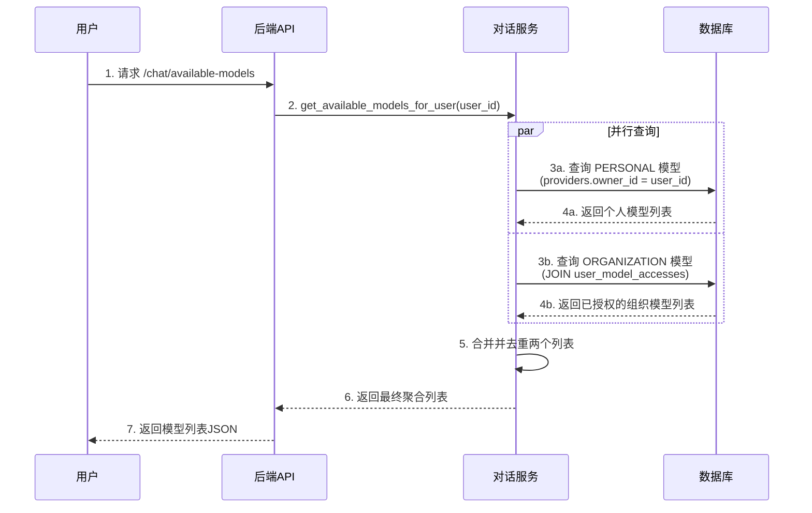
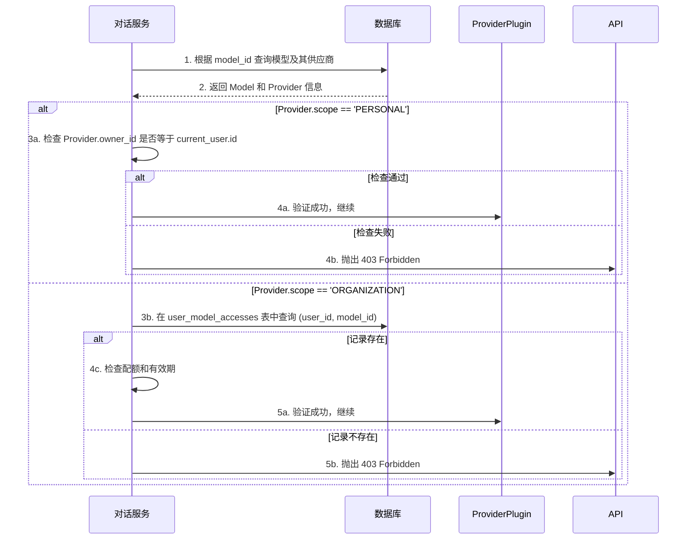
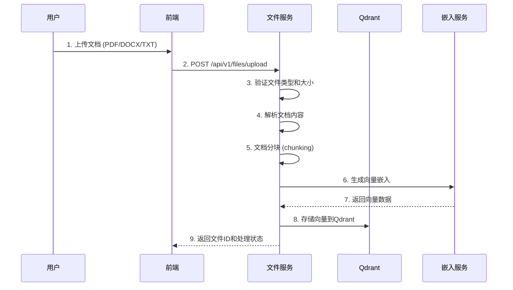

# LYSS AI 平台 - 核心业务流程实现 (V2.1)

**版本**: 2.1
**最后更新**: 2025年7月2日

---

## 1. 概述

本文档阐述了 V2.1 架构下，平台后端关键业务流程的实现逻辑。

## 2. 业务流程一: 聚合用户可用模型列表

此���程对应 `GET /api/v1/chat/available-models` 端点，是用户开始聊天的第一步。

### 2.1. 流程图



### 2.2. 服务层实现

```python
# app/services/chat_service.py
from sqlalchemy.orm import selectinload
from sqlalchemy import select, and_
from app.models import Provider, Model, UserModelAccess
from datetime import datetime

class ChatService:
    async def get_available_models_for_user(self, db: AsyncSession, user_id: uuid.UUID) -> list[Model]:
        # 1. 获取用户自己的 PERSONAL 模型
        personal_stmt = (
            select(Model)
            .join(Provider)
            .where(
                and_(
                    Provider.owner_id == user_id,
                    Provider.scope == 'PERSONAL',
                    Provider.is_enabled == True
                )
            )
            .options(selectinload(Model.provider)) # 预加载供应商信息
        )
        personal_models_result = await db.execute(personal_stmt)
        personal_models = personal_models_result.scalars().all()

        # 2. 获取分发给用户的 ORGANIZATION 模型（包含权限有效性检查）
        current_time = datetime.utcnow()
        org_stmt = (
            select(Model)
            .join(UserModelAccess, Model.id == UserModelAccess.model_id)
            .join(Provider)
            .where(
                and_(
                    UserModelAccess.user_id == user_id,
                    Provider.scope == 'ORGANIZATION',
                    Provider.is_enabled == True,
                    # 检查权限有效期
                    or_(
                        UserModelAccess.expires_at.is_(None),  # 永久权限
                        UserModelAccess.expires_at > current_time  # 未过期
                    ),
                    UserModelAccess.is_active == True
                )
            )
            .options(selectinload(Model.provider))
        )
        org_models_result = await db.execute(org_stmt)
        org_models = org_models_result.scalars().all()

        # 3. 合并和去重
        all_models = {model.id: model for model in personal_models}
        all_models.update({model.id: model for model in org_models})

        return list(all_models.values())
    
    async def verify_model_access(self, db: AsyncSession, model_id: uuid.UUID, user_id: uuid.UUID) -> bool:
        """验证用户对特定模型的访问权限"""
        # 获取模型和其供应商信息
        model_stmt = (
            select(Model)
            .join(Provider)
            .where(Model.id == model_id)
            .options(selectinload(Model.provider))
        )
        result = await db.execute(model_stmt)
        model = result.scalar_one_or_none()
        
        if not model or not model.provider.is_enabled:
            return False
        
        # 检查个人模型权限
        if model.provider.scope == 'PERSONAL':
            return model.provider.owner_id == user_id
        
        # 检查组织模型权限
        if model.provider.scope == 'ORGANIZATION':
            access_stmt = (
                select(UserModelAccess)
                .where(
                    and_(
                        UserModelAccess.user_id == user_id,
                        UserModelAccess.model_id == model_id,
                        UserModelAccess.is_active == True,
                        or_(
                            UserModelAccess.expires_at.is_(None),
                            UserModelAccess.expires_at > datetime.utcnow()
                        )
                    )
                )
            )
            access_result = await db.execute(access_stmt)
            access = access_result.scalar_one_or_none()
            return access is not None
        
        return False
```

## 3. 业务流程二: 对话权限验证 (V2.1)

在用户发起对话请求时，验证其对所选模型 `model_id` 的使用权。

### 3.1. 流程图



## 4. 业务流程三: 文件处理与文档问答

### 4.1. 文件上传与处理流程



### 4.2. 文档问答流程

```python
# app/services/file_service.py
from app.services.embedding_service import EmbeddingService
from qdrant_client import QdrantClient
from qdrant_client.http import models

class FileService:
    def __init__(self):
        self.qdrant_client = QdrantClient(url=settings.QDRANT_URL)
        self.embedding_service = EmbeddingService()

    async def process_document(self, file_path: str, user_id: str) -> str:
        """处理上传的文档"""
        # 1. 解析文档内容
        content = await self._extract_content(file_path)
        
        # 2. 文档分块
        chunks = self._chunk_document(content)
        
        # 3. 生成向量并存储
        collection_name = f"user_{user_id}_documents"
        await self._ensure_collection_exists(collection_name)
        
        for i, chunk in enumerate(chunks):
            # 生成嵌入向量
            vector = await self.embedding_service.embed_text(chunk.content)
            
            # 存储到Qdrant
            self.qdrant_client.upsert(
                collection_name=collection_name,
                points=[
                    models.PointStruct(
                        id=f"{file_path}_{i}",
                        vector=vector,
                        payload={
                            "content": chunk.content,
                            "file_path": file_path,
                            "chunk_index": i,
                            "user_id": user_id
                        }
                    )
                ]
            )
        
        return f"Document processed: {len(chunks)} chunks"

    async def search_documents(self, user_id: str, query: str, limit: int = 5) -> list[str]:
        """搜索相关文档片段"""
        collection_name = f"user_{user_id}_documents"
        
        # 生成查询向量
        query_vector = await self.embedding_service.embed_text(query)
        
        # 在Qdrant中搜索
        search_result = self.qdrant_client.search(
            collection_name=collection_name,
            query_vector=query_vector,
            limit=limit,
            score_threshold=0.7  # 相似度阈值
        )
        
        # 返回相关文档内容
        return [hit.payload["content"] for hit in search_result]
```

## 5. 业务流程四: 成本计算与用量统计

### 5.1. 成本计算实现

```python
# app/services/usage_service.py
from app.models import UsageLog, Model, Provider
from decimal import Decimal

class UsageService:
    async def record_usage(
        self, 
        db: AsyncSession,
        user_id: uuid.UUID,
        model_id: uuid.UUID,
        prompt_tokens: int,
        completion_tokens: int,
        total_tokens: int
    ) -> UsageLog:
        """记录API使用情况并计算成本"""
        
        # 获取模型定价信息
        model = await db.get(Model, model_id)
        if not model:
            raise ValueError("Model not found")
        
        # 计算成本 (假设模型有 price_per_1k_tokens 字段)
        cost = self._calculate_cost(
            prompt_tokens=prompt_tokens,
            completion_tokens=completion_tokens,
            model=model
        )
        
        # 创建使用记录
        usage_log = UsageLog(
            user_id=user_id,
            model_id=model_id,
            prompt_tokens=prompt_tokens,
            completion_tokens=completion_tokens,
            total_tokens=total_tokens,
            cost=cost,
            created_at=datetime.utcnow()
        )
        
        db.add(usage_log)
        await db.commit()
        return usage_log
    
    def _calculate_cost(self, prompt_tokens: int, completion_tokens: int, model: Model) -> Decimal:
        """计算API调用成本"""
        # 不同模型可能有不同的定价策略
        if hasattr(model, 'price_per_1k_prompt_tokens') and hasattr(model, 'price_per_1k_completion_tokens'):
            # 分别计费模式
            prompt_cost = Decimal(prompt_tokens) * model.price_per_1k_prompt_tokens / 1000
            completion_cost = Decimal(completion_tokens) * model.price_per_1k_completion_tokens / 1000
            return prompt_cost + completion_cost
        else:
            # 统一计费模式
            total_tokens = prompt_tokens + completion_tokens
            return Decimal(total_tokens) * model.price_per_1k_tokens / 1000

    async def get_user_usage_stats(self, db: AsyncSession, user_id: uuid.UUID, days: int = 30) -> dict:
        """获取用户使用统计"""
        start_date = datetime.utcnow() - timedelta(days=days)
        
        usage_stmt = (
            select(
                func.sum(UsageLog.total_tokens).label('total_tokens'),
                func.sum(UsageLog.cost).label('total_cost'),
                func.count(UsageLog.id).label('total_requests')
            )
            .where(
                and_(
                    UsageLog.user_id == user_id,
                    UsageLog.created_at >= start_date
                )
            )
        )
        
        result = await db.execute(usage_stmt)
        stats = result.first()
        
        return {
            'total_tokens': stats.total_tokens or 0,
            'total_cost': float(stats.total_cost or 0),
            'total_requests': stats.total_requests or 0,
            'period_days': days
        }
```
