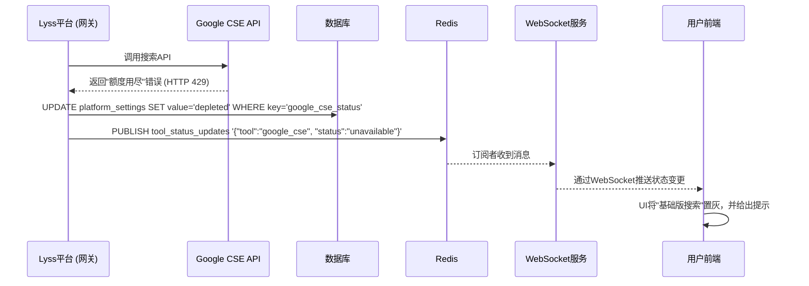

# Lyss AI Platform - 工具调用集成方案 (V2.0 最终版)

## 1. 概述

为了极大地增强平台所聚合的LLM的实时性和准确性，本文档设计了一套为支持工具调用的模型（如GPT-4o, Claude 3等）集成外部工具（以网络搜索为例）的标准化方案。本方案经过深入讨论，已包含**配置管理、状态同步和自动恢复**等关键设计，确保了功能的健壮性和可运营性。

## 2. 设计原则

1.  **双轨并行**: 同时提供平台级的免费基础服务和用户级的付费高级服务。
2.  **状态感知**: 系统必须能实时感知并处理免费服务因限额而产生的状态变化。
3.  **用户透明**: 必须将服务的可用状态实时、清晰地同步给前端用户。
4.  **安全可控**: 所有平台级密钥由超级管理员通过安全的方式进行配置。

## 3. 核心方案：双轨制网络搜索

### 3.1. 轨道一：平台免费版 (Google CSE)

- **技术选型**: **Google Custom Search Engine (CSE) API**，利用其每日100次的免费查询额度。
- **配置管理**:
    - **配置者**: 超级管理员。
    - **配置方式**: 通过部署时的**环境变量**注入，网关服务启动时读取。
        - `GOOGLE_CSE_API_KEY`: Google API Key。
        - `GOOGLE_CSE_ID`: 自定义搜索引擎ID。
    - 如果环境变量未配置，此功能在平台全局禁用。

### 3.2. 轨道二：用户高级版 (Tavily AI)

- **技术选型**: **Tavily AI API**，利用其为AI优化的搜索结果。
- **配置管理**:
    - **配置者**: 用户本人。
    - **配置方式**: 用户在个人设置页面填写自己的Tavily API Key。
    - **数据库设计**: 在 `users` 表中增加 `tavily_api_key` 字段，**必须加密存储**。
    - 如果用户未配置此Key，该选项在前端不可用。

## 4. 状态管理与实时同步机制

这是本方案的核心，用于处理平台免费版（Google CSE）的每日限额问题。

### 4.1. 技术栈

- **状态持久化**: **数据库** (`platform_settings` 表)，用于记录工具的全局状态 (`available`/`depleted`)。
- **实时消息总线**: **Redis Pub/Sub**，用于在状态变更时广播通知。
- **实时推送通道**: **WebSocket**，用于维持服务器与所有在线客户端的长连接，实时推送状态更新。
- **状态自动恢复**: **定时任务 (Cron Job)**，用于每日自动重置状态。

### 4.2. 工作流程

#### 4.2.1. 额度耗尽流程

#### 4.2.2. 额度自动恢复流程

1.  一个**定时任务**在每日零点（UTC）触发。
2.  任务执行 `UPDATE platform_settings SET value='available' WHERE key='google_cse_status'`。
3.  更新成功后，同样通过Redis发布 `{"tool":"google_cse", "status":"available"}` 通知。
4.  所有在线用户的前端将自动恢复“基础版搜索”选项的可用性。

## 5. 前端交互设计

- 当模型支持工具调用时，网络搜索选项呈现为一个**下拉框**。
- **选项一**: `网络搜索 (基础版)`。其可用性由WebSocket实时控制。
- **选项二**: `网络搜索 (Tavily AI)`。其可用性由用户是否配置了`tavily_api_key`决定。
- 用户可以根据需求，在每次请求时自由选择使用哪个搜索引擎。

## 6. 结论

本方案通过引入**环境变量配置、数据库状态持久化、Redis消息总线、WebSocket实时推送和定时任务**，构建了一套完整的、可运营的、用户体验良好的双轨制工具调用系统。它不仅功能强大，而且在架构上考虑了各种异常和边界情况，为平台的稳定运行提供了坚实的基础。